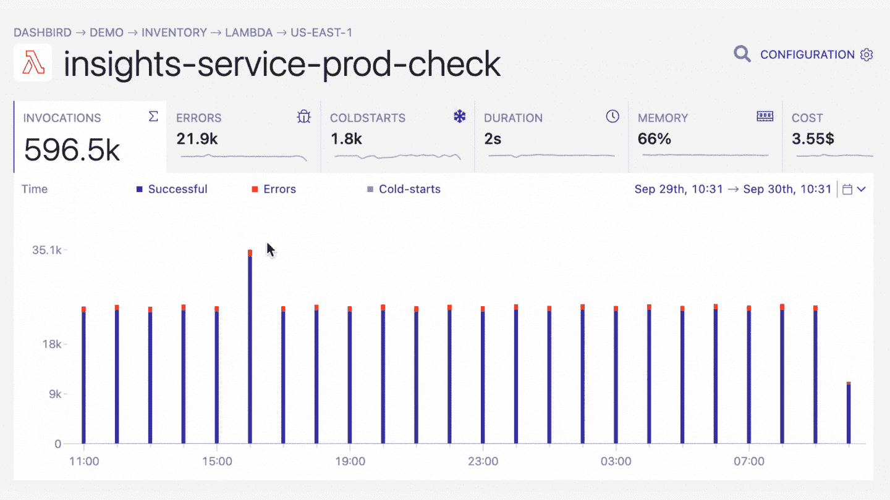

# AWS Lambda 中的 Python 错误处理

> 原文：<https://blog.devgenius.io/python-error-handling-in-aws-lamb-5b9b52e941a8?source=collection_archive---------2----------------------->

大约 53%的 Lambda 函数使用 Python，它是最流行的无服务器语言。在本文中，您将了解在 AWS Lambda 中处理 Python 的**错误的须知。**

# 故障类型

在您的 Lambda 中，有许多不同的事情可能会出错，所以让我们逐一分析。


# 语法错误

语法错误，也称为**解析错误**，可能是最常见的一种失败。它们会在任何程序命令执行之前被抛出。这是其中一个的样子:

```
>>> while True print('Hello world')
  File "<stdin>", line 1, in ?
      while True print('Hello world')
                     ^
SyntaxError: invalid syntax
```

# 例外

**异常**如果一个语句或表达式在语法上是正确的，但在执行时出错，就会出现异常。作为开发人员，您可以处理异常，并使它们对您的程序不致命。但是，大多数异常都没有得到处理，并导致如下错误消息:

```
>>> 10 * (1/0)
Traceback (most recent call last):
  File "<stdin>", line 1, in ?
ZeroDivisionError: division by zero
>>> 4 + spam*3
Traceback (most recent call last):
  File "<stdin>", line 1, in ?
NameError: name 'spam' is not defined
>>> '2' + 2
Traceback (most recent call last):
  File "<stdin>", line 1, in ?
TypeError: Can't convert 'int' object to str implicitly
```

# 无法导入模块

值得单独注意的是导入模块异常。本质上，这是一个异常，但在 Lambdas 中需要特别注意。**在执行到达函数处理程序**之前引发，意味着它没有到达函数处理程序包装的执行。这通常可以防止错误警报代理报告这种类型的故障。

```
START RequestId: db1e9421-724a-11e7-a121-63fe49a029e8 Version: $LATESTUnable to import module 'lambda_funxction': No module named 'lambda_funxction'REPORT RequestId: db1e9421-724a-11e7-a121-63fe49a029e8  Duration: 15.11 ms Billed Duration: 100 ms  Memory Size: 128 MB  Max Memory Used: 18 MB
```

阅读更多关于[如何在 Python 中处理异常的内容。](https://docs.python.org/3.3/tutorial/errors.html)

# AWS 误差

# 资源限制:超时

当您使用无服务器框架时，默认超时为 6 秒，但您可以将其配置为 5 分钟。下面是 CloudWatch 中超时错误的样子。

```
REPORT RequestId: 41a10717-e9af-11e7-892c-5bb1a4054ed6  Duration: 300085.71 ms  Billed Duration: 300000 ms Memory Size: 128 MB Max Memory Used: 92 MB
2017-12-25T20:12:38.950Z 41a10717-e9af-11e7-892c-5bb1a4054ed6 Task timed out after 300.09 seconds
```

# 资源限制:内存不足

Lambda 执行可能会遇到内存限制。当报告行中的`Max Memory Used`和`Memory Size`值相同时，您可以识别故障。

示例:

```
START RequestId: b86c93c6-e1d0-11e7-955b-539d8b965ff9 Version: $LATESTREPORT RequestId: b86c93c6-e1d0-11e7-955b-539d8b965ff9 Duration: 122204.28 ms Billed Duration: 122300 ms Memory Size: 256 MB Max Memory Used: 256 MBRequestId: b86c93c6-e1d0-11e7-955b-539d8b965ff9 Process exited before completing request
```

# 配置失败

在这种情况下，引用的 Lambda 函数处理程序不存在。

```
START RequestId: db1e9421-724a-11e7-a121-63fe49a029e8 Version: $LATESTHandler 'lambda_handlerx' missing on moduleREPORT RequestId: db1e9421-724a-11e7-a121-63fe49a029e8 Duration: 15.11 ms Billed Duration: 100 ms Memory Size: 128 MB Max Memory Used: 18 MB
```

# 处理故障

好了，现在我们知道什么会出错了。幸运的是，Lambda 有一些锦囊妙计，我们可以用来补救这种情况。

# AWS 中的重试行为

**同步调用:** (API Gateway，Amazon Alexa 等。)

在这种情况下，Lambda 向负责重试的调用应用程序返回 429 错误。一些同步事件源**可能有内置的重试逻辑**，所以一定要检查 AWS 的[支持的事件源](https://docs.aws.amazon.com/lambda/latest/dg/invoking-lambda-function.html)。

**异步调用:** (AWS SNS、AWS SES、AWS CloudWatch 等)

这些事件在被调用之前被排队，如果执行失败，**它们被重试两次**,调用之间有延迟。可选地，您可以为您的函数指定一个[死信队列](https://docs.aws.amazon.com/lambda/latest/dg/dlq.html)，并将失败的事件发送到 AWS SQS 或 SNS。但是，如果不指定 DLQ，则事件会在两次重试后被丢弃。

**基于流的事件源**(亚马逊 Kinesis 数据流和 DynamoDB 流):

在这种情况下，Lambda 轮询您的流并调用 Lambda 函数。如果调用失败，Lambda 将再次尝试处理批处理，直到数据过期。为了确保按顺序处理流事件，异常被阻塞，并且该函数不会读取任何新记录，直到失败的批处理被成功处理或过期。

# 幂等函数

根据系统的流程，重试可能是有害的。例如，让我们设想一个负责向数据库添加用户行并发送欢迎电子邮件的函数。如果该函数在创建用户后失败并重试，您将在数据库中有一个重复的行。

克服这个问题的一个好方法是将你的函数设计成[等幂](http://www.restapitutorial.com/lessons/idempotency.html)。

**幂等函数**是具有单一任务的函数，该任务要么成功，要么可以重试，而不会对系统造成任何损害。您可以使用阶跃函数重新设计上述函数。首先是负责将用户添加到数据库的函数，第二步，另一个函数发送电子邮件。点击阅读更多关于步进函数[的信息。](https://aws.amazon.com/step-functions/)

# 改进日志记录

为了便于以后的调试，我建议注销有用的信息，如**事件对象**(注意不要注销密码等)。)、可疑的数据库和网络请求以及其他可能的故障点。此外，如果您处理了一个关键异常，请确保将跟踪记录下来。这使得基于日志的监控解决方案如 [Dashbird](https://dashbird.io/) 能够捕捉和处理。

# 基于日志的监控和警报

这里需要注意的是，大多数错误在默认情况下不会被报告。在最好的情况下，如果您碰巧打开了 CloudWatch metrics dashboard，您会注意到它们。此外，在程序执行之外发生的故障很难或不可能被代理发现，因为执行在到达处理程序或来自上层之前就停止了。解决这个问题的一个好方法是从 CloudWatch 日志中检测这些问题。使用[dash bird](https://dashbird.io/)——一种易于设置的无服务器监控工具——在此基础上，可以在一个地方超级简单快速地检测错误并排除故障。

使用 Dashbird，您将能够跟踪 Python 错误，同时获得应用程序状态的整体视图。一旦你设置好你的账户，你就可以看到每一个函数调用，实时跟踪，错误报告，费用明细等等。

Dashbird 的好处是，它对你的 Lambda 性能或 AWS 成本没有任何影响。它还与您的 Slack、Pagerduty(通过 webhooks)或电子邮件帐户相集成，为您的开发聊天带来了警报。



# 结论

这涵盖了您需要了解的关于 AWS Lambdas 中错误处理的大部分内容。在我们的[事件库](https://dashbird.io/event-library/)中了解更多关于 AWS Lambda 错误以及如何解决它们的信息。