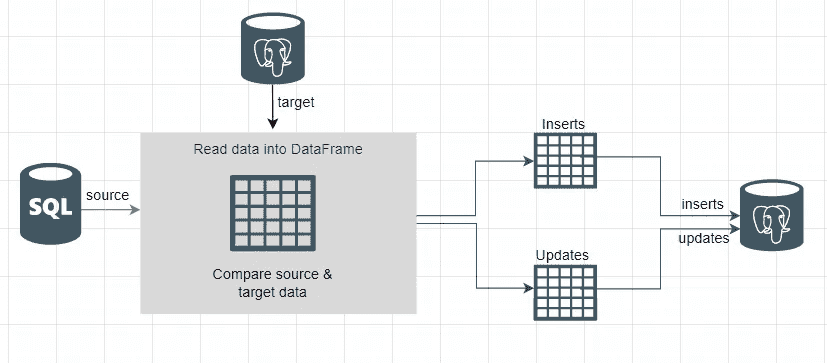
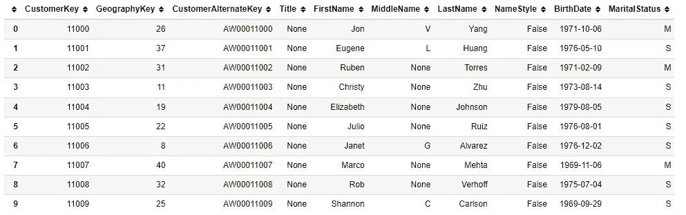
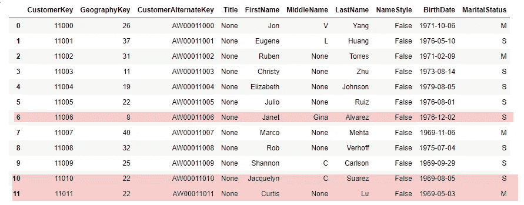

# Python ETL 管道:增量数据加载技术

> 原文：<https://blog.devgenius.io/python-etl-pipeline-the-incremental-data-load-techniques-20bdedaae8f?source=collection_archive---------0----------------------->

增量数据加载

ETL 中的增量数据加载方法(提取、转换和加载)是理想的设计模式。在这个过程中，我们识别和处理自上次 ETL 运行以来新的和修改过的行。增量数据加载是高效的，因为我们只处理行的子集，并且它使用的资源更少。例如，如果我们正在处理一个有两万行的表，然而，自从上次 ETL 运行以来，只有 500 条新记录和 200 条修改过的记录。增量方法只能处理和加载 700 行。现在想象一下，如果你的桌子大十倍。随着我们的数据扩展，这种方法变得必不可少。这种技术，如果应用正确，涉及的风险最小，是有效的，它保存了历史数据。

到目前为止，我们已经介绍了[全加载方法](/how-to-build-an-etl-pipeline-with-python-1b78407c3875)，在这种方法中，我们删除所有记录并从源系统加载所有内容。这种方法简单且易于设置；然而，对于大型数据集，这将成为性能瓶颈。随着数据的扩展，您的 ETL 过程将需要更长的加载时间。移动和转换数据的时间与您正在处理的数据量成正比。根据上面的例子，处理 700 条记录比处理 20000 条记录花费的时间要少得多。有多种增量加载方法；源更改检测、目标更改比较和更改数据捕获(CDC)。今天我们将探讨第二种方法。如果你感兴趣的话，我已经在这里报道了疾病预防控制中心的方法[。](https://www.youtube.com/watch?v=FJSvKgfXgtk)

完整的代码可在 [GitHub](https://github.com/hnawaz007/pythondataanalysis/tree/main/ETL%20Pipeline) 上获得。视频教程可以在 YouTube 上找到。

**信号源变化检测**

在 source change detection 设计模式中，我们使用在 datetime 字段修改和创建的两个关键字段来检测更改。我们将数据拉入自上次 ETL 运行以来插入和/或更改的 ETL 管道。

**目的地变更比较**

如果源不支持源变化检测，那么我们退回到源到目的地的比较。我们将源数据与目标数据进行比较，以确定哪些是新的或修改过的行。这种更改检测方法需要逐行比较，以区分未更改和已更改的数据。这比源代码更改检测的性能差。对于这种方法，我们将所有数据加载到 ETL 管道中进行比较。接下来我们将实现目的地变化比较。

**实施目的地变更比较**

我们将使用来自 *AdventureWorks* 数据库的客户表，该数据库是我们之前[建立的](https://www.youtube.com/watch?v=e5mvoKuV3xs)。让我们利用前面的 [ETL 管道](/how-to-build-an-etl-pipeline-with-python-1b78407c3875)会话中的代码来定义带有数据库细节的变量，并建立数据库连接。我们把数据读入熊猫的数据框。为了简单起见，我将读十行。在初次运行时，我们将所有数据从源加载到目的地。因此，我们的两个环境现在是同步的。

同步数据

第二天，我们有两个新的交易，我们在数据库中添加了两个新客户。此外，我们更改了一个现有客户的名称(CustomerKey: 11006)。

新的和修改的数据

让我们看看如何比较这两个数据集来检测变化。让我们看一下代码。

获取新的和修改过的行

首先，我们将元组函数应用于每一行。这给了我们一个带有元组列表的 Series 对象(元组是元素的有限有序列表(序列))。每个元组包含来自源和目标的整行。然后我们在源上应用 *isin* 方法来检查每个元组是否存在于目标中。结果是一个 *pd。具有 *boo* l 值的系列*。*如果来自源的元组在目标中，则 Bool* 值为 *True* 。最后，我们用波浪符号~否定结果，并对源应用过滤器。因此，我们只能从源中获得不在目标中的行。我们将来自该子集的修改的和新的记录分成新的数据帧；插入并修改。

**处理上插**

插入部分很容易。我们只需使用“to_sql()”函数将新记录添加到数据库中现有的表中。要更新现有表中的记录，我们可以编写 insert 语句并逐行更新。基于行的方法很慢。因此，我们将采用基于集合的方法。我们将创建下面的函数。它接受一个数据帧，带有修改过的记录、一个表名和表的主键。我们将数据帧存储在一个临时表中，并构建一个动态 SQL update 语句。我们可以对任何表使用这个函数。我们在主键上连接临时表和目标表，如果匹配，那么我们将目标表的列设置为临时表的列。我们用修改后的数据框以及表名和键来调用这个函数。该函数使用来自源的更新来更新表中的行。我们已成功更新了修改后的记录。

更新目标表

这就是我们如何在 Python ETL 管道中使用目的地变化比较来实现增量数据加载。下次和我一起进行源代码变更检测。

**结论:**

*   我们描述了什么是增量 ETL 方法？以及可用于实现增量数据加载的不同方法。
*   我们展示了使用 Pandas 在 ETL 管道中实现目的地变化比较是多么容易。
*   我们使用 Python、Pandas、SQL Server 和 PostgreSQL 在 ETL 管道中实现了增量加载方法。
*   完整的代码可以在[这里找到](https://github.com/hnawaz007/pythondataanalysis/tree/main/ETL%20Pipeline)