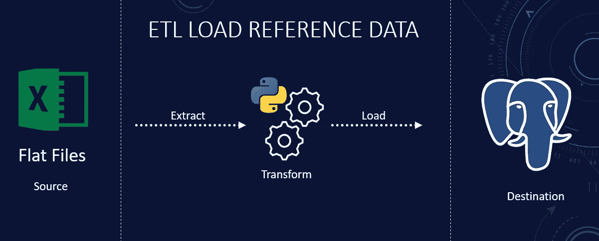

# Python ETL 管道将参考数据加载到数据库中

> 原文：<https://blog.devgenius.io/python-etl-pipeline-to-load-reference-data-into-your-database-cc706e98cd58?source=collection_archive---------2----------------------->

接收参考数据的管道

作为数据工程师，我们的任务是从所有类型的来源中提取数据。这包括从 API 到数据库，甚至平面文件。在上一篇文章中，我们用 Python 开发了一个 ETL 管道来从数据库中提取数据。如果你是视觉学习者，那么我在 YouTube 上有一个附带的视频，里面有完整代码的演示。用于 ETL 的完整源代码可以在 [GitHub](https://github.com/hnawaz007/pythondataanalysis/tree/main/ETL%20Pipeline) 上获得。

我们将构建 Python 的 ETL 管道来覆盖平面文件。今天，我们将学习如何使用 Python 摄取多个平面文件并将它们加载到 Postgres 数据库中。目标是从网络共享中读取数据，然后将其加载到数据库中。因此，参考数据可用于分析。

我们将从共享文件夹中加载两个 excel 文件。这些文件包含客户和区域映射。我们在数据库中有一个帐户表，但它不包括报告所需的详细程度。例如，您正在为您的公司准备一个收入状态，并且您的帐户表具有基本帐户，但是它不包括将类别(即收入)分解为总销售额、退货、调整和折扣的标题或子标题。这使您能够扩展特定类别，以查看收入或运营支出的构成。

我们可以使用映射来扩充现有数据或翻译表格。但是，我们不希望将映射保存在 excel 中，因为它们可能会被其他人覆盖，或者有人可能会错误地修改它，从而导致工作时间变得不可用。为了避免这些陷阱，将参考数据保存在您的数据仓库中是一个好主意。我们将利用 Python ETL 管道来读取这些文件，并将它们保存到一个表中。

在开始编写管道代码之前，我们将讨论几个基本主题:如何打开和读取平面文件中的数据，以便存储和处理数据。我们将在处理文件之前对其进行检查。

这个 ETL 管道将使您能够:

*   了解操作系统模块以遍历目录
*   对文件执行某些检查
*   用熊猫读取文件并将数据写入数据库
*   将数据存储在数据库表中
*   以电子邮件形式发送失败、成功通知

**设置**

我已经准备了一个 [PostgreSQL](https://www.youtube.com/watch?v=fjYiWXHI7Mo) 环境，它将作为我们加载数据的目的地。我们从环境变量中获取密码和用户名，并将服务器、数据库和端口等数据库细节定义为本地变量。

我们将使用网络共享作为源，并使用 Python 在 PostgreSQL 中加载数据。如果你想继续下去，一定要看看 PostgreSQL [视频](https://www.youtube.com/watch?v=fjYiWXHI7Mo&t)。我们将在网络共享中创建一个文件夹，并在此复制两个文件。GitHub 上有 Excel 文件。我们将这个目录位置保存在一个局部变量中。

**用 OS 模块读取文件**

Python 提供了各种选项来遍历目录中的文件。您可以选择最适合您需求的方法。我们将使用操作系统模块中的“[”listdir()](https://www.geeksforgeeks.org/python-os-listdir-method/)”函数。这个函数返回给定目录中的文件和子目录列表。我们可以使用“os.path.isfile()”函数过滤列表，只获取文件。此外，我们可以将我们的标准限制在特定类型的文件中，例如，我们可以使用 Python 字符串“endswith()”方法。如果字符串以 xlsx 后缀结尾，则“endswith()”方法返回 True。一旦我们得到了文件，我们就可以用“path.join()”方法构建一个完整的文件路径。join 方法结合了文件路径和文件名来给出完整的路径。我们的提取功能将基于这种方法。

**通过 SMTP 的通知**

[Python](https://realpython.com/installing-python/) 自带内置 [smtplib](https://docs.python.org/3/library/smtplib.html) 模块，用于使用简单邮件传输协议(SMTP)发送电子邮件。我们将使用本地 SMTP 服务器发送电子邮件，但同样的原则也适用于任何电子邮件服务。如果你需要更深入的使用 Gmail 设置 SMTP 的教程，或者想要发送带有高级选项的格式化电子邮件，那么看看这个[视频](https://www.youtube.com/watch?v=cKsTNnVMKt8&t)。

我们使用下面的方法启动一个 SMTP 连接，我们使用“sendmail()”发送一封电子邮件。电子邮件详细信息作为参数提供给“send_mail()”函数。

用 SMTP 发送电子邮件

**摘录**

第一步是将 Excel 文件作为 pandas 数据帧读取。我们遍历目录并获得文件名。我们将使用文件名作为表名，因此，请确保正确命名您的文件。让我们拆分文件名以获取不带扩展名的名称。

我们只有 excel 文件中的数据，所以让我们检查文件扩展名是否是 xlsx。我们不想处理任何其他类型的文件，以防有人在此目录中复制 csv 或文本文件。

我们用操作系统点路径的连接函数连接目录和文件名。这为我们提供了完整的文件路径。

现在我们有了完整的文件路径。让我们用“read_excel()”读取 pandas 数据框架中的文件。我们调用 load 函数，这是我们接下来要编写的代码，我们向这个函数传递数据帧和不带扩展名的文件名。

读取 Excel 文件

**负载**

在 load 函数中，我们将数据保存为数据库表。表名作为该函数的参数提供。为了将数据保存到我们的数据库，让我们用 SQLAlchemy 创建一个到 PostgreSQL 的连接。我们从局部变量中为它提供连接细节。Pandas 使用 pandas 的“to_sql()”函数轻松地将数据加载到 SQL 数据库中。我们处理传递给加载函数的数据帧。我们将遵循 truncate and load 方法，因为它很简单，每次运行都会替换表。这可以是您的分段环境，您可以在其中以给定的时间间隔获取新数据。从这里，您可以将这些数据加载到表示层，以便进行报告。下面的代码演示了如何使用**熊猫**连接和存储 **PostgreSQL** 数据库中的数据。

将参考数据加载到数据库

这就是了。我们已经成功地将我们的参考数据从平面文件加载到我们的数据库中，用于报告和分析。

**结论**

*   我们已经演示了如何遍历一个目录并读取引用数据。
*   我们通过 SMTP 库整合了电子邮件通知。
*   我们使用 Python、Pandas 和 SQLAlchemy 实现了 ETL 管道。
*   完整的代码可以在[这里](https://github.com/hnawaz007/pythondataanalysis/blob/main/ETL%20Pipeline/file_upload.py)找到