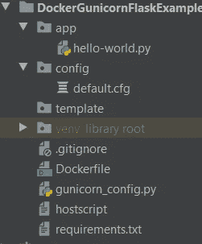
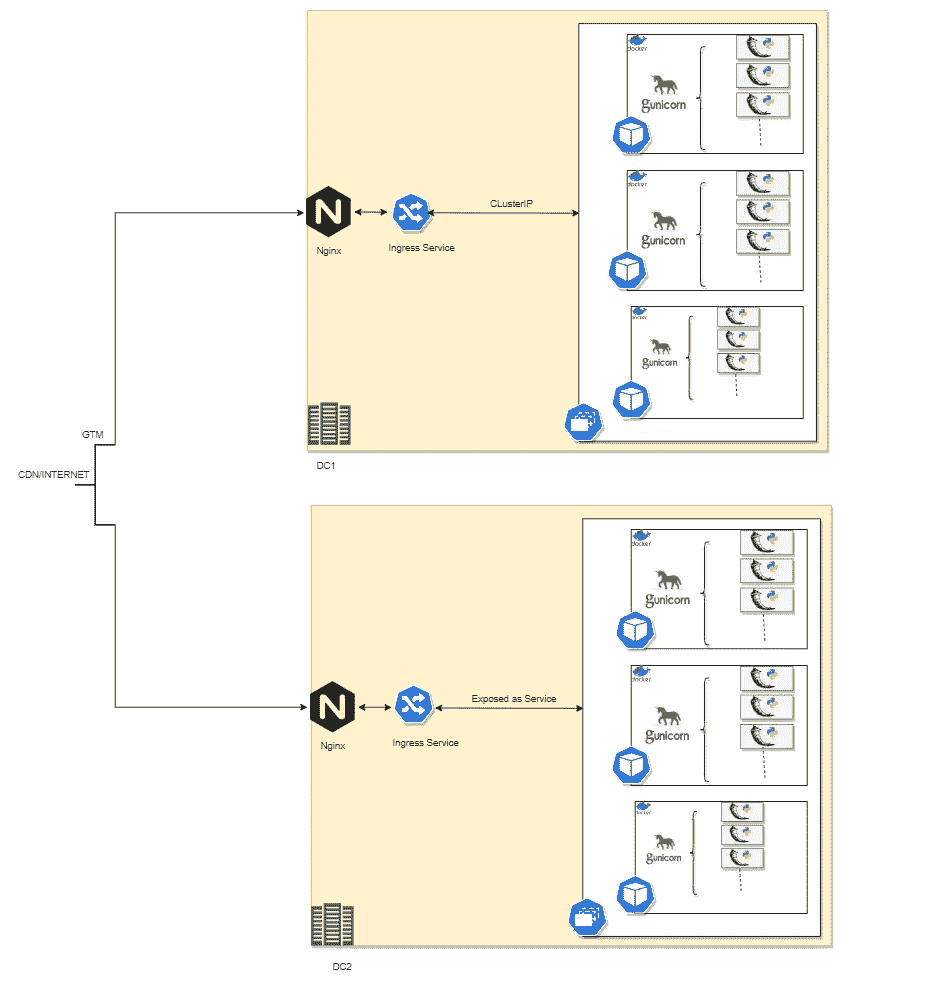

# 在 Kubernetes 上部署带有 gunicorn 的烧瓶作为停靠容器

> 原文：<https://blog.devgenius.io/python-flask-wsgi-gunicorn-docker-kubernetes-magic-soup-with-philosophers-stone-ca6832cf8886?source=collection_archive---------0----------------------->

我们试图完成什么

[这是您的一个映像，如果 repo 遵循统一的文件夹结构，它可以用于相同/不同应用程序的多个微服务以及所有环境。](https://hub.docker.com/repository/docker/imvegeta/excalibur)

配置、依赖项、应用程序名称、回购路径，所有—可插拔

[本文的**目标**是解释前面提到的所有组件是如何以最令人瞠目结舌的方式相互配合的。](https://hub.docker.com/repository/docker/imvegeta/excalibur)

[我们的神剑！结束目标！](https://hub.docker.com/repository/docker/imvegeta/excalibur)

# 先决条件:

需要的先验知识—(可以是全部的 3/5)

*   遵循项目文件夹结构，并根据需要提供配置。
*   准备好您的环境
*   快跑！

**基本、背景和原因** —

*   烧瓶是太多的自由，为你内心的混乱铺平了道路
*   对于一个初学者来说，使用 Flask/Django 到 Prod 总是一件新鲜事，尤其是如果你来自 JAVA，那就不容易了。你会继续寻找 JAR，Tomcat 服务器，等等！
*   WSGI 和 guni corn——这些词无处不在，但是它们到底是什么意思呢？
*   即使我设法理解了以上所有内容，我将如何部署它呢？在服务器上？将它作为一个流程来运行？(如果您正在这样做，请从这些遗留方法中继续前进)
*   把它归档怎么样？然后呢？我如何在各种环境中保持标准？

**行话**:

*   Flask——Python 中的一个 mirco 框架，它以其极简主义的方法风靡世界。它不是为生产而建造的，但尽管如此，它从一开始就是 django 的主要竞争对手。[你可以在这里找到样品！](https://realpython.com/flask-by-example-part-1-project-setup/)
*   [WSGI](https://wsgi.readthedocs.io/en/latest/what.html)—[*web 服务器与 Web 应用程序或框架之间的简单通用接口:Python Web 服务器网关接口(WSGI)。*](https://www.python.org/dev/peps/pep-3333/) *或多或少，一个标准——定义服务器端如何调用应用程序端提供的可调用对象的标准*
*   gunicorn —根据 WSGI 标准用 Python 构建的 web 服务器。
*   [Docker](https://opensource.com/resources/what-docker) —这是一种[集装箱化技术](https://www.slideshare.net/SrinivasVaddi4/cloud-computing-and-docker)，简单来说就是对资源利用的隔离和控制的结合。它类似于虚拟机，但在某种意义上非常简单。理想情况下，容器是用于无状态应用程序的，它不需要持久性保证。
*   Kubernetes —一个相当简单的容器**编排**工具。

**解决方案简述**:

*   遵循严格的文件夹结构
*   按照我们的文件夹结构将所有代码推送到存储库
*   使用一个基本映像来满足我们几乎所有的需求。
*   将的值作为环境变量动态传递给 Docker 容器。

当你浏览这篇文章时，你会开始钦佩我们作为一个行业、技术、开发工具、CICD、原生云已经走了多远，最重要的是，我们在 Kubernetes 上运行微服务是多么轻松！我们怎么会在这里？

本文的想法不是更详细地解释上述任何事情，而是将这些点连接起来，并使用 Gunicorn 部署一个生产级 Flask 微服务。

总是需要一些标准化，特别是如果你在和时间赛跑。根据我的经验，或者说，在寻找从原型开发到生产的速度时，我发现每当我试图解决一个问题时，总会有更大的问题出现，质疑我的能力。

解决以上所有问题的办法只有一个，探索，需要是所有发明之母。

# 我们的文件夹结构是什么？

*   hello-world.py —是你的 API/Flask 应用。
*   default.cfg —是应用程序的配置文件
*   guni corn _ config . py—guni corn 的配置
*   requirements.txt —所有使用" **pip install** "的应用程序依赖项

这个图像期望的**环境变量**是什么？

*   git_url —要克隆的 Git url(可以包含用户名和密码，检查任何有效的内容)
*   git_branch —要提取的分支！
*   项目名称—您的项目的名称
*   port_addr —您希望在容器外部公开服务的端口，用于 gunicorn
*   pyconf —您的配置文件的绝对路径，如果您从任何 configmap/repo 加载配置，您可以只编辑这一个变量
*   python_app —您想要运行的应用程序文件夹中的文件—“不要给 xyz.py，xyz 就可以了！”

**如何运行**:

将上述所有环境变量传递给 docker run 命令:

> " docker run-itd-p 5000:5000-e git _ URL =[https://github . com/vaddisrinivas/dockergunicornflasktemplate](https://github.com/vaddisrinivas/dockergunicornflasktemplate)-e project _ name = dockergunicornflasktemplate-e python _ app = hello-world-e pyconf =/app/dockergunicornflasktemplate/config/default . CFG-e port _ addr = 5000-e git _ branch = master im vegeta/excalibu

*现在我们已经运行了我们的神剑，让我们看看我们正在完成什么，更大的画面！#futurescope —这是我们在未来的时间里要做的事情！*

**

*如果部署在 Kubernetes 上，此图像的可用性的高级架构。零到英雄！*

*将它扩展到 Kubernetes 将是下一篇文章的主题！*

*[**点击此处查看**](https://hub.docker.com/repository/docker/imvegeta/excalibur) **！***

***在这里可以** [**玩 DOCKER！**](https://labs.play-with-docker.com/#) **在从这里创建的新实例中使用 run 命令即可！***

*请让我知道你认为做事情更容易的方法是什么！也一定要分享你对这篇文章的看法！*

*感谢您的时间读者！*