# python+Folium+Oracle REST API(又名 ORDS)

> 原文：<https://blog.devgenius.io/python-folium-oracle-rest-apis-aka-ords-61b79811838e?source=collection_archive---------2----------------------->

# 威尔科曼

我偶然发现了一个新的*【对我来说*】python 库，叫做`[Folium](https://python-visualization.github.io/folium/)`。它是一个映射工具，使 python 开发人员(或者是程序员，这不太令人讨厌？)在*传单*地图上可视化数据。

# 关于`folium`

> `*Folium*` *使用 Python 处理的数据在交互式活页地图上可视化变得容易。它既可以将数据绑定到地图上用于* `[*choropleth*](https://en.wikipedia.org/wiki/Choropleth_map)` *可视化，也可以将丰富的矢量/光栅/HTML 可视化作为标记传递到地图上。*
> 
> *该库有多个* *内置****tilesets****来自 OpenStreetMap、Mapbox 和 Stamen，支持使用 Mapbox 或 Cloudmade API keys 定制 tilesets。* `*Folium*` *支持图像/视频、GeoJSON 和 TopoJSON 叠加。*
> 
> [*叶文档*](https://python-visualization.github.io/folium/)

# …但是`leaflet.js`呢？

> `*Leaflet.js*` *是领先的开源 JavaScript 库，用于移动友好的交互式地图。开箱即用的功能包括:切片图层/WMS、标记/弹出窗口、矢量图层(折线、多边形、圆形、矩形)、图像叠加和 GeoJSON*
> 
> [*【功能】页*](https://leafletjs.com/#features)

# Tilesets

我突出显示了上面的 *tilesets* ，我不确定这是 GIS 还是传单术语，但似乎 tilesets 指的是不同的地图渲染。leav 包括以下内容:

*   OpenStreetMap
*   雄蕊地形
*   雄蕊调色剂
*   雄蕊水彩

在撰写本文时，我还没有 Mapbox Bright 或 Mapbox Control Room 的 API 证书。但是我假设如果您有适当的 API 证书，它们仍然可以工作。

除了地图框图块，默认打包的图块已经足够了:

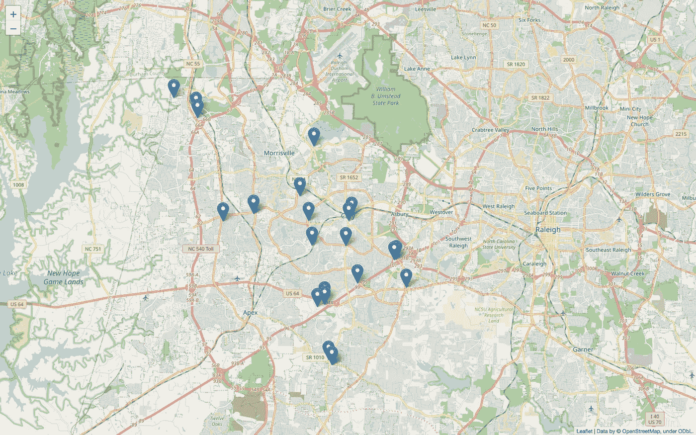

OpenStreetMap *默认*

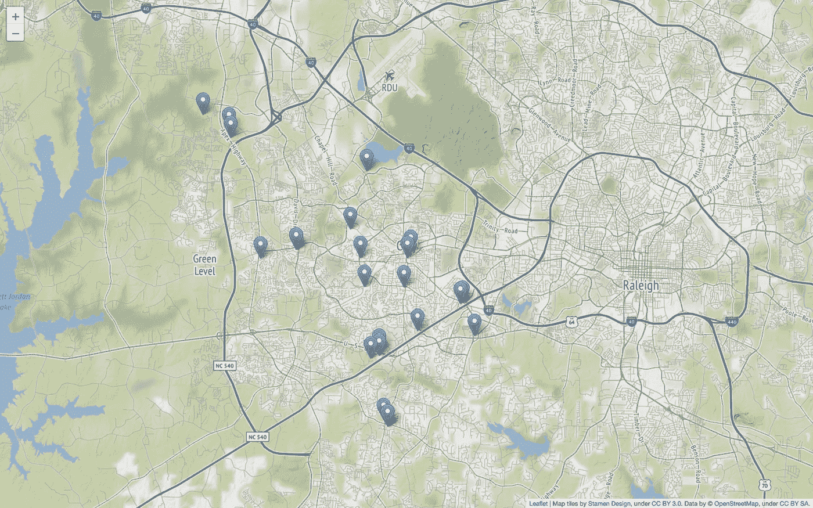

雄蕊地形


雄蕊调色剂

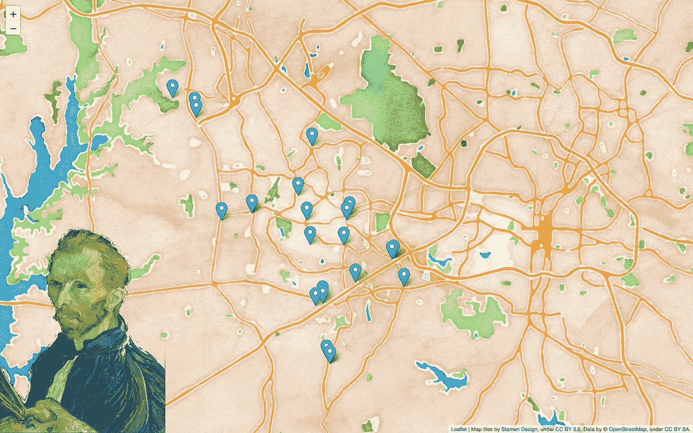

雄蕊水彩

```
**Tip:** Read more on Stamen [here](http://maps.stamen.com/#toner/12/37.7706/-122.3782), *s'il vous plaît*. They seem to be the original creators of these Stamen tiles.
```

# 蟒蛇+叶子+ ORDS =幸福

Folium 安装和快速启动页面非常简单，只需最少的步骤和工作。安装[直播服务器](https://github.com/ritwickdey/vscode-live-server)扩展也是如此。安装完成后，您可以右键单击一个. html 文件，将其加载到本地开发服务器上(这样它就会显示在一个新的浏览器窗口中)。

让我直接进入我如何设置与 ORDS 合作的叶子。如果您还记得，我的自治数据库中的大多数表都是支持 REST 的([前一篇与 ORDS 合作的文章](https://followthecoffee.com/get-requests-with-python-ords-and-the-oracle-autonomous-database/))。

# ORDS 评论

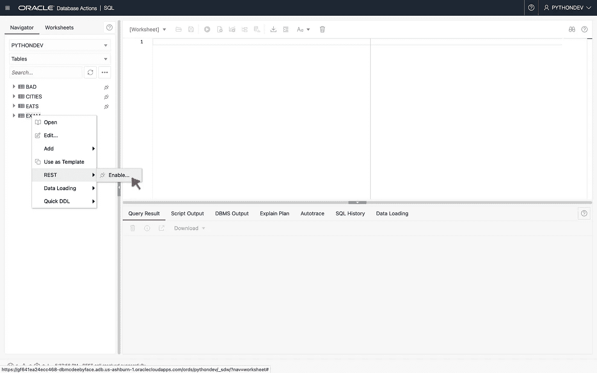

1.在数据库操作中，右键单击一个对象并选择 REST > Enable。

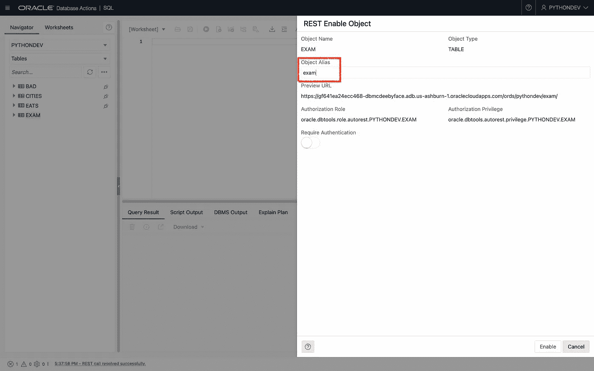

2.选择别名(好的安全措施)和身份验证(也是好的实践)。

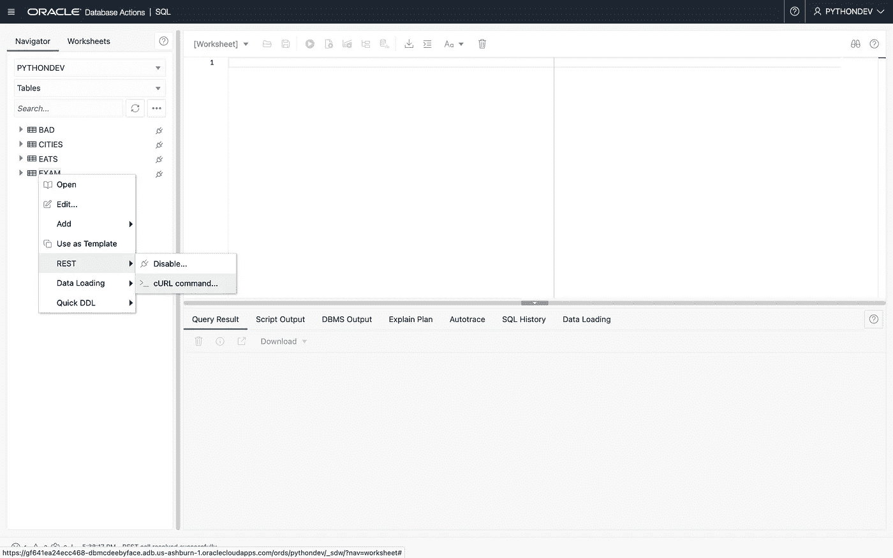

3.如果您忘记了 URI，您可以查看 cURL 命令。

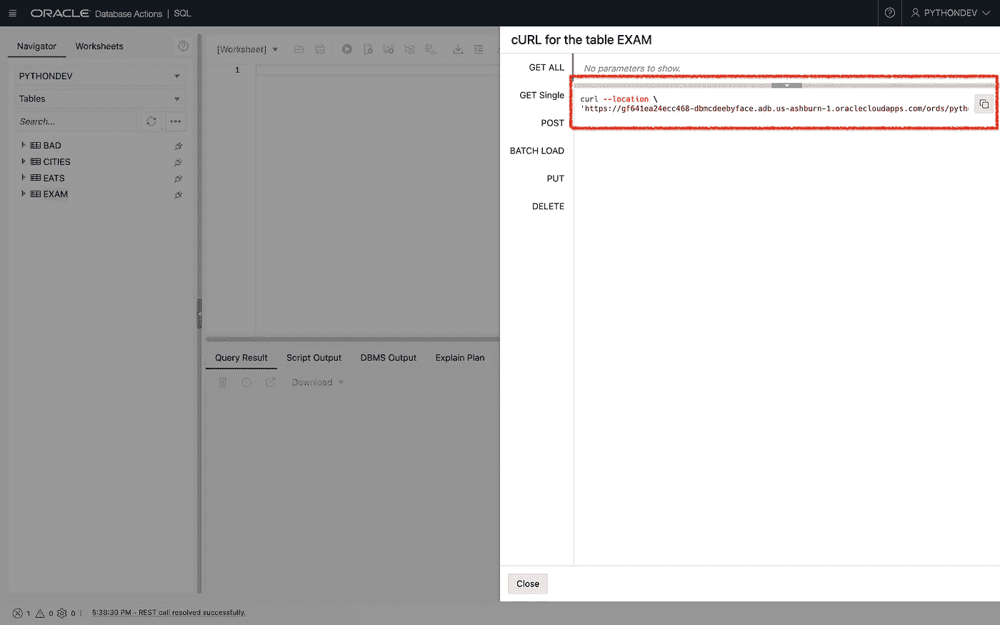

4.在那里你可以直接复制/粘贴到命令行*或者*复制 URI 部分并放到你浏览器的地址栏中。

# …现在回到你的定期博客文章

因为我需要 leav 的纬度和经度坐标，所以我决定使用我的*餐馆*表。将 REST 端点(URI)直接放入浏览器；你会看到这个:

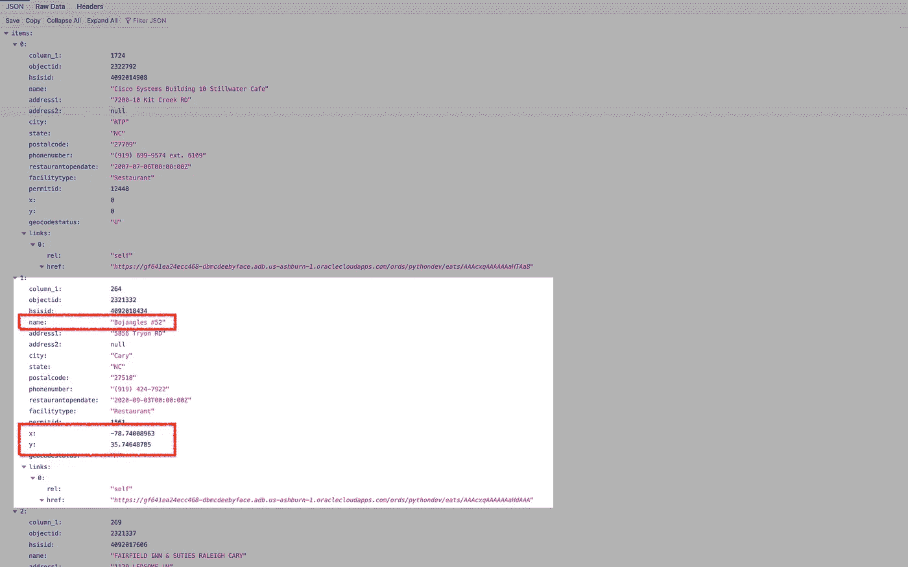

之后，我查看了 JSON 对象，看看它是如何构造的(有太多的列表、字典、数组等等。为了纪念阿米利特？！)因为我需要遍历 GET 响应中的所有条目——梳理出 follow 需要什么。

# 现场解说

# 打印响应(看看它看起来像什么)

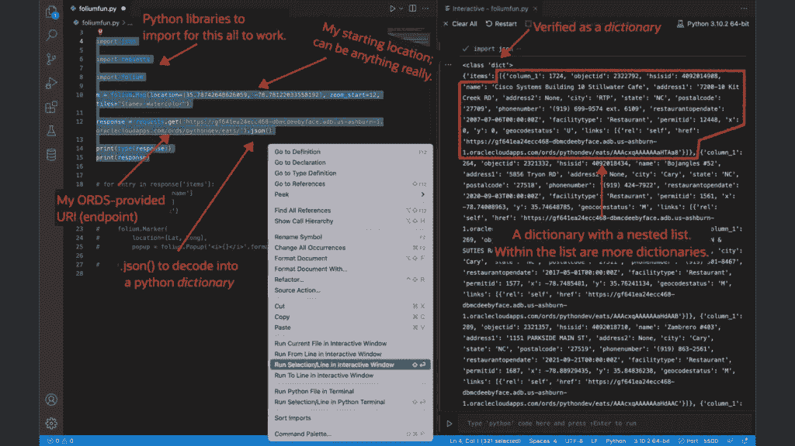

*   我在这里面面俱到；从我的自治数据库的表中查看 ORDS 提供的请求/对象
*   使用`json.()`将其“解码”成一个 python 字典
*   请注意第 10 行，我实际上在那里创建了底图

# 回顾叶子需要什么

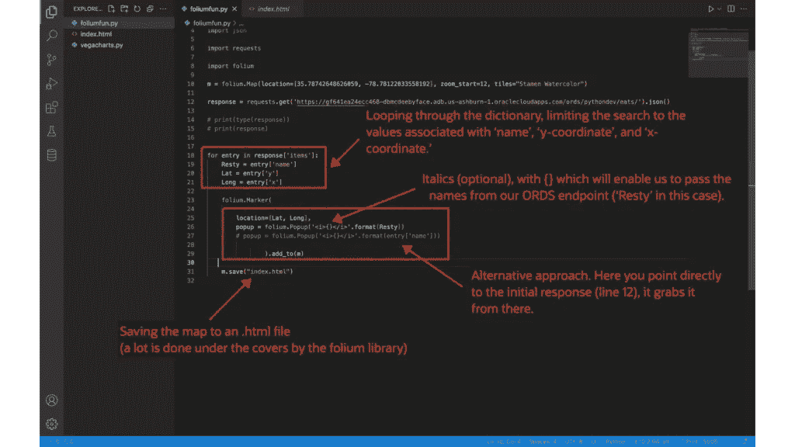

*   遍历 python 字典，找出下一步需要的内容
*   包括第 25–29 行来创建弹出标记。
*   `('<i>{}</i>'.format(Resty))`允许我将名字传递给字符串(用引号括起来，加上`{}`)。斜体的 HTML 是可选的。
*   在这种情况下，“x”和“y”是坐标
*   第 31 行保存了一个. html 文件(它使用了[引导程序](https://getbootstrap.com/docs/5.2/getting-started/introduction/)！)

# 新渲染的。超文本标记语言

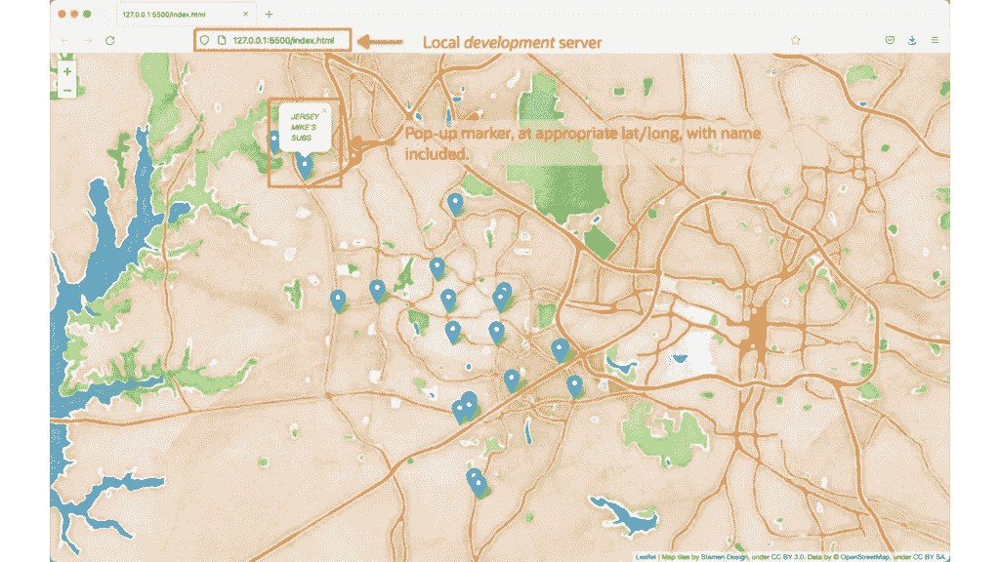

*   使用实时服务器扩展，我可以查看`Folium`地图和弹出标记！

```
**NOTE:** This isn't the focus, but spoiler alert, I'll be putting this into a Flask application. I'll also build this out, so the individual markers/popups have charts/graphs for each restaurant. Again, all of which will be provided by ORDS-enabled tables (not so shameless plug).
```

# 摘要

该说的都说了，该做的都做了，我花了不到一个下午的时间就想出了如何实现这一点。所以如果你有一个带经纬度的表，你还在等什么？！用 ORDS 启用 REST，你可以自己想出一个*非常*快速的演示！

**还有**，我不需要创建任何数据库模型，依赖性很小(几个 python 库)，一个[永远免费的 OCI 账户](https://www.oracle.com/cloud/free/#always-free)真的是你入门所需要的全部。

# 密码

```
import json
import requests
import foliumm = folium.Map(location=[35.78742648626059, -78.78122033558192], zoom_start=12, tiles="Stamen Watercolor")response = requests.get('your ORDS enpoint/URI').json()# print(type(response))
# print(response)for entry in response['items']:
    Resty = entry['name']
    Lat = entry['y']
    Long = entry['x']

    folium.Marker( location=[Lat, Long], 
        popup = folium.Popup('<i>{}</i>'.format(Resty))
#this line is optional/an alternative to the above line
        # popup = folium.Popup('<i>{}</i>'.format(entry['name'])) ).add_to(m)

    m.save("index.html")
```

# [我没有]重新发明轮子

最后，我从以下两个视频中学到了很多关于叶子的知识(我建议将它们标上书签以供参考):

*   来自 franchyze923 的完整[叶子+ Python 播放列表](https://youtube.com/playlist?list=PLO6KswO64zVs8qdRgduxUxdVOn1YseuVb)
*   来自 Traversy Media 的精彩[树叶漫游](https://youtu.be/4RnU5qKTfYY)


# 跟我来…

就这样了，伙计们！

*   [我的博客](https://followthecoffee.com/)
*   [推特](https://twitter.com/chrishoina%29)
*   [乳齿象](https://mastodon.technology/web/@chrishoina)
*   [YouTube](https://www.youtube.com/user/chrishoina/)
*   [GitHub](https://github.com/chrishoina)
*   [不和](https://discord.gg/seYeAPgq9E)
*   [领英](https://www.linkedin.com/in/chrishoina/)
*   [堆栈溢出](https://stackoverflow.com/users/9552864/chris-hoina)
*   [Tealfeed](https://tealfeed.com/chrishoina)