# Python 初学者:如何为 Windows PC 安装 Python 3.8.3

> 原文：<https://blog.devgenius.io/python-for-beginners-how-to-install-python-3-8-3-for-windows-pc-a84f5d237c19?source=collection_archive---------2----------------------->


在 [Unsplash](/s/photos/coding-for-beginners?utm_source=unsplash&utm_medium=referral&utm_content=creditCopyText) 上拍摄的 [ThisisEngineering RAEng](https://unsplash.com/@thisisengineering?utm_source=unsplash&utm_medium=referral&utm_content=creditCopyText)

当我在大学学习信息技术入门时，我只从一个叫做 codeacademy.com[的网站上学习了 Python 的基础知识。在整个课程中，许多学生，比如我自己，从教程中学到了很多。然而，在整个课堂上，我都没有机会在我的电脑上运行 Python 脚本。今天，我想详细介绍如何安装 Python，如何将 Python 添加到 PATH 环境中，如何使用 PIP install 下载模块，以及如何运行 Python 代码的快速演示。](https://www.codecademy.com/catalog/language/python)

# 如何在 Windows 10 PC 上安装 Python 3.8.3:

第一步是前往 [Python 网站](https://www.python.org/downloads/)的下载页面，然后向下滚动并点击**“Python 3 . 8 . 3”的下载按钮**

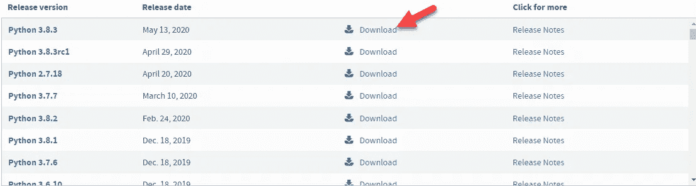

Python 页面下载不同版本的 Python

一旦你下载了 python-3.8.3.exe 文件，然后打开程序。安装程序可能无法正常运行，因为您的电脑可能缺少让 Python 正常工作的 JDK 环境。该网站会将你重定向到[甲骨文网站](https://www.oracle.com/java/technologies/javase-jdk13-downloads.html)，在那里你可能需要创建一个甲骨文账户(这是免费的)来下载。

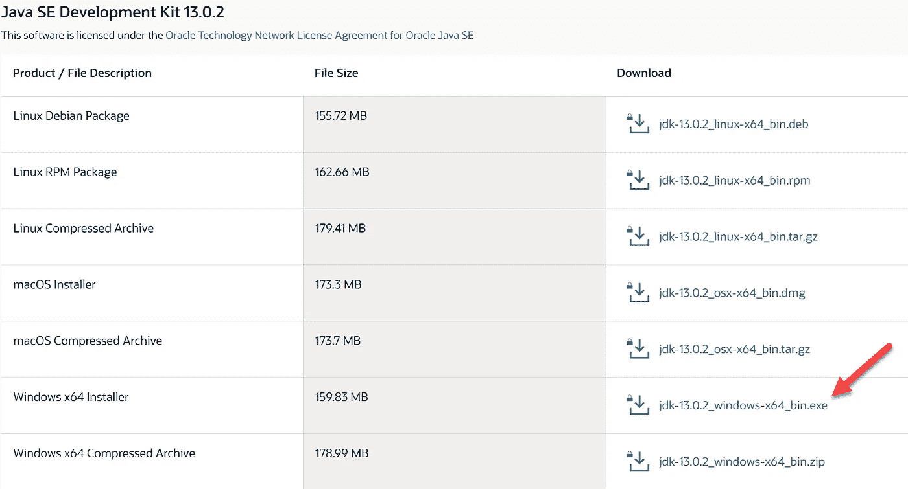

下载 JDK 软件包的 Oracle 页面

现在让我们回到 python-3.8.3.exe 文件并运行安装程序。您应该会看到安装 UI。如果您想将 Python 添加到您的路径环境中(用于命令提示符)，请选中下面的框。然后点击**“立即安装”**如果您忘记了勾选这个复选框，并且您想将 Python 添加到您的 PATH 环境中，那么我将在本文的后面向您展示如何手动完成这项工作。

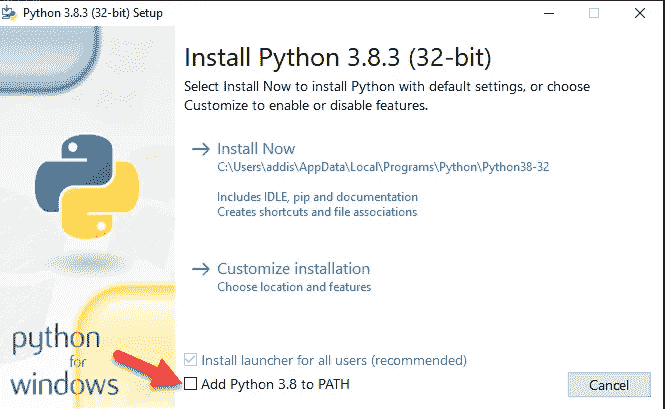

Python 安装程序简介

现在，它将在您的计算机上安装运行 Python 所需的所有文件。等待此操作完成。

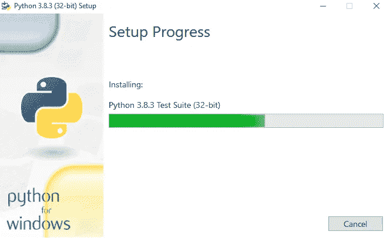

Python 安装正在进行

一旦安装成功，您应该看到确认，然后点击关闭。

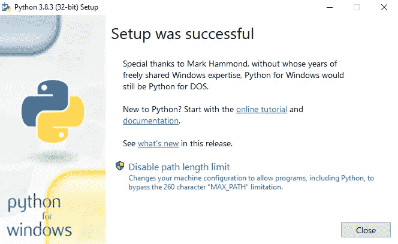

Python 安装完成

# 如何手动将 Python 添加到路径环境:

在安装过程中，您可能会意外跳过将 Python 添加到路径环境的选项。但是后来，您意识到您希望能够在命令提示符下运行 Python。你可能会问自己，这有什么关系？嗯，这是假设您正在使用命令提示符运行 Python。您可以手动复制 Python 的确切目录路径，以便在命令提示符下运行它，或者您可以将它添加到 path 环境中，这样您就可以在命令提示符下键入 **"Python"** 。我会一步一步地告诉你需要做什么。

进入开始菜单，输入**“编辑系统环境变量”，**，然后运行它。

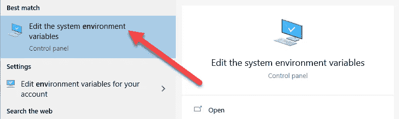

您应该会在系统属性中看到一个弹出窗口。点击**“环境变量”**

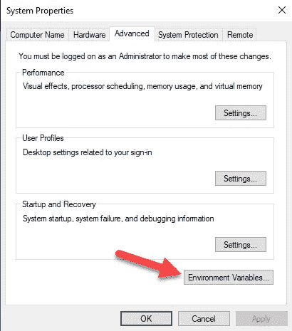

从这里开始，只注意最上面的部分，那里写着，**“User 变量 for (User)。”**从那里，点击名为**“路径”的变量，**它应该被高亮显示，然后点击**“编辑…”**

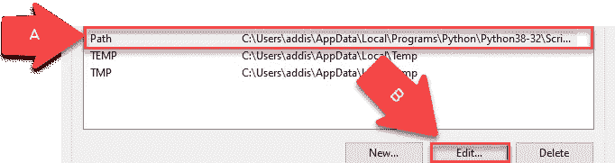

最后，您将希望基于 Python 程序的当前位置(通常在 C:驱动器中)添加两个新路径。一般来说，Python 的位置是**" \ Users \[您的用户名]\ AppData \ Local \ Programs \ Python \ Python 38–32 \ "**您还将包括位于 Python 目录中的脚本文件夹。看下面的截图，你应该如何写目录路径。我建议你先从电脑上查一下。完成后，单击“确定”

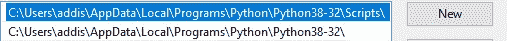

进入**“开始菜单”**，输入**“命令提示符”**，然后运行。

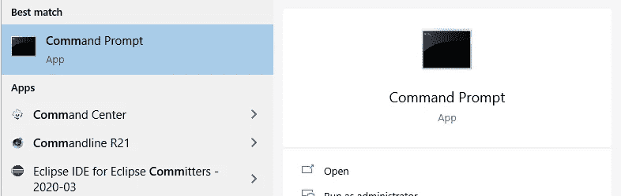

为了测试你所有的努力是否奏效，输入**“python”，**，你应该看到它执行了。恭喜你，你做到了！

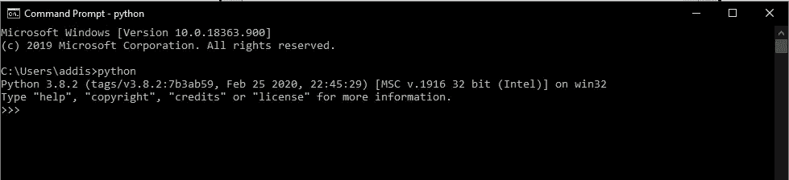

# 如何使用“PIP 安装”安装模块:

如果您决定将 Python 添加到 Windows Path 环境中，那么通过命令提示符安装 Python 模块包将非常简单。转到命令提示符并键入下面的语句。浏览一下 [Python 模块](https://docs.python.org/3/py-modindex.html)的列表，找出哪个包还没有包含在 Python 中，然后下载你需要的那些包。

如果您将 Python 添加到了 PATH 环境中，请尝试以下方法。

```
pip install (package name)
```

如果您想手动执行此操作，请尝试以下方法。

```
C:\Users\(Username)\AppData\Local\Programs\Python\Python38–32\Scripts
```

请确保更新您计算机上的 pip，以便您是最新的。

```
python -m pip install --upgrade pip
```

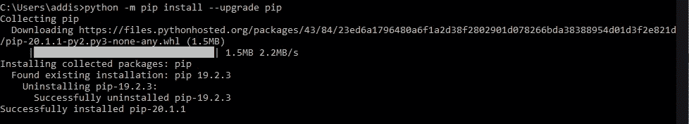

下面是一个示例，说明如何从命令提示符下使用 PIP install 下载模块，如**“请求模块”**。

```
pip install requests
```

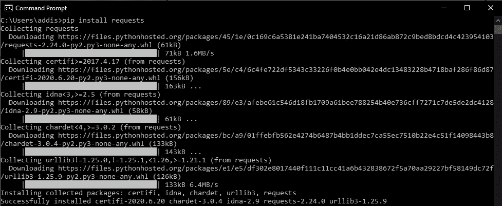

一旦安装成功，现在就可以在 Python 环境中使用这个模块了。

# 如何在 Python Shell 解释器上运行 Python(Windows 10):

成功安装 Python 后，您可以按照下面的步骤运行解释器。

进入开始菜单，找到 Python 3.8，点击下拉菜单，然后点击**“空闲(Python 3.8 32 位)”**

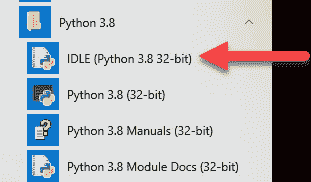

在这里，您应该看到 Python shell 解释器，您将在这里运行您的代码。要开始编码，进入“文件”，然后点击**“新文件”**Python 解释器将打开一个空文件，您可以在这里开始编写 Python 代码。

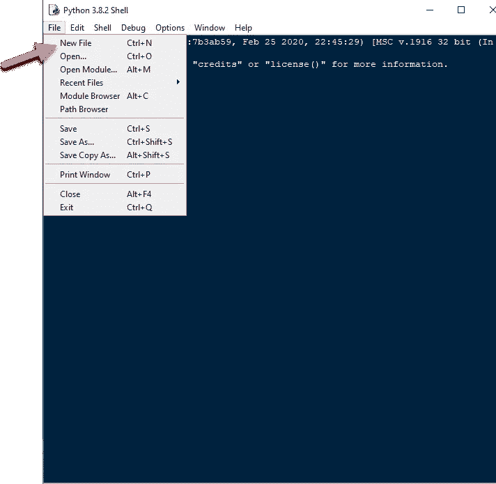

让我们从 Python 解释器开始创建我们的第一个 Python 文件！

我将编写一个简单的代码，要求用户输入一只猫的名字，然后我的代码将输出一个打印语句和名字的长度。确保保存文件(默认情况下，它将另存为。py 扩展名)。让我们把这个文件命名为**“你好猫”**

```
print('What is your cat name?')

catName = input()
print(catName + ' ' + 'is a purrfect name!')
print('The name length of' + ' ' + catName + ' ' + 'is about' + ' ' + str(len(catName)) + '!')
```

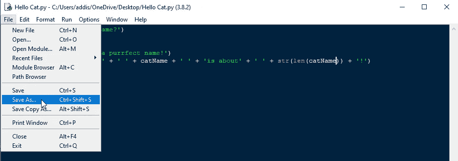

始终保存您的 Python 文件

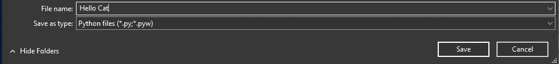

将 Python 文件命名为 Hello Cat，并保存到我的计算机中。

一旦您将文件保存到您的 PC 上，让我们运行该模块，看看会出现什么。

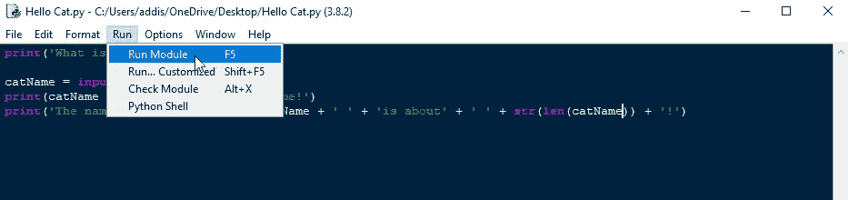

下面是运行代码的方法

您应该会在 Python Shell 窗口中看到代码的输出。在这里，您需要输入一个名称。然后代码将输出打印语句。

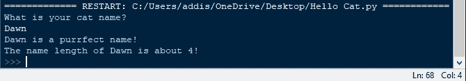

最终输出

# 如何在命令提示符下运行 Python:

如果您更喜欢在命令提示符下运行 Python (py)文件，请遵循以下步骤

打开命令提示符，确保您拥有 Python 文件的准确目录路径位置。为此，您需要了解一些命令提示符术语，例如 [cd、](https://www.digitalcitizen.life/command-prompt-how-use-basic-commands)，这意味着我们正在切换到桌面目录。我们让命令提示符知道我们现在在哪里获取 Python 文件。就我而言，我的桌面上有这个文件。

```
cd C:\Users\addis\OneDrive\Desktop
```

现在，我们可以在命令提示符下运行我们的 Python 文件，并像从 Python Shell 解释器中一样获得准确的输出。

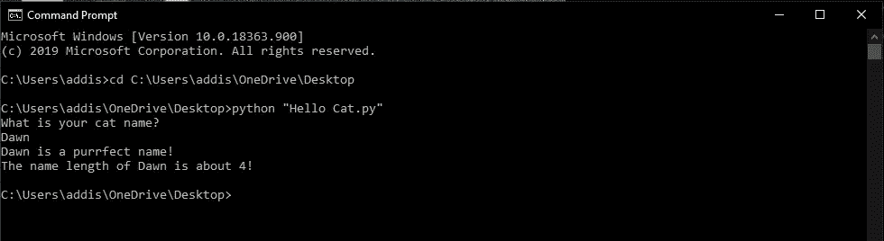

# 总体而言:

我希望这能帮助开始学习如何在 Python 上编码的人，或者以前从未编码但想从某个地方开始的人。这是一个很好的起点！希望我关于如何设置 Python 的经验能帮助到你！

附:这是我的猫的照片:

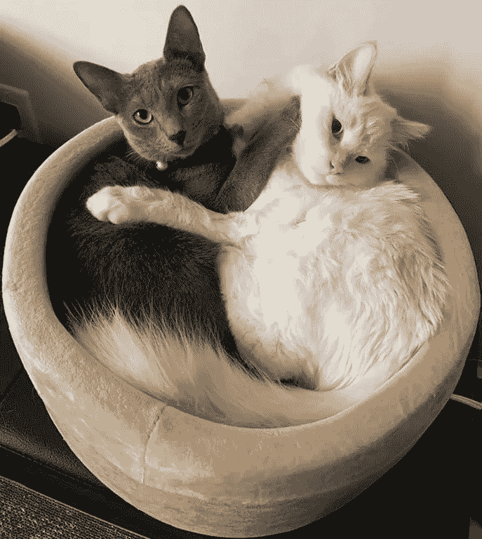

黎明在右边，黑脸田鸡在左边

谢谢你花时间看我的文章。希望这对有兴趣学习编码的人有所帮助。我主要致力于成为一名更好的程序员，在空闲时间，我只是为了乐趣而编码。我很想收到你们所有人的来信！你可以在 [Linkedin](https://www.linkedin.com/in/addison-chen/) 上和我联系。