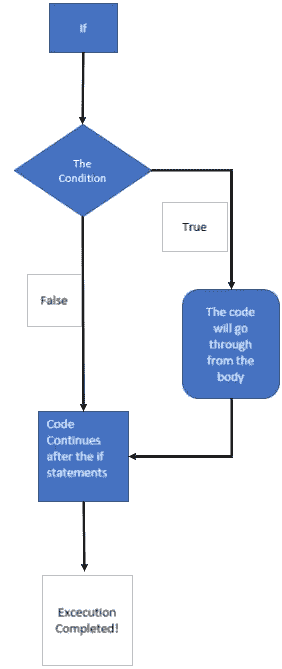
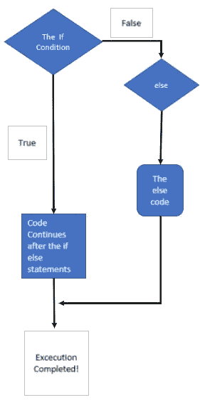
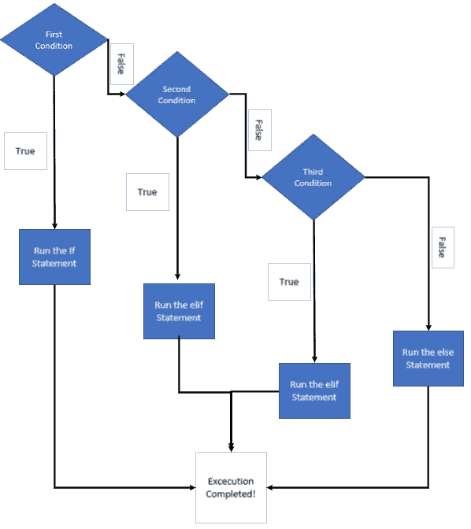
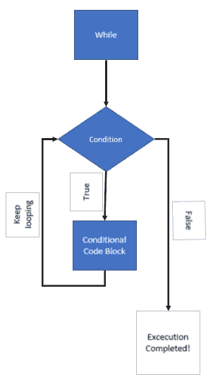
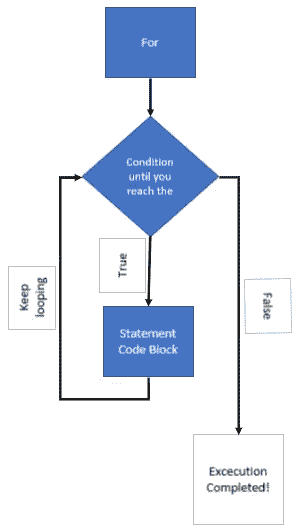

# Python 初学者:如何使用条件语句

> 原文：<https://blog.devgenius.io/python-for-beginners-how-to-use-conditional-statements-510abdb83412?source=collection_archive---------17----------------------->

Lukas 摄:[https://www . pexels . com/photo/开机的笔记本电脑-574073/](https://www.pexels.com/photo/turned-on-laptop-computer-574073/)

当我们第一次开始学习如何编码时，我们中的一些人可能认为这将是惊人的，我们可能有一天会成为一名黑客！但在此之前，我们需要掌握通过使用条件语句来控制计算机在想什么的方法！今天，我想深入研究条件语句，并讨论如何在 Python 编程中利用逻辑语句。

## 什么是条件语句？

从我记事起，计算机就被设计成使我们的生活更容易。但要做到这一点，我们需要开发详细的指令，以便计算机能够理解我们希望它接下来做什么。要做到这一点，我们需要知道条件语句是如何工作的，以及哪些语句最适合根据您构建的代码来使用。

## 条件语句的类型

*   如果语句
*   嵌套 if 语句
*   否则
*   嵌套的 if Else 语句
*   否则如果
*   While 循环
*   For 循环

## 使用关系运算符的逻辑条件

*   小于:<
*   Less than or equal to: <=
*   Greater than: >
*   大于或等于:> =
*   等于:= =
*   不等于:！=

## If &嵌套 If 语句

if 语句是经典的控制流语句，可能是在学习如何打印“Hello World！”之前，您将在计算机科学导论课上学习的第二件事。if 语句依赖于布尔值 true 或 false，其中如果值是预期的，则继续代码流。否则，如果为 false，将在 if 语句后继续。

简单的 If 条件语句图

嵌套的 if 语句应该用于在一个条件和另一个条件为真之后，您可能希望检查多个条件的特定情况。这确保了当多个条件返回 true 时，您可以选择所有的值。有些情况下，您必须基于多个条件选择多个值。

## If Else &嵌套的 If Else 语句

if else 语句是决策制定中最常用的逻辑流程之一。我在学校、个人项目和工作中的几乎每一份申请中都见过它。如果 else 语句用于执行一个条件来检查 true 和 false，那么它将指定执行哪个代码块。这通常用于错误处理，如果条件为 false，则在运行代码时会返回一个错误处理字符串。

简单的 If Else 语句图

嵌套 if-else 语句是指使用多个 if else 语句为应用程序提供更好的决策逻辑。您可能已经注意到 if else 语句是多么有用。但是，如果您需要检查更多的条件，即使一个条件已经为真，那么嵌套的 if else 语句就是您要找的！

## Elif 语句

Elif 语句是 Python 特有的，它也代表 else if 语句。elif 语句允许您检查表达式语句，如果条件为假，则代码将检查下一个 elif 语句的条件，然后从那里继续。如果第一个语句表达式为真，那么代码将继续执行。如果所有条件都为假，else 语句将开始执行，通常用于错误处理。

简单中频 Elif 环路图

## While 循环

Python 中的 while 循环用于反复迭代，只要条件为真。这通常在需要一定次数的运行而无法确定数量时使用，因此 while 循环是这些情况下的完美条件语句。

简单 While 循环图

## For 循环

for 循环用于迭代特定序列，例如列表、字符串或集合。它用于以已知的次数重复特定的代码块。

简单 For 循环图

## 结论

每个条件语句都有一个目的，并取决于基于每个条件路线所需逻辑的开发人员。我希望这是有帮助的，你可以利用这一点，特别是对于第一次学习 Python 或一般编程语言的人。