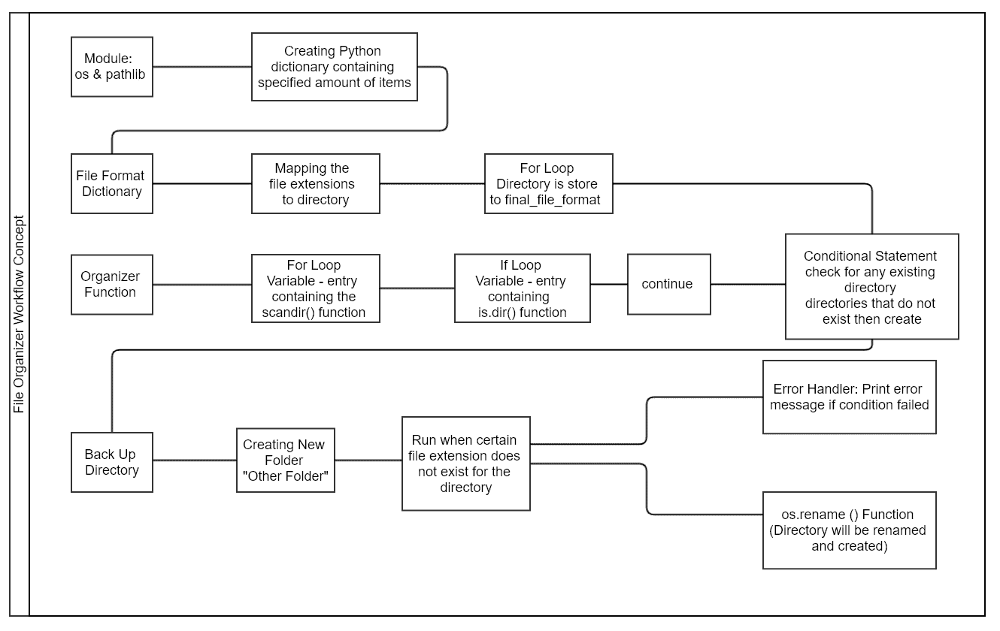
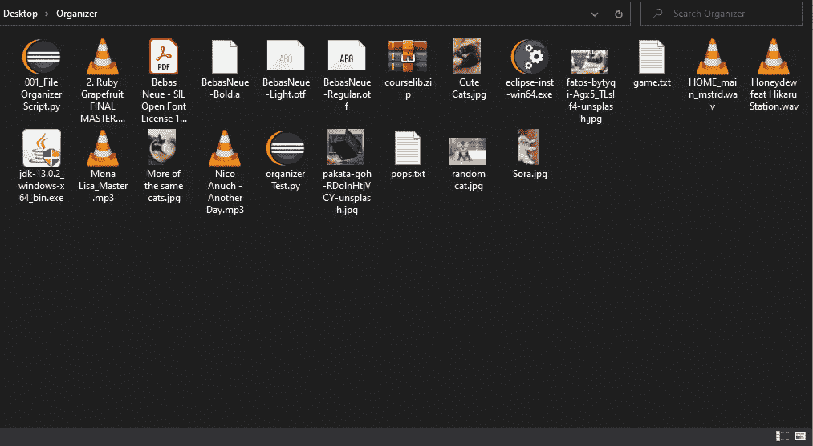

# Python 初学者:如何编写一个简单的文件管理器代码

> 原文：<https://blog.devgenius.io/python-for-beginners-how-to-write-a-simple-file-organizer-code-fd6a12eb4b3d?source=collection_archive---------5----------------------->


Artem Sapegin 在 Unsplash 上拍摄的照片

每个月，我们都倾向于下载你知道你永远不会再使用的猫照片或提高生产力的程序，以及那些在你第一次安装新电脑后忘记删除的随机一次性安装程序。尽管如此，我们都知道它最终只是停留在你的桌面上，收集“字节”(明白吗？我搞笑)好几年了。我承认，在整理我的 PC 或 Macbook 上的文件时，我会非常懒惰，直到用完存储空间，我才会回头。今年，我决定学习使用 Python 编写一个简单的脚本来组织我的文件。

文件管理器的目标是根据文件扩展名排列 PC 上的所有随机文件，它将创建通用名称文件夹，然后代码将文件拖到相应的文件夹中。代码将作为脚本运行。这样，当您运行它时，它将立即执行。在整篇文章中，我将讨论工作流和代码结构。

# 您首先需要了解的基础知识:

我将链接一些资源，这样你可以用它们来学习下面所有的基础知识！

*   理解文件[目录](https://www.geeksforgeeks.org/structures-of-directory-in-operating-system/)的概念和基本原理。
*   研究一下各种操作系统接口( [OS](https://docs.python.org/3/library/os.html) )和面向对象的文件系统路径( [pathlib](https://docs.python.org/3/library/pathlib.html) )导入模块。
*   研究 Python 中不同的[文件目录函数](https://www.programiz.com/python-programming/directory)。
*   学习并理解 [Python 字典](https://www.programiz.com/python-programming/dictionary)的概念。
*   学习并练习使用 [for 循环](https://www.w3schools.com/python/python_for_loops.asp)和 [if 循环](https://www.w3schools.com/python/python_conditions.asp)(一般为条件语句)。
*   学习在 Python 中创建和声明一个[函数](https://www.w3schools.com/python/python_functions.asp)。
*   不是必需的，但是在你的代码中使用[错误处理异常](https://docs.python.org/3/tutorial/errors.html)是一个好习惯。

# 整体工作流程:

我开发了一个代码逻辑的快速工作流，演示了从哪里开始，以及在编写脚本时我的期望是什么。编写代码可能比你想象的要花更长的时间，并且可能会让你迷失方向。作为一个可视化的学习者，画出工作流，帮助我组织我的思想，提高编写成功代码的效率。



文件管理器工作流

# 代码结构的运行:

```
import osfrom pathlib import Path
```

经过一些研究，我知道我需要使用操作系统模块来操作文件目录。我还需要 pathlib 模块来访问**“path()”**函数，这将允许我管理目录的路径。

```
listOfDirectories = { “Picture_Folder”: [“.jpeg”, “.jpg”, “.gif”, “.png”], “Video_Folder”: [“.wmv”, “.mov”, “.mp4”,“.mpg”, “.mpeg”, “.mkv”], “Zip_Folder”: [“.iso”, “.tar”, “.gz”, “.rz”, “.7z”,”.dmg”,      “.rar”, “.zip”], “Music_Folder”: [“.mp3”, “.msv”,“.wav”, “.wma”], “PDF_Folder”: [“.pdf”],}
```

我们需要用 Python 创建一个包含文件夹名和文件扩展名的字典。把字典想象成一盒巧克力，里面有不同种类的巧克力，但是巧克力里面都是不同的口味。我们可以说巧克力是关键，各种馅料是价值。


杰西卡·约翰斯顿在 Unsplash 上拍摄的照片

下面是一个快速的工作流程，解释了我是如何使用 Python 字典的。这个函数的美妙之处在于，你可以在声明键的时候输出值。您可以在这里添加更多您认为需要的键(文件夹名)和值(文件扩展名)。


Python 字典工作流

```
File_Format_Dictionary = { final_file_format: directory for directory, file_format_stored in listOfDirectories.items() for final_file_format in file_format_stored}
```

这是 Python 字典的另一个用例。变量名**“文件格式字典”**包含一项，其中**“最终文件格式”**是包含名为**目录的值的关键字**for 循环将文件扩展名列表与目录进行映射。现在我们有了包含文件扩展名长列表的变量。我们将继续创建代码的逻辑。

```
def organizer(): for entry in os.scandir(): if entry.is_dir(): continue file_path = Path(entry) final_file_format = file_path.suffix.lower() if final_file_format in File_Format_Dictionary: directory_path = Path(File_Format_Dictionary[final_file_format]) os.makedirs(directory_path, exist_ok=True) os.rename(file_path, directory_path.joinpath(file_path))
```

现在我们正在定义一个名为**“组织者”的函数。**管理器功能将开始组织您的文件，并创建当前位置不存在的目录。只要你理解基本的目录函数，比如 **"scandr()，"** **"is_dir，"** **"makedirs "，**和 **"rename "，这个工作流程的逻辑就非常简单了。****“scandr()”**函数将扫描当前目录，**“makedirs”**将创建一个新的文件目录，“重命名”将重命名文件。它继续根据目录列表组织文件和重命名文件夹。

```
try: os.mkdir(“Other_Folder”)except ValueError: print(“Failed to create new directory”)
```

您可能想知道我没有添加到第一个字典中的文件扩展名发生了什么变化？这就是为什么我们将创建另一个目录，我忘记添加的任何扩展都将转到我正在创建的备份目录。

```
for dir in os.scandir(): try: if dir.is_dir(): os.rmdir(dir) else: os.rename(os.getcwd() + ‘/’ + str(Path(dir)), os.getcwd() + ‘/Other_Folder/’ + str(Path(dir))) except ValueError:
                 print(“Failed to create new directory called Other Folder. File directory may already exist”)
```

我们将需要调用变量名 **"dir"** 来扫描目录，然后条件语句将检查目录是否存在。如果有文件扩展名与目录列表不匹配，那么它将创建另一个名为**“其他 _ 文件夹”的文件夹**

```
if __name__ == “__main__”:organizer()
```

现在为了确保脚本运行，您需要在最后调用 organizer 函数。

# 最终结果:



在我运行脚本之前


之后，我运行了脚本。

# 总体思路:

在我看来，画出工作流程确实提高了我的效率，帮助我更好地理解从第一步到第二步我需要做什么。我所面临的挑战是弄清楚我需要使用哪个“OS”或“Path”函数来让代码做我想要做的事情。我知道你至少需要花两个小时来研究和查看语法和结构。

谢谢你花时间看我的文章。希望这对有兴趣学习编码的人有所帮助。我主要致力于成为一名更好的程序员，在空闲时间，我只是为了乐趣而编码。我很想收到你们所有人的来信！你可以在 [Linkedin](https://www.linkedin.com/in/addison-chen/) 上和我联系。