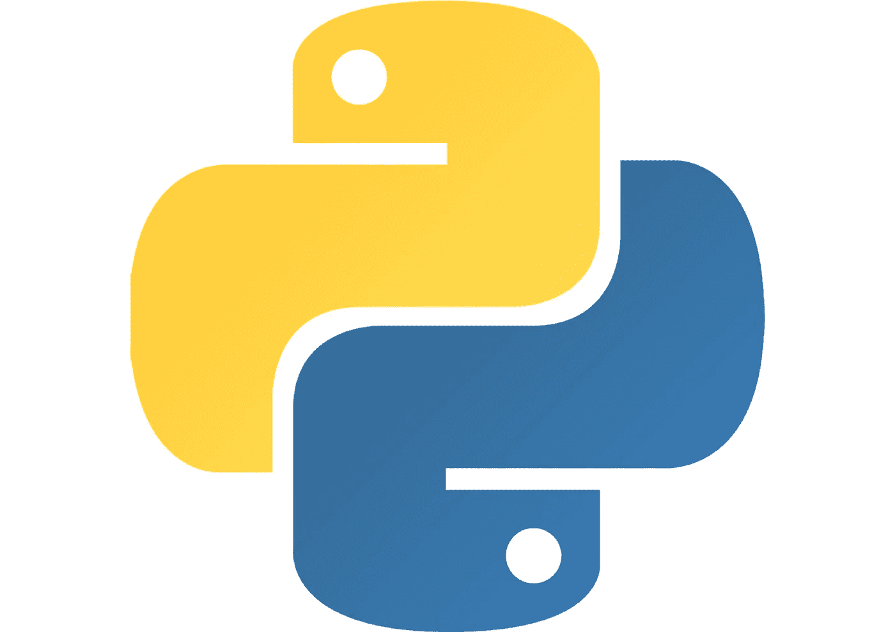
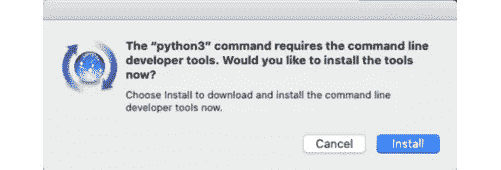
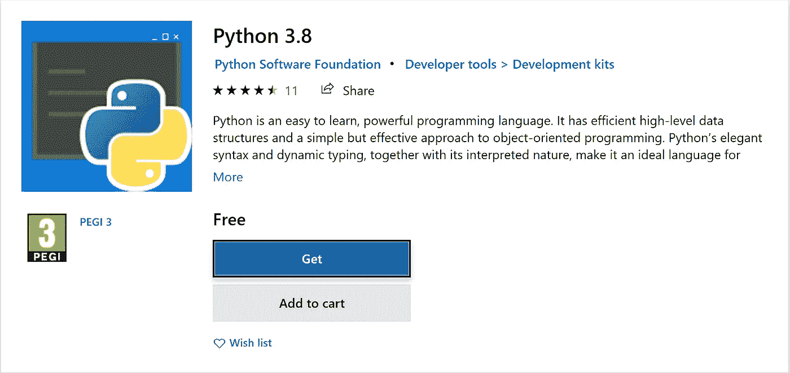

# Python，面向有经验的程序员

> 原文：<https://blog.devgenius.io/python-for-experienced-programmers-a2ee334ce62f?source=collection_archive---------1----------------------->

开始使用 Python 所需要知道的一切



蟒蛇标志由[弗罗伊](https://en.wikipedia.org/wiki/File:Python-logo-notext.svg)

在本教程中，我将全面概述 Python 编程。目的是通过提供足够的信息让有经验的程序员尽快熟悉*的工作。*

如果您已经安装了 Python，请随意跳到“Python 基础知识”一节。

# 安装 Python

Python 的最新主要版本是 Python 3。python 2[不再支持](https://www.python.org/doc/sunset-python-2/)，即使它预装在一些操作系统上，你也不应该使用它。

## Linux 操作系统

几乎所有的 Linux 发行版都预装了 Python。请确保您使用的是 Python 3。有些发行版同时带有 Python 2 和 Python 3，你可能需要输入`python3`来使用那个版本。

## 马科斯

从 Catalina 开始，Python 成为 macOS 开发工具的一部分，这是我推荐的快速安装方式。如果您还没有安装开发工具，请键入:

```
python3 --version
```

这将打印您已安装的 Python 版本，或者邀请您安装开发人员工具:



Python 3 安装对话框

这将把 Python 3 安装到`/Applications/Xcode.app/Contents/Developer/Library/Frameworks`中。

除了本教程的范围之外，还有许多其他方法可以得到一个工作的 Python，但是如果你想更深入，请看这里的。

## Windows 操作系统

在 Windows 上安装 Python 甚至更容易，因为它现在可以在 Windows 商店上获得。



这会将 Python 安装到`c:\Users\<yourname>\AppData\Local\Microsoft\WindowsApps`中，您可以将它添加到您的 Windows PATH 环境变量中。或者，可以在开始菜单中找到 Python 的快捷方式。

## 移动设备

Python 也可以在大多数移动设备上使用。在 iOS 上我强烈推荐 [Pythonista](http://omz-software.com/pythonista/) 。在 Android 上 [PyDroid 3](https://play.google.com/store/apps/details?id=ru.iiec.pydroid3) 值得调查。

## 网

不想装什么？好吧…用 [repl.it](https://repl.it/languages/python3) 在你的浏览器中运行 Python。

# Python 基础

## 你好世界

先说经典的《Hello World》节目。我们将通过打开一个交互式 python 解释器来做到这一点。我假设您的 Python 命令名为`python3`，那么我们的步骤将如下所示:

```
**$** python3
Python 3.7.3 (default, Apr 24 2020, 18:51:23)
[Clang 11.0.3 (clang-1103.0.32.62)] on darwin
Type "help", "copyright", "credits" or "license" for more information.
>>> print("Hello World")
Hello World
```

这里发生了很多事情，所以让我们来分析一下。

```
$ python3
```

`$`是你的 shell 提示。根据你的平台不同，这可能是`C:\>`或者别的什么。

`python3`是调用交互式 python 解释器的命令。

`>>>`是 Python 的主要提示。当按下回车键*时，这里输入的任何内容都将被解释器评估，除非*输入的语句是代码块的开始(见下文)。

`print("Hello World")`是我们实际打印“Hello World”的 Python 代码。这将调用内置函数`print()`，并将`"Hello World"`作为参数传递。

当我们按回车键时，文本`Hello World`被返回。

## 使用解释器

Python 的主要优势之一是它能够动态操作，并在运行时检查或修改程序的许多方面。这与编译语言不同，在编译语言中，在程序编译后，对可以改变或自省的内容通常有限制。

例如，如果我们键入:

```
>>> help(print)
```

我们将获得`print`功能的帮助(或[文档字符串](https://www.python.org/dev/peps/pep-0257/))。

我们还可以使用`type()`函数在运行时找出*类型*信息。

```
>>> type(print)
<class 'builtin_function_or_method'>
```

这告诉我们`print`是类`builtin_function_or_method`的一个实例。我们可以通过以下内容来证实这一点:

```
>>> help(type(print))
```

尝试使用`help`和`type`是学习 Python 如何工作的好方法。

## 运行脚本

在解释器中直接输入命令对于实验是有用的，但是这不是运行生产代码的通常方式。相反，我们将代码保存到一个文本文件中，并将文件路径作为参数传递给解释器。

让我们创建一个名为`hello.py`的文件，并将我们的语句`print("Hello World")`添加到文件的顶部。

现在保存文件并使用以下命令运行脚本:

```
$ python3 hello.py
```

这将在控制台上打印“Hello World”。

# Python 语言

## 评论

在 Python 中,`#`符号用于表示注释:

```
# This is a Python comment
```

从现在开始，注释将用于注释代码片段。

**数字类型**

主要的数字类型是`int`和`float`，前者可以保存任意长度的有符号整数，后者通常使用 C [IEEE 754 64 位](https://floating-point-gui.de/formats/fp/)T2 在内部实现。

例如，在 Python 中，我们可以写:

```
>>> x = pow(2, 255)   # generate a 256-bit int and assign to x
>>> x.bit_length()    # display number of bits needed to represent x
256
```

这不同于 C 风格的语言，在 C 风格的语言中，整数类型具有固定的大小(32 位无符号、64 位等)。

**罗列了**

Python 列表是可变序列。

```
>>> x = [1, 2, 3, 4]   # create a list and assign to x
>>> y = x[0]           # retrieve the zeroth element and assign to y
>>> x[1] = y           # lists are mutable so we can modify elements
>>> x                  # show the current value of x
[1, 1, 3, 4]
```

列表有一些有用的内置操作，例如:

```
z = x + [y]            # concatenate two lists and assign to z
del x[0]               # delete the zeroth element in x
len(x)                 # return the number of elements in x
x.sort()               # sort the elements in x
```

列表可以包含任何类型的项目，甚至是多种类型的组合:

```
x = [[1, 2], [1, 1]]  # list of lists
x = [2.1, [1, 1]]     # list containing a float and a list
```

**琴弦**

另一方面，字符串是不可变的。

```
"Foo"             # double quoted string
'Foo'             # single quoted string (equivalent)
"Hello 'Foo'"     # nested quotes, no need to escape
"""               # triple quotes for multi-line string
Multi-line
"""
a = 'Foo'         # assign 'Foo' to variable a
a[1] = 'f'        # a is immutable, will throw a TypeError exception
```

**元组和范围**

元组和范围也是不可变的序列类型。

```
x = (1, 2, 3, 4)   # a tuple is an immutable list
x[1] = 3           # this will throw a TypeError exception
y = list(x)        # create a new list from a tuple
x = range(10)      # create a range from 0 to 10
y = x[5]           # assign the 5th element in the range to y
```

**切片**

字符串、列表、元组和范围都是 Python *序列*的例子。它们的一个共同点是可以用 Python 的*切片*操作符来访问。切片具有以下语法:

```
sequence[*start*:*stop*:*step*]
```

`start`是切片的起始索引，`stop`是结束索引，`step`是步长。也可以使用负索引，因此`-1`的`stop`将是`N-1th`元素，其中`N`是元素的数量。默认分别为`0`、`N`和`1`。

```
x = 'Hello World'       # assign the string Hello World to x
y = x[:5]               # slice from the zeroth to 5th element
y                       # y is now 'Hello'
y = x[4:-3]             # y is now 'o Wo'
y = x[::-1]             # -1 steps backwards, y is now 'dlroW olleH'
```

**字典**

Python 字典是可变的数据结构，提供了键/值对的映射。字典是用花括号语法定义的。

```
a = {'a':1, 'b':2}     # define a dictionary with keys 'a' and 'b'
b = a['a']             # retrieves the value at key 'a'
a['a'] = 3             # assigns a new value to the key at 'a'
dict([['a', 1], ['b', 2]]) # create a dictionary from list of lists
```

[从 Python 3.7 开始](https://mail.python.org/pipermail/python-dev/2017-December/151283.html)Python 中的字典保证是插入排序的。

## 代码块

在“C 风格”语言中，代码块用花括号`{...}`表示。在 Python 中，我们使用冒号来引入一个代码块，该代码块中的所有代码都必须缩进至少一个空白字符。

**条件执行**

像大多数语言一样，Python 使用`if` / `else`结构进行条件分支。这里我们使用 Python 布尔类型进行分支，它可以有值`True`或`False`。

```
if True:               # valid code block, code indented by 4 spaces
    print("Here")
else:
    pass               # pass statement does nothing
if True:
   print("Here")       # error: inconsistent indentation in block
```

**循环**

此外，与许多语言类似，Python 支持“for”循环。然而，以下习语*不受*支持:

```
for (int i = 0; i < 10; ++i) {   // do something }
```

这可以用一个范围迭代器来代替:

```
for i in range(10):
    # do something
```

如果我们想要迭代一个序列的元素，同时维护一个索引计数，我们可以使用`enumerate()`函数:

```
for i,v in enumerate((1,2,3,4,5)): # enumerate elements in tuple
    if i % 2 == 0:                 # continue loop for even indexes
       continueprint(v)                       # otherwise print the value
```

在 Python 中，如果一个类型(例如一个范围)可以被迭代，它被称为*可迭代*。

**功能**

`def`关键字在 Python 中用于开始函数定义。然后，它必须后跟一个函数名和零个或多个括号中的参数名。

与 C 风格语言不同，我们不需要声明函数参数的类型，也不需要声明返回类型。

```
def add(x, y):         # define a function that takes two arguments
    return x + yadd('Hello', 'World')  # returns 'HelloWorld'
add([1, 2], [3, 4])    # returns [1, 2, 3, 4]
add(1, 2)              # returns 3
```

**异常情况**

像许多现代语言一样，Python 支持异常。

要引发异常，我们可以写:

```
raise Exception("Error message")
```

这将导致以下内容打印到控制台:

```
Traceback (most recent call last):
File "<stdin>", line 1, in <module>
Exception: Error message
```

为了处理异常，我们使用了一个`try` / `except`组合:

```
try:                                      # try block
    raise Exception("Error message")      # raise an exception
except Exception as e:                    # catch the exception
    print(e)                              # print the exception
```

这将打印“错误信息”。

通常例外会比`Exception`更具体。更多详情见[此处](https://docs.python.org/3/tutorial/errors.html)。

## 对象和类

Python 中的一切都是对象。

例如，如果我们使用前面介绍的`type()`函数，我们可以看到:

```
>>> type('hello')
<class 'str'>
```

所以`hello`是一个`str`类的实例。我们可以使用内置的`dir()`函数来列出一个类的方法和属性:

```
>>> dir(str)
```

我们可以看到`str`有大量的方法。例如，我们可以通过调用它的`capitalise()`方法来大写一个字符串:

```
'hello'.capitalize()    # this will return the new string 'Hello'
```

**定义类别**

可以用`class`关键字定义新的类。

```
class A:               # define a class called A
    pass               # do nothinga = A()                # create an instance of A and assign to a
```

成员变量(或者 Python 中的*属性*)可以通过在`class`范围赋值来添加。

```
class A:
    x = 2              # create class attribute xy = A.x                # y is now 2
B = A                  # create a reference to A and assign to B
B.z = 3                # class attributes can be added dynamically
print(A.z)             # A.z is now 3
```

可以通过在`class`范围定义函数来添加方法。

```
class Counter:
    count = 0          # class attribute count
    def increment():   # define method to increment count
        count += 1

Counter.increment()    # call the method increment(), count is now 1
counter = Counter()    # create instance of Counter
counter.count          # class attribute... count is still 1
```

到目前为止，我们所有的变量和方法都在`class`范围内运行，但是这通常不是我们想要的。为了定义*实例属性*，我们向方法传递一个`self`参数。`self`对象是指*类实例*。

我们还将使用一个特殊的方法，`__init__`，当创建一个对象时会调用这个方法。类似于在其他语言中如何自动调用*构造函数*。

```
class Counter:
     def __init__(self):   # define __init__ method passing self
         self.count = 0    # set instance attribute count to 0
     def increment(self):  # define increment method passing self
         self.count += 1   # add 1 to instance attribute count

c1 = Counter()             # create Counter instance
c2 = Counter()             # create another instance
c1.increment()             # increment counter for c1
c1.count                   # count is 1
c2.count                   # count is 0
```

**继承**

与其他语言类似，Python 类通过将父类放在子类旁边来支持继承。

```
class Parent:               # define a parent class
     def test(self):        # define an instance method
         print("test")class Child(Parent):        # Child inherits from Parent
     passc = Child()                 # Create an instance of Child
c.test()                    # Call inherited test() method
```

# 模块和包

## Python 模块

大多数语言都允许将可重用的代码块打包，供其他代码使用。Python 通过模块支持这一点。

在 Python 中，模块只是一个导入到另一个 Python 文件中的 Python 文件。例如，如果我们创建一个名为`mymodule.py`的文件并添加一个测试函数:

```
def test():
    print("test")
```

现在创建另一个名为 main.py 的文件:

```
import mymodule          # import the module just createdmymodule.test()          # call the test function from mymodule
```

如果我们现在用`python3 main.py`运行`main.py`，它会在控制台上打印“测试”。我们也可以写:

```
from mymodule import test # only import the test functiontest()                    # call the test function from mymodule
```

## 内置模块

Python 附带了一个大型的内置模块库，称为 [Python 标准库](https://docs.python.org/3/library/)。一些常用的模块包括:

*   [数学](https://docs.python.org/3/library/math.html)为数学函数
*   [csv](https://docs.python.org/3/library/csv.html) 用于 csv 读写
*   系统相关功能的 [sys](https://docs.python.org/3/library/sys.html) 和 [os](https://docs.python.org/3/library/os.html)
*   [urllib](https://docs.python.org/3/library/urllib.html) 用于处理 URL

## 包装

Python 包是分发大块代码的一种方式。因此，一个包将包含 1 个或多个模块。

为了创建一个包，我们创建一个与我们的包同名的目录，并在目录中创建一个空的`__init__.py`文件。然后，我们在目录中添加我们想要包含的任何模块。结果应该是这样的:

```
mypackage
├── __init__.py
├── module1.py
└── module2.py
```

现在我们可以像这样使用这个包:

```
import mypackage              # import the package
mypackage.module1.func()      # call func from module1 in mypackagefrom mypackage import module2 # import module 2 from mypackage
module2.func()                # call func from module 2
```

有许多有用的 Python 包可用，从机器学习库到图像处理，再到 web 应用程序框架。其中许多可以从 [Python 包索引](https://pypi.org)中获得。

# 放在一起:读取一个 JSON 文件

在任何语言中，一个非常常见的任务是读取、编辑和写入文件。作为一个快速演示，我们将编辑一个 JSON 文件。

首先从[这里](https://gist.github.com/jamiebullock/eeeb4c902f298e6dd2d7b293f92305b4)下载我们的测试文件。现在，我们的剧本:

```
import json                       # import the json modulef = open('fake_fruit.json', 'w')  # use open() to open the file
data = json.load(f)               # call json.load() to load as json
```

`data`现在是包含 JSON 数据的 Python 字典，所以`print(data)`会给出:

```
{'Fruit': [{'Name': 'Banana', 'Colour': 'Yellow'}, {'Name': 'Apple', 'Colour': 'Green'}, {'Name': 'Orange', 'Colour': 'Orange'}]}
```

我们现在可以用以下命令修改和写回文件:

```
data['Fruit'][1]['Name'] = 'Wrong' # write 'Wrong' to 'Name' field
json.dump(data, f, indent=4)       # write JSON back to file
f.close()                          # close the file
```

如果你检查 JSON 文件，你会看到，'苹果'已被'错误'取代。

# 进一步阅读

本文的目的是让有经验的程序员进入 Python 的世界。同时，我们可以利用这里所解释的内容做很多事情，这里有一些链接供那些希望更进一步的人使用:

*   官方 Python 网站令人惊叹
*   [ipython](https://ipython.readthedocs.io/en/stable/) 是一个必不可少的 Python shell 来代替默认的
*   [Flask](https://flask.palletsprojects.com/en/1.1.x/) 是一个很棒的 Python web 框架
*   一本很棒的书是马克·卢茨和大卫·阿舍尔写的《学习 Python》