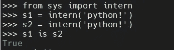
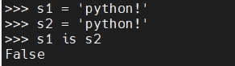

# Python 基础—内存池

> 原文：<https://blog.devgenius.io/python-fundamentals-memory-pool-839014e92b38?source=collection_archive---------6----------------------->

## Python 内存池简介


由于 Python 中的一切都是对象，所以 Python 的存储问题就是对象的存储问题。事实上，对于每个对象，Python 都会分配一块内存来存储它。

那么 python 是如何分配内存、管理内存、释放内存的呢？

概括起来有几个方面:引用计数，垃圾收集，内存池机制。在我以前的文章中，我已经谈到了 [Python 引用和垃圾收集](https://medium.com/geekculture/python-reference-e6458a9a0582)，在这篇文章中，让我们探索一下“内存池”。

# Python 内存池

在 Python 中，很多时候请求的内存是一小块内存。这些小块内存应用后，很快就会被释放。

在创建大量消耗小内存的对象时，频繁调用`new/malloc`会造成大量内存碎片，导致效率降低。

在实际应用中，我们确实在做这样的事情，尤其是小整数的使用，比如`1`、`2`、 `5`，这些`int`类型的数据，几乎每次使用 for 循环的时候都会用到。所以下面的情景经常发生:

1.  小整数使用频繁，销毁频繁
2.  频繁地创建对象和销毁对象会导致内存碎片

**内存池的概念是预先在内存中申请一定数量的大小相等的内存块，留作备用**。当有新的内存需求时，它会先从内存池中分配内存给这个需求，内存不够时再申请新的。

这样做最显著的好处就是可以减少内存碎片，提高效率。

# 小整数对象

如果没有特殊的机制，小整数的频繁创建和销毁会影响系统的性能。

所以 Python 提供了**对象池技术**。`int`类型数据是不可变的对象，这意味着它可以被共享。Python 启动后，会在内存中申请一块内存，在这里存放常用的小整数。

在整个程序运行期间，这些小整数总是存在的，不会被破坏，它们的使用只会增加它们的引用计数。

你可能会问，缓存了多少个整数？这个范围很小，[-5，257]。你可能不同意小整数的范围。但是每个人对常用的小整数都有自己的理解，所以，如果你希望扩大这个范围，你可以修改 python 源代码并重新编译，但是这非常费力。

我们可以验证这个小整数缓冲池确实存在于 python 交互式解释器中

```
>>> a = 256 
>>> b = 256 
>>> id(a) 
4511188896 
>>> id(b) 
4511188896 
>>> a = 257 
>>> b = 257 
>>> id(a) 
4515645744 
>>> id(b) 
4515645840
```

我们来观察两个变量`a`和`b`的内存地址。当它们都被分配 256 时，它们的存储器地址是相同的，而当它们都被分配 257 时，存储器地址是不同的。小整数缓冲池的范围正好是[-5，257]。

# 字符串驻留

对于字符串的使用，也存在内存问题。假设有 100 个变量，全部赋值为“`python`”，我们真的要在内存中创建 100 个 string 对象，它们的值完全一样吗！

显然我们不能这样做，这是对内存的浪费。为此，Python 提供了实习生机制。简单来说，Python 内部维护了一个字典(`interned`)。

当一个字符串需要驻留时，到`interned`检查该字符串是否已经存在。如果存在，增加字符串的引用计数。如果不存在，则增加字符串的引用计数。放进字典里。

使用派驻技术有以下两个好处:

*   节省内存
*   比较字符串时，常驻字符串比非常驻字符串快得多

**注意，驻留发生在编译时，不驻留在运行时**。让我们看看下面的例子:

```
s1 = 'py' + 'thon' 
print(s1 is 'python') a = 'py' 
b = 'thon' 
print(a+b is 'python')
```

输出是

```
True
False
```

`s1`的值在编辑阶段计算，因此驻留，而`a+b`仅在运行阶段计算，因此**没有驻留**发生。

默认情况下，空字符串和长度为`1`的字符串将存在。Python 认为这样的字符串是经常使用的字符串。

## 使用 sys.intern 指定居住地

您可以使用`sys.intern`来指定居住地，例如:



并且不使用`intern`:



## 乘以(*)得到的字符串

这部分是比较复杂的规则，我们先来看乘数为`1`的情况。

1.  如果字符串只包含下划线、数字、字母，则默认情况下驻留。
2.  如果字符串的长度小于或等于 1，则它驻留在

```
>>> s1 = 'uwesdfwe'
>>> s2 = s1*1
>>> s1 is s2
True
```

如果乘数大于或等于 2，规则如下:

1.  该字符串仅包含下划线、数字、字母，长度小于或等于 20，默认情况下驻留
2.  当包含其他字符时，无论长度如何，它都不会驻留

```
>>> s1 = 'pythonpythonpython' 
>>> s2 = 'python'*3 
>>> s1 is s2
True 
>>> s1 = '&&&' 
>>> s2 = '&'*3 
>>> s1 is s2 
False
```