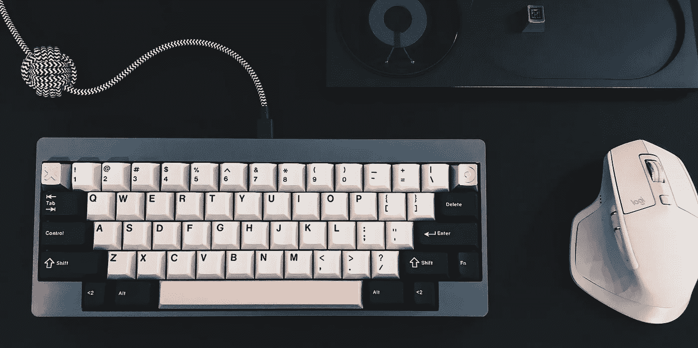
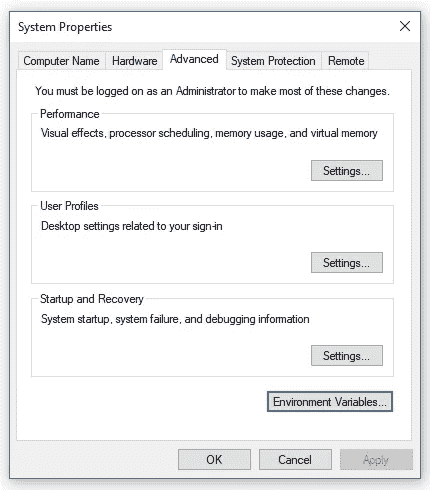
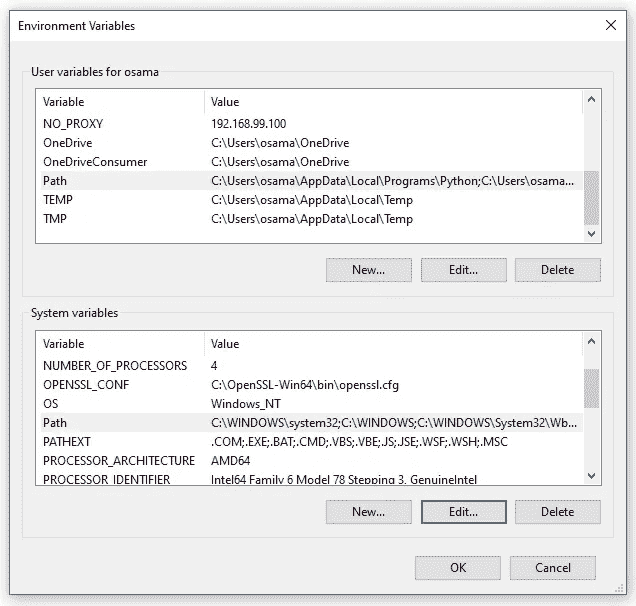
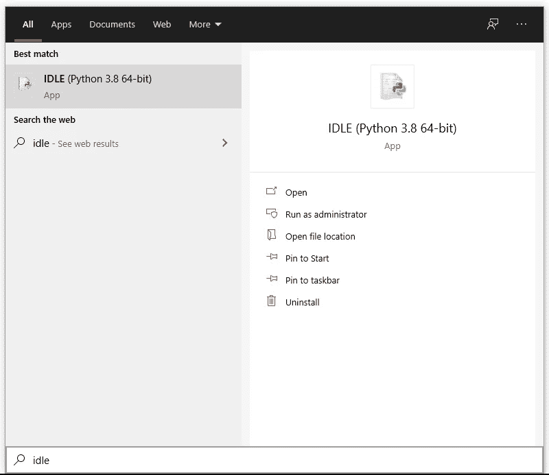

# Python:入门

> 原文：<https://blog.devgenius.io/python-getting-started-4df476fb2837?source=collection_archive---------24----------------------->



来源: [randomfrankp](https://www.youtube.com/user/randomfrankp)

# Python 到底是什么？

Python 是最流行的编程语言之一！

它是一种广泛使用的高级编程语言，由吉多·范·罗苏姆设计，于 1991 年首次发布。

## Python 有什么特别之处？

根据它的创造者的说法，Python 是一种:

> 高级编程语言，它的核心设计理念是关于代码可读性和语法，它允许程序员用几行代码表达概念

*   术语**‘高级’**指的是 Python 是一种动态类型的编程语言，提供自动内存管理并支持多种编程范式。
*   Python 语法的可读性相当容易，代码看起来太接近人类的思维方式了。如果你以前从未读过 python 的一行，你能推断甚至接触到下面的代码吗？

> 这么直观！但是现在不要离开去睡觉，还有很多有待发现！

## Python 相对较慢的原因:

如前所述，Python 的语法优势使其成为最容易理解的语言之一。

这抽象了计算机在引擎盖下所做工作的细节，从声明变量类型如 *str、int 或 bool、*到内存管理等等。

但是在大多数情况下，0.01 秒的差异对用户来说并不重要，甚至是不明显的；然而，如果你正在处理主要依赖于速度的东西，例如**游戏开发、竞争性编程等**，你应该考虑使用另一种编程语言，比如 **C++** 。

## 用 Python 可以做什么？

这可能是一个棘手的问题，因为 Python 是一种通用编程语言，这意味着你可以用它做任何事情。

但是 Python 最出名的应用是:

*   **数据科学:**包括机器学习、数据分析&可视化
*   **Web 开发:**使用 **Flask** 或 **Django** 框架
*   **脚本:**简单任务的自动化

但是如上所述，Python 可以做得更多！事实上，你可以用 Python 开发一个名为 PyGame 的游戏库；然而，这似乎并不是最受欢迎的选择。

# 我们来深入挖掘一下！

在了解 Python 及其能力之后，我认为这是开始使用它的最佳时机。

让我们把手弄脏吧！

## 安装 Python

Python 目前使用两个功能版本:

*   Python 3: 最新版本，正在积极开发中
*   **Python 2:** 旧版，不再接收安全更新。注意，许多项目是用 Python 2 编写的，但是迁移到 Python 3 变得越来越容易。

你可以在这里下载并安装 Python [的任何一个版本。](https://www.python.org/downloads/)

我推荐安装 Python 3，因为它是目前最新最流行的选择，我们将会使用它。

## 验证安装

为了验证 python 是否被正确安装，我们将在选择的终端中运行以下命令，如果你像我一样使用 Windows，我建议使用基于 Unix 的 shell，如 **Git Bash。**

`$ python --version`

如果您正确安装了 Python 3，您应该会看到如下内容:

```
$ python --version
Python 3.8.2
```

同样，如果您在 Windows 中，在运行这个命令之前，必须将 Python 添加到环境变量中，所以让我们仔细检查一下。

*   右键单击开始图标并选择**系统**
*   点击**系统信息**然后选择**高级系统设置**



*   在高级选项卡上，单击**环境变量…**
*   在**系统变量**下点击**路径**



*   点击**编辑…** ，然后选择**新建**，如果默认没有 Python 安装路径，则添加该路径
*   点击**应用**，然后点击**确定**使更改生效。

> **注意:**根据您的 Windows 版本，用于添加环境变量的图形用户界面可能略有不同。

## 你好世界！

现在让我们打开**闲置**；它附带了一个简单的 Python 编辑器。在 Windows 8+中，搜索 IDLE，然后打开它。



它将打开一个顶部有选项的外壳。

在 shell 中，有三个右尖括号的提示:

```
>>>
```

现在，在提示符下右键单击下面一行:

```
>>> print("Hello World!")
```

点击**进入**

```
>>> print("Hello World!")
Hello World!
```

瞧啊。您刚刚编写了第一个 Python 程序。

现在试着在提示`>>> 3 + 5`中写下这个表达式，然后点击**回车，**你看到了什么？

## 其他 Python 环境

在上一节中，我们在 IDLE 中运行了我们的第一个 python 行，这是 Python 的一个集成开发环境。

我们还可以在终端中使用下面的命令`$ python -i`启动一个交互式 Python shell，这也被称为 Python 解释器或 REPL(用于“读取评估打印循环”)。你可以出去试试你在提示中 IDLE 写的那一行。

在你使用完解释器后，你可以使用这个`>>> quit()`并点击**回车来关闭 python shell。**

我们注意到 python 解释器接受一行代码并立即输出结果；然而，当编写由许多行代码组成的大程序时，解释器并不是最佳选择。

对于长期存储，您可以将内容保存到。py 文件，并使用外部工具将其作为脚本或程序进行编辑或执行，例如 ide(如 **PyCharm** 或 **Spyder** )、文本编辑器(如 **VSCode** 等。然而，这里讨论的方法对于入门是足够的。

# 最后但并不是最不重要的

这是对 Python 的一个总体概述。是啊！我们写了第一行 Python 代码，但这绝不是 Python 教程。

是啊！我们安装了 Python 并使用了它强大的解释器，但是我们仍然需要学习 Python 本身，我们仍然需要挖掘得更深！

你对 Python 和它的语法越了解，你就会越喜欢它，❤️

> 保持安全，不断学习，永远享受 Python。