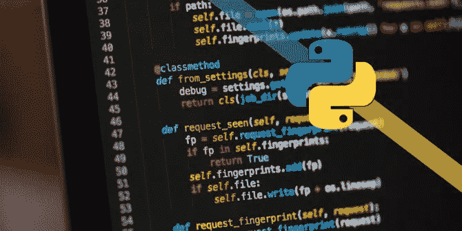

# Python 初学者指南

> 原文：<https://blog.devgenius.io/python-guide-for-beginners-247d9d663535?source=collection_archive---------14----------------------->

你想学习，但如果你不知道从哪里开始呢？在这里，我将通过如何毫不费力地学习 python 来支持你。

## 1-知道你想用 python 做什么

Python 可以用于任何事情。从学习到创建自己的游戏。但问题是，你为什么学习，你学习的目的是什么？ 问题解决后，就可以进行下一步了。

## 2-搜索在线或离线 python 课程

你已经到了第二步。现在是根据你的喜好、时间和预算来找课程的时候了。我选择在线课程是为了方便和自定进度的环境(我仍然参加有截止日期的在线课程)。更有甚者，它们是免费的，或者你付一定的钱。

## 3-继续朝着你的目标前进

这是最具挑战性的部分开始。忠于你的目标。而这个目的不应该只是为了赚钱。应该是你的生活方式。这就是伟大的程序员和优秀的程序员的区别。他们相互联系，他们只是将自己的生命奉献给这项事业，以创造比他们更伟大的东西。相信我，我走上了这条路，并且在一年内做了许多编程工作。

## 4-向知识渊博的人寻求帮助

***如果你问他们关于你不会做的练习的问题，大多数知识渊博的人都会在这里帮助你*** 。好的方面是。这是免费的，你只需要问他们。此外，有几个网站和在线社区专门用于提问和回答问题(这需要一点时间，有时他们可能不清楚)。

## 5-不断寻找机会

没有学历怎么办？一开始可能会伤害你，但是，如果你不断尝试，在各种网站上做项目和建立关系网；你有很好的机会发表你的项目并得到一份真正的工作。更重要的是，python 用户在就业市场上有很多机会，因为它在商业中有广泛的应用。

*您想为 python 初学者指南添加什么？在下面的评论区分享你的想法。*