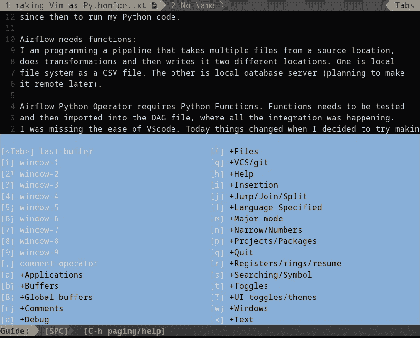

# 带有空间 VIM 的 Python IDE

> 原文：<https://blog.devgenius.io/python-ide-with-space-vim-607eaa8d31bd?source=collection_archive---------16----------------------->

# **背景:**

这是学习 t hat 的一个[分支，来自我运行 Manjaro Linux 的低端笔记本电脑。VScode 是一个功能丰富、友好的编辑器，擅长执行和备份代码到 Git。当使用 VScode 时，我的老式笔记本电脑开始随机死机。3 个月前才勉强卸载。从那以后，我就带着](https://medium.com/@kamaljp/why-i-decided-to-vim-ca87ddc9fbd6)[鼠标垫(linux 编辑器)、用于 JS 代码的](https://github.com/codebrainz/mousepad)终端和 Jupyter-notebook 来运行我的 Python 代码。

# 气流需求函数:

挑战在于对需要多个*的流水线进行编程。XLS 文件来自源位置，进行转换，然后写入两个不同的位置。一个是本地文件系统作为一个 CSV 文件。另一个是本地数据库服务器(计划以后将其远程化)。代码可以在 Git Repo 中找到。气流 **Python 算子** [(喜欢就叫他们喽啰；)](https://medium.com/@kamaljp/airflow-minions-on-your-server-da7bad00172c)需要 Python 函数。与 Jupyter 笔记本单元不同，函数必须经过单元测试，然后导入到 DAG 文件中，所有的集成都在 DAG 文件中进行。我错过了 VScode 的易用性，因为它通过快捷键流行执行，并管理环境变量。今天，当我决定让 VIM 成为 Python IDE 时，事情发生了变化。


Vim 占用最少的 RAM 和交换内存

# 空间维姆选择了我:

我一直在寻找 VS-Code 的替代品，并考虑过太空 MAC。我研究过的 Emacs 变体。另一个选择是 SpaceVim。我意识到 [**两个编辑器在架构层面是一样的**](https://stackshare.io/stackups/spacemacs-vs-spacevim) 。我以前有过 Vim 的经验，但是 SpaceVim 把 Vim 内部的窗口和缓冲带到了完全不同的层次。最重要的是，插件超级棒。我知道维姆空间选择了我。



带 Windows +缓冲区和各种其他选项的 SpaceVim

# Space Vim 的插件非常简单:

[该链接显示了如何](https://spacevim.org/quick-start-guide/)开始使用 SpaceVim。我写过[关于 DTs 视频](https://medium.com/@kamaljp/why-i-decided-to-vim-ca87ddc9fbd6)如何帮助我跟上 SpaceVim 的速度。我只是想探索在 spaceVim 中添加插件。只有下面四行需要添加到 init.toml 文件中，以[添加对 Git 和 Python](https://spacevim.org/use-vim-as-a-python-ide/) 这两个我想要的重要应用程序的支持。

```
name = “lang#python”
python_interpreter =”/bin/python3" 
name = “git”
git_plugin = “fugitive” 
```

为了让 Python 林挺工作，建议 pip 安装 pylint、yapf 和 isort 库。然后必须重启 Vim。一旦它被启动，插件就会自动安装(我认为互联网是必需的)。之后，在 Vim 中启用了执行 python 脚本和操作 git repo 的选项。为了让 git 工作，不需要进一步安装。


空间 Vim 中的 Git 选项

这些命令是

```
Spc l r ==> To execute the python program
Spc g A ==> To stage all files 

#There are many other options as shown in the picture, 
# which are explained in the SpaceVim documentation. 
```

# 这篇文章是用 SpaceVim 写的:

我喜欢备份我的作品，所以我先在本地文本文件中起草。然后将它存储在 Git-repo 中。Git 回购是面向互联网的。编辑完文本后，将提交推送到互联网是轻而易举的事。有一个挑战，图片没有被存储，命令的格式也不一样。为了克服这个缺点，SpaceVim 在编辑器中提供了一个名为**的文件树。**


文件树缓冲器和文档缓冲器

这些都是小缺点，为了努力投入的安全性，这些缺点是可以容忍的。我完全被 SpaceVim 迷住了。终于有一个 IDE 可以听我的话，支持我完成任务，而不用占用我所有的笔记本电脑内存。

# 题外话:

保持事情简单优雅，以便你的经理能够理解。如果你能让他看到数据，以及相应的假设，那么你就成功了一半。你可以让别人相信你的想法，让假设成真。拥有快速、反应灵敏、使用最少资源的工具可以让你不用熬夜。