# Python:导入包

> 原文：<https://blog.devgenius.io/python-importing-packages-14c4671841fc?source=collection_archive---------17----------------------->

## Python 的引入肯定会对大脑造成负担！以下是处理方法。

[图片](https://unsplash.com/photos/fN603qcEA7g)作者[作者](https://unsplash.com/@chuttersnap)

## **目录:**

*   什么是脚本、模块、包和库？
*   什么是进口？
*   不同的导入方式
*   常见导入错误
*   结论

## 什么是脚本、模块、包和库？

当处理导入时，通常是从脚本、模块、包导入到另一个脚本中。下面让我们来看看这四个项目是什么。

**脚本:**是写有代码的文件。代码可以执行操作、更新、删除或采取某种形式的动作。脚本包含可以在其他脚本中使用的变量、类和/或函数。

**模块:**通常是一个类、变量、函数，甚至是整个脚本，它们可以被导入到其他脚本中以执行一些动作。

**包:**是相关模块和/或脚本的集合，它们一起工作，为用户提供一个具有许多功能的内聚工具。

**库:**你可以认为这是一个或大或小的模块集合。一个库可以包含几十到几百个模块，以提供更强大的功能。matplotlib 或 pandas 就是大型库的一些例子。

## **什么是进口？**

导入是一个允许您在构建应用程序时将大量项目拉入当前模块的过程。这些项可以是包、变量、类、依赖项等。导入允许在应用程序中更好地组织，所以不用写一个很长很复杂的模块，你可以把你的脚本分成不同的模块，让它们做特定的事情，然后在其他地方需要时调用它们。当您的代码被组织成单独的部分时，不仅使它更容易理解，而且在需要时允许更好的故障排除。如果你所有的代码都在一个模块中，你会花相当多的时间去调试问题，并且在一个文件中跳跃。

您可以使用`import`命令导入一个项目，然后列出您想要导入的项目的名称。需要确定的一件事是，包/依赖项已经下载并安装在您的机器、虚拟环境或 docker 容器上。

**—使用 __init__ 导入包。py:**

这涉及到一个叫做`__init__.py`文件的特殊文件。当您创建空的。py 文件并将其标记为`__init__.py`，您是在告诉 Python 这个目录中的所有这些文件都被分组为一个包。

## **不同的导入方式:**

**—正常导入:**

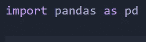

作者图片

— —这里我们导入 pandas 库，并给它一个别名 pd。给你的库取一个别名可以让你简化名字。

**—从不同模块导入:**

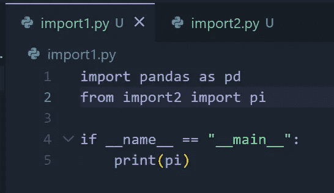

作者图片

— —这里我们可以看到两个模块，`import1`和`import2`。

— —在我们的`import2`模块中，我们有一个名为`pi`的变量，它等于 3.14，我们正在将 pi 导入到我们的`import1`模块中。

— —自己测试一下，看看这个脚本是否能打印出 3.14。

— —当使用`from import2 import pi`时，我们只要求 pi 变量，而不是从`import2`模块导入所有内容。如果我们想包含来自`import2`的所有内容，我们将使用`from import2 import *`，`*`表示导入模块内部的所有内容。

**—相对进口:**

相对导入处理您想要相对于当前目录的位置导入哪个模块。虽然有两种类型的相对导入，即隐式相对导入和显式相对导入，但后者更常用，因此我们将重点关注它。相对导入的语法显式相对导入使用`.`符号。帮助你处理嵌套的子目录。

`.` —单个点表示模块/包位于当前目录/与您要导入该模块/包的目录相同的目录中。

`..` —双点表示模块/包位于当前目录的父目录中，该目录是模块/包要导入到的目录。

`...` —三点表示模块/脚本在您当前位置的父目录或祖父目录的父目录中，依此类推。

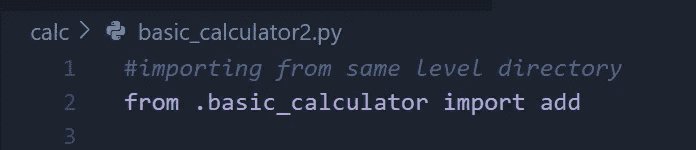

作者图片

→这里我们有一个模块的 add 函数，该模块与我们试图导入 add 函数的模块在同一目录级别。

**优点:**
→它们涵盖了使用绝对进口的缺点，可以将相对复杂的进口陈述变得简单。
→适用于可能改变的目录结构。

缺点:
→看起来不像绝对进口的那么干净。

**—绝对进口:**

→包括使用模块所在位置的完整路径。从项目的根文件夹开始，到您想要的模块/脚本所在的目录。这里有几个例子:

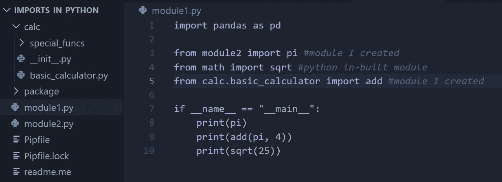

作者图片

→这里我们有 3 个导入。其中两个是我创建的，而中间一个来自 Python 的内置模块。在第 5 行，我们可以看到`.`操作符，它进一步深入到`calc`目录并提取`basic_calculator`模块。从`basic_calculator`模块中，我们导入了`add`函数。

**优点:**
→使用绝对导入的最大好处是它们实现起来非常简单。
→人教版 8 推荐的。
→它帮助您识别模块在应用中的具体位置。

**缺点:
→** 如果你的模块目录结构比较复杂，那么设置起来甚至看起来可能会有点繁琐。如下例所示:

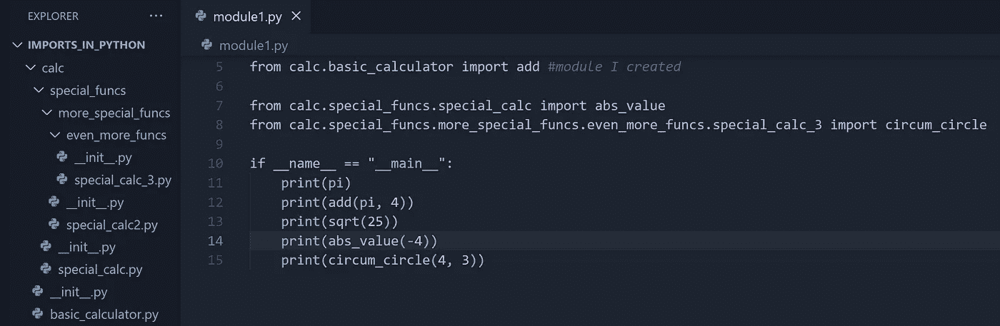

作者图片

→您可以看到，随着您想要导入的目录逐渐深入子目录，import 语句开始看起来有点长且混乱。就像小学时老师让你不要做的那些又长又连续的句子！

**—导入的 Sys 包:** →Sys 包包含函数和变量，帮助您与您的解释器中的设置进行交互。其中一项是`sys.path`变量。这个变量存储了一个存储模块的目录列表，当您编写/执行导入语句时，它会在这个列表中查找正确的模块。首先，它会查看 Python 的内置模块，如果找不到，它会搜索您在 sys.path 中创建的目录列表。

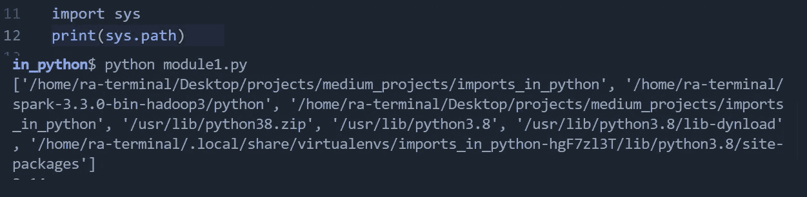

作者图片

— Sys-Append Path:
→是 Sys 包中的一个模块。它用于添加一个指定的路径，允许您的解释器搜索您想要导入的模块。下面的代码暗示这个路径，我的特殊函数所在的路径，将被添加到我的解释器在寻找我想要导入的模块时搜索的路径列表中。

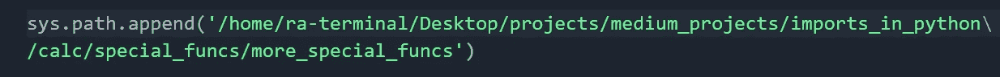

作者图片

## 常见导入错误:

**—循环导入错误:**
这些导入错误发生在两个或多个模块相互导入时。这些呼叫无限重复。当您执行 python 脚本时，您的 IDE 从上往下读取。如果模块 A 正在导入模块 B，而模块 B 正在导入模块 A，则会出现以下错误:

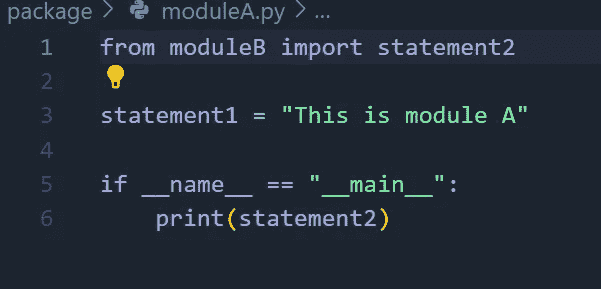

作者图片

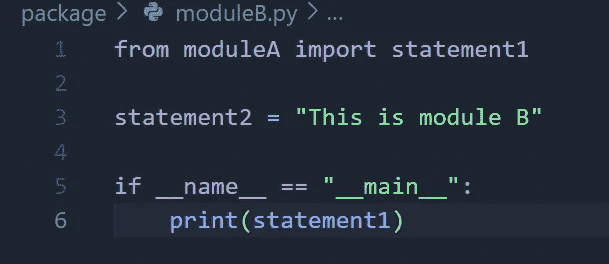

作者图片

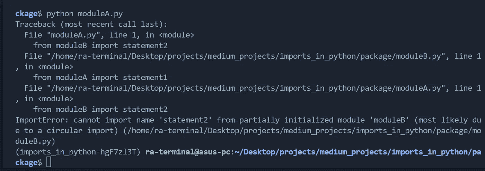

作者图片

进口应该只遵循一个方向。要么你导入`module B` - > `module A`要么导入`module A` - > `module B`。这减少了循环导入错误。

**—模块未找到错误:**

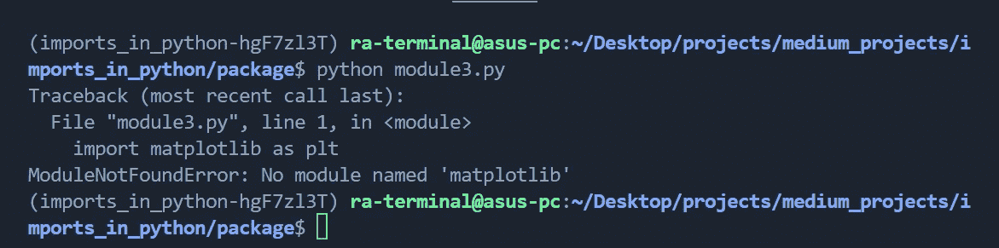

作者图片

当您的机器、docker 容器或虚拟环境中没有安装软件包/库时，通常会发生这种情况。也可能是您的 IDE 没有找到您创建的模块/包。如果是后者，那么您可能需要修改 import 语句。

**—尝试相对导入，但不知道父包错误:**

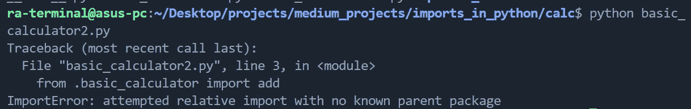

作者图片

通常在您尝试将模块作为脚本运行时发生。将`__init__.py`文件添加到我们的`calc`文件夹覆盖了那个文件夹和里面的所有脚本，打包成一个包。这就是为什么运行`python basic_calculato2.py`不起作用，因为这个命令将这个文件作为普通脚本运行。然而，当从项目根目录使用`python -m calc.basic_calculator2`时，我们将这些文件作为模块运行并修复错误。

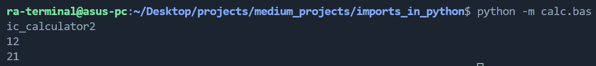

作者图片

## 结论:

Python 导入可能有点棘手。尤其是当您处理常见的导入问题时。但是好处远远超过了“不那么有趣”的小技巧。能够将您的代码划分为不同的部分，并在需要时导入您需要的内容，可以实现更高效的开发和协作体验。干净的代码使调试更容易，允许团队成员少跳来跳去，诊断发生了什么变得不那么乏味！