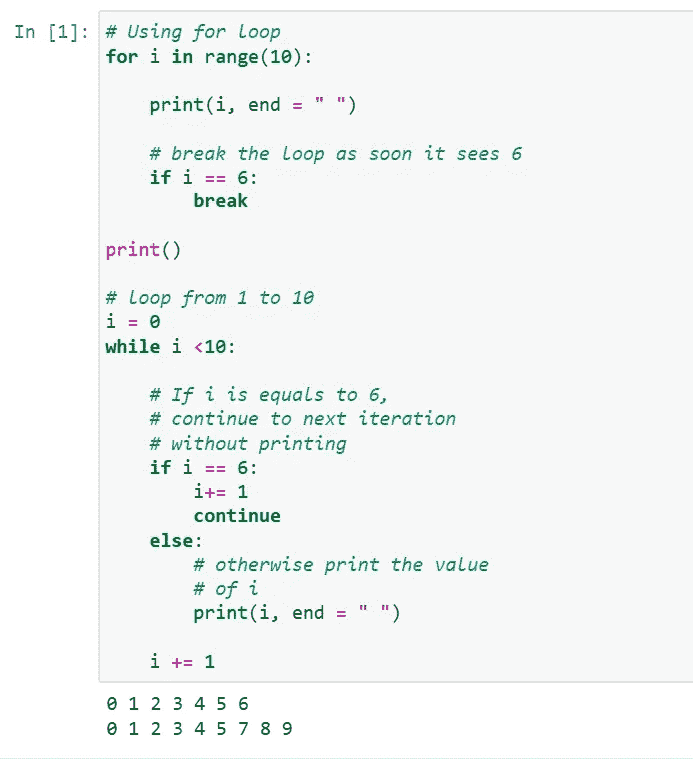

# PYTHON 关键字:

> 原文：<https://blog.devgenius.io/python-keywords-18d427d048ca?source=collection_archive---------5----------------------->

**Python 中的关键字**是保留字，不能用作变量名、函数名或任何其他标识符。

## Python 中所有关键字的列表:

*   **真实**
*   **假**
*   **无**
*   **和**
*   **或**
*   **不是**
*   **在**中
*   **是**
*   **迭代关键词:for，while，break，continue。**
*   **条件关键词:if，else，elif。**
*   **定义**
*   **返回**
*   **类**
*   **为**
*   **通过**
*   **λ**
*   **导入，来自**
*   **德尔**

所以，让我们详细讨论这些，

# 真、假、无:

*   **真:**这个关键字用来表示一个布尔值真。如果语句为真，则打印“真”。
*   **假:**这个关键字用来表示一个布尔假。如果语句为假，则打印“假”。
*   **无:**这是一个特殊的常量，用于表示空值或无效。重要的是要记住，0，任何空容器(如空列表)不计算为无。
    它是其数据类型——NoneType 的对象。不可能创建多个 None 对象，但可以将它们赋给变量。

示例:

# and，or，not，in，is:

*   **和**:这是 python 中的逻辑运算符。"和"**返回第一个假值。如果没有找到，返回最后一个**。下面描述了“和”的真值表。

3 和 0 **返回 0**

3 和 10 **返回 10**

10 或 20 或 30 或 10 或 70 返回 **10**

对于来自像 **C** 这样逻辑运算符总是返回布尔值(0 或 1)的语言的程序员来说，上面的语句可能有点混乱。

*注:表达式 x 和 y 先对 x 求值；如果 x 为 false，则返回其值；否则，计算 y 并返回结果值。*

*表达式 x 或 y 先对 x 求值；如果 x 为真，则返回其值；否则，计算 y 并返回结果值。*

*   **或**:这是 python 中的逻辑运算符。或者“返回第一个真值，如果没有找到，返回最后一个”。“或”的真值表如下所示。

3 或 0 **返回 3**

3 或 10 **返回 3**

0 或 0 或 3 或 10 或 0 返回 **3**

*   **非:**该逻辑运算符对真值求反。“不”的真值表如下所示。
*   **in:** 该关键字用于检查容器是否包含值。这个关键字也用于遍历容器。
*   **is:** 该关键字用于测试对象的同一性，即检查两个对象是否占用相同的内存位置。

示例:

# 迭代关键字— for、while、break、continue:

*   [**for**](https://www.geeksforgeeks.org/python-for-loops/) **:** 该关键字用于控制流量和循环。
*   [**而**](https://www.geeksforgeeks.org/python-while-loop/) **:** 有一个类似“for”的工作方式，用来控制流量和进行循环。
*   [**break**](https://www.geeksforgeeks.org/python-break-statement/)**:**“break”用于控制循环的流量。语句用于中断循环，并将控制权传递给紧跟在循环之后的语句。
*   [**继续**](https://www.geeksforgeeks.org/python-continue-statement/) **:** “继续”也用于控制代码的流向。关键字跳过循环的当前迭代，但不结束循环。

示例:

# 条件关键字— if，else，elif:

*   **如果**:决策的控制语句。**真值表达式强制控制进入“if”语句块。**
*   **else** :是用于决策的控制语句。**假表达式强制控制进入“else”语句块。**
*   **elif** :决策控制语句。是“ **else if** ”的简称。

示例:

# 定义:

def 关键字用于声明用户定义的函数。

示例:

# 返回:

这个关键字用于从函数返回。

示例:

# 类别:

[**类**](https://www.geeksforgeeks.org/python-classes-and-objects/) 关键字用于声明用户定义的类。

示例:

# 作为:

**as** 关键字用于为导入的模块创建别名。即给导入的模块起一个新名字。例如，导入数学作为我的数学。

示例:

# 通过:

[**pass**](https://www.geeksforgeeks.org/python-pass-statement/) 是 python 中的空语句。遇到这种情况时，不会发生任何事情。这用于防止缩进错误，并用作占位符。

示例:

# λ:

[**Lambda**](https://www.geeksforgeeks.org/python-lambda/) 关键字用于使内联返回函数内部不允许有语句。

示例:

# 导入，来自:

*   [**导入**](https://www.geeksforgeeks.org/import-module-python/) **:** 该语句用于将一个特定的模块包含到当前程序中。
*   **from :** 通常与 import 一起使用，from 用于从导入的模块中导入特定的功能。

示例:

# 德尔:

**用来删除对一个对象的引用。使用 del 可以删除任何变量或列表值。**

**示例:**

****

**这些是关键词，你只需要理解这些术语和关键词的基本定义，稍后你就会知道如何在编写代码时使用这些关键词。**

**这就是这篇博客的内容。接下来我们将在另一篇博客中讨论更多关于 python 的内容。**

**谢谢你。**

***********************************************************************

**我希望你理解这个简单的概念。所以我打算用一种简单的方式写一个关于 python 的每一个概念的博客，在这里你可以轻松地学习。**

**所以请继续支持我们，感谢所有阅读过这篇完整博客的人。**

***请喜欢并关注本账号。***

*****全爱无恨。*****

**我们有一个 Youtube 频道，我们在那里上传关于编程相关的话题，你可以通过订阅我们的频道来支持。**

**[***https://www.youtube.com/channel/UChiEiQ2E3_DUGYDG340si-A***](https://www.youtube.com/channel/UChiEiQ2E3_DUGYDG340si-A)**

*****这是我们的 Youtube 频道链接，请订阅。*****

***本文概念及作者:***

*****赛·库马尔和维诺德·库马尔。*****

*   **********************************************************************