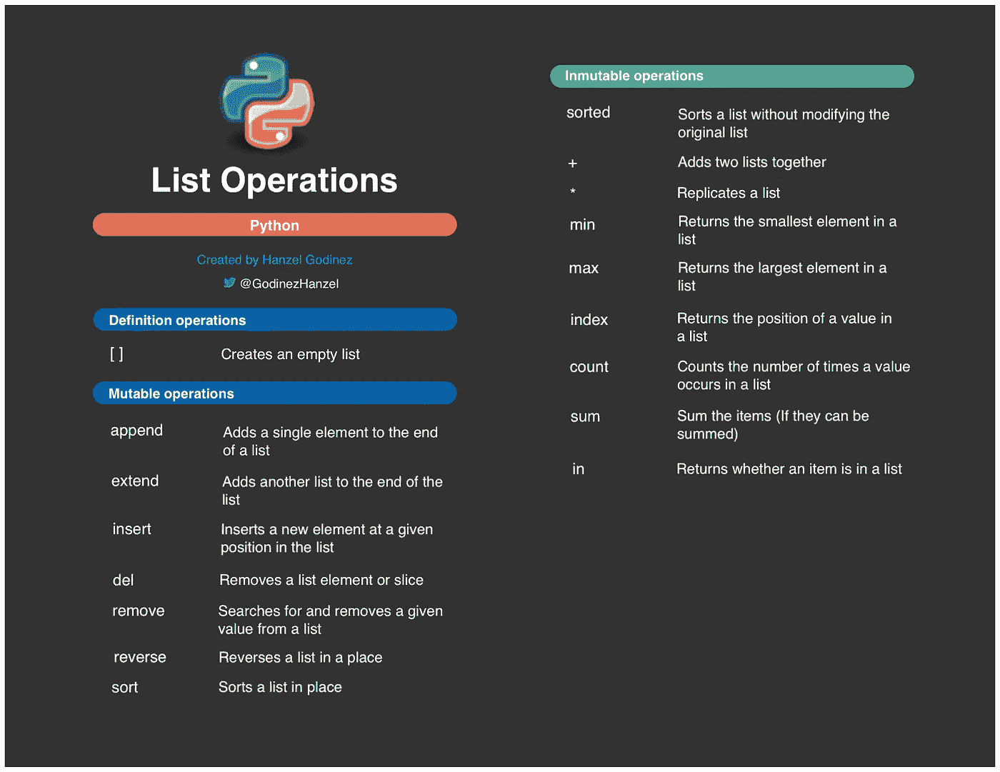

# Python 列表操作

> 原文：<https://blog.devgenius.io/python-list-operations-56bf7f93e39c?source=collection_archive---------0----------------------->

Python 中最常见的列表操作



列表操作

在开始 Python 中的列表所支持的操作之前，我想推荐文章 [Python 数据类型](https://medium.com/dev-genius/python-data-types-4959eb84635f)，这是一篇好文章，在开始稍微高级一些的文章之前。

我想提醒你的是，Python 中的列表是一种非常强大且被广泛使用的数据类型。列表与其他编程语言中的数组非常相似，但有所不同，因为在 Python 中，列表可以包含数据类型的组合，如字符串、元组、列表、字典、函数、文件对象和任何类型的数字。

列出示例:

```
x = [2, 6, 4.5, "seven", ["a", "b"], (5, 0)]y = []matrix = [[1, 2, 3], [4, 5, 6], [7, 8, 9]]
```

现在，我们更好地理解了列表，让我们看看 Python 中支持这些列表的不同操作。

# 列表操作

我将根据对这些操作的影响对列表操作进行分组，我的目标是使解释和理解更容易:

## 1.定义操作

这些操作允许我们定义或创建一个列表。

**1.1。[ ]**

创建一个空列表。

```
y = []
```

## 2.可变操作

这些操作允许我们处理列表，但是改变或修改它们以前的定义。

**2.1。追加**

将单个项目添加到列表底部。

```
x = [1, 2]x.append('h')print(x)Output:[1, 2, 'h']
```

**2.2。扩展**

将另一个列表添加到列表的末尾。

```
x = [1, 2]x.extend([3, 4])print(x)Output:[1, 2, 3, 4]
```

**2.3。插入**

在列表中的特定位置插入新元素，此方法接收该位置作为第一个参数，接收要添加的元素作为第二个参数。

```
x = [1, 2]x.insert(0, 'y')print(x)Output:['y', 1, 2]
```

**2.4。del**

删除位于特定索引中的元素。这个方法还可以通过“:”操作符从列表中删除一部分元素。你只需要定义一个起点和终点[start:end]，记住终点是不会考虑的。这些点可以忽略，其中 0 位置将是起点，列表中的最后一个位置将是终点。

```
x = [1, 2, 3]del x[1]print(x)Output:[1, 3]y = [1, 2, 3, 4, 5]del y[:2]print(y)Output:[3, 4, 5]
```

**2.5。移除**

移除指定项目的第一个匹配项。

```
x = [1, 2, 'h', 3, 'h']x.remove('h')print(x)Output:[1, 2, 3, 'h']
```

**2.6。反向**

颠倒列表中元素的顺序，将最后的元素放在开头，将初始元素放在末尾。

```
x = [1, 2, 'h', 3, 'h']x.reverse()print(x)Output:['h', 3, 'h', 2, 1]
```

**2.7。排序**

默认情况下，该方法将列表中的元素从最小到最大排序，可以使用参数 reverse = True 来修改该行为。

```
x = [3, 2, 1, 4]x.sort()print(x)Output:[1, 2, 3, 4]y = ['R', 'C', 'Python', 'Java', 'R']y.sort(reverse=True)print(y)Output:['R', 'R', 'Python', 'Java', 'C']
```

重要的是要知道，当应用 sort 方法时，必须对具有相同数据类型的元素的列表执行该操作，否则，将会面临 TypeError 异常。

排序方法的好处之一是自定义排序。我们只需要创建一个函数，根据一些自定义的标准进行排序，然后我们可以通过关键参数来使用它。请记住，自定义排序比默认排序慢。

自定义排序示例:

```
def sorting_by_length(str):
    return len(str)

x = ['Python', 'is', 'the', 'best']x.sort(key=sorting_by_length)print(x)
```

## 3.不可变操作

这些操作允许我们在不改变或修改列表先前定义的情况下使用列表。

**3.1。已排序**

这个方法从最小到最大对列表中的元素进行排序，这与 sort 方法非常相似，但是这个行为可以使用参数 reverse = True 来修改。

```
x = [5, 2, 9, 0]print(sorted(x))print(x)Output:[0, 2, 5, 9][5, 2, 9, 0]
```

关于排序方法有趣的是，它不局限于列表，它也适用于元组和字典，这是我们将在另一篇文章中讨论的主题。

**3.2。+**

这个操作允许我们在一个新的列表中连接两个不同的列表。

```
x = [1, 2, 3]y = [4, 5, 6]print(x + y)print(x)print(y)Output:[1, 2, 3, 4, 5, 6][1, 2, 3][4, 5, 6]
```

**3.3。***

此操作会将列表复制到指定的次数。

```
x = [1, 2, 3]print(x * 3)print(x)Output:[1, 2, 3, 1, 2, 3, 1, 2, 3][1, 2, 3]
```

**3.4。最小**

这个方法返回列表中最小的元素。

```
x = [40, 100, 3, 9, 4]print(min(x))print(x)Output:3[40, 100, 3, 9, 4]
```

**3.5。最大值**

与 min 方法不同，它返回列表中最大的项。

```
x = [40, 100, 3, 9, 4]print(max(x))print(x)Output:100[40, 100, 3, 9, 4]
```

**3.6。索引**

返回指定元素在列表中的位置。

```
x = [10, 30, 20]print(x.index(30))print(x)Output:1[10, 30, 20]
```

**3.7。计数**

返回指定项目在列表中出现的次数。

```
x = [10, 30, 20, 30, 30]print(x.count(30))print(x)Output:3[10, 30, 20, 30, 30]
```

**3.8。总和**

这个方法对列表中的项目求和，只要它们能被求和。Sum 是一种广泛用于数字类型列表的方法。

```
x = [2.5, 3, 3.5]print(sum(x))print(x)Output:9.0[2.5, 3, 3.5]
```

**3.9。在**

当元素在列表中时，只返回两个可能的值 True，否则返回 False。此方法广泛用于避免方法中的异常，如:index 和 remove。如果在列表中找不到所搜索的元素，将会导致异常。

```
x = ['h', 2, 'a', 6, 9]print('a' in x)print(x)Output:True['h', 2, 'a', 6, 9]
```

这些是一些与 Python 列表相关的最常见和最重要的操作，从我的角度来看，详细了解它们是非常有帮助的，因为你通常会使用这些结构，当然还有它们的操作。

我邀请你对任何没有提到的细节发表意见。我确信你的贡献将是非常宝贵的。

在说再见之前，我留下下面的[链接](https://github.com/hgodinez89/list-operations-cheat-sheet)，在那里你可以得到一个包含所有列表操作的备忘单。

非常感谢你来到这里。😊 👈

这篇文章是受这本书的启发📖"[快手蟒书](https://books.google.co.cr/books/about/The_Quick_Python_Book.html?id=urVEzQEACAAJ&source=kp_book_description&redir_esc=y)"📖如果你想了解这门语言的基本概念，同时想了解其他高级主题，我向你广泛推荐。