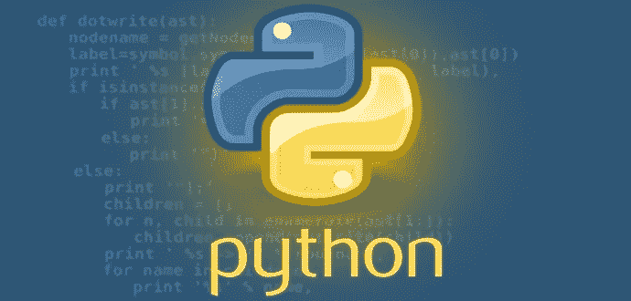

# Python:模块和 PIP

> 原文：<https://blog.devgenius.io/python-modules-pip-9d7210c387ea?source=collection_archive---------9----------------------->

了解什么是模块和 pip(软件包管理器)

计算机编程语言

**模块:**模块是包含一些由开发人员编写和验证的代码的文件，我们可以将这些代码导入到我们的程序中，并根据我们的要求使用它们。
在我们的程序中导入模块可以节省我们大量的重写别人已经编写和测试过的相同代码的工作。

模块有两种类型:
**内置模块**——这些模块是我们在系统中安装 python 时预先安装的。例如操作系统、abc、日期时间、dbm

外部模块 —我们必须自己使用一些命令来安装这些模块。例如烧瓶、Tensorflow

pip :它是 python 的包管理器。这意味着通过使用这个命令，我们可以下载 python 标准库没有提供的外部模块、库和依赖项。
例如 pip 安装烧瓶

*更多内容尽在*[*blog . dev genius . io*](http://blog.devgenius.io)*。*