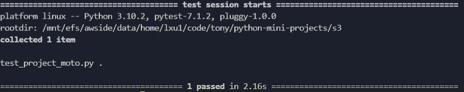

# Python — Moto，为什么您应该使用

> 原文：<https://blog.devgenius.io/python-moto-why-you-should-use-8a8152209aec?source=collection_archive---------7----------------------->

## 如何使用 Moto 测试你的 boto3 代码


当您使用 AWS SDK for Python ( `boto3`)来创建、配置和管理 AWS 服务时，比如 AWS EC2、S3 桶、RDS 实例甚至 lambda 函数，您将面临的一个挑战就是测试。

如果没有测试，您将不会对更改代码然后部署它感到舒服，因此最好设置测试来更好地理解代码行为，并以受控的方式更改代码。

# 为什么 IAC 测试具有挑战性

但是测试对于 IAC(基础设施即代码)开发来说并不容易。在 IAC 开发过程中，要么测试函数本身使用外部资源，要么它测试的代码部分使用外部资源，但不保证在执行时可用。

即使你有一个测试环境，比方说一个团队测试 AWS 帐户，然后在测试设置中管理这些外部资源，等待资源变得可用的时间，以及为了节省成本而在测试后删除测试资源将是一个令人头痛的问题，并且使测试帐户的目的变得不现实和麻烦。

因此，当运行您的`boto3`单元测试时，您希望确保它们不依赖于可用的 AWS 资源。实现这一点的常见做法是嘲讽。

# 什么是 Moto

Moto([https://github.com/spulec/moto](https://github.com/spulec/moto))是一个开源的 Python 库，它为 Python 的内置单元测试模拟库提供了一种简单的抽象 AWS 资源的方法。

**Moto** 支持丰富的 AWS 资源和功能，所以大多数场景下你都不需要重新发明轮子来创建自己的模拟对象。

在 Moto 中不需要依赖注入，你可以把代码放在适当的位置，然后直接测试它。你只需要启用 **Moto** 的嘲讽功能，并采取一些防范措施，就可以了。

# Moto 是怎么工作的？

在进入细节之前，我们先了解一下 **Moto** 是如何工作的。 **Moto** 的主钩子是 botocore 中的“handlers”(名为**BUILTIN _ HANDLERS**),**BUILTIN _ HANDLERS**是`boto3`的基础。这些处理程序在这个文件中定义:[https://github . com/boto/boto core/blob/master/boto core/handlers . py](https://github.com/boto/botocore/blob/master/botocore/handlers.py)

代码片段如下所示:

```
BUILTIN_HANDLERS = [
    ('choose-service-name', handle_service_name_alias),
    (
        'getattr.mturk.list_hi_ts_for_qualification_type',
        ClientMethodAlias('list_hits_for_qualification_type'),
    ),
    (
        'before-parameter-build.s3.UploadPart',
        convert_body_to_file_like_object,
        REGISTER_LAST,
    ),
    (
        'before-parameter-build.s3.PutObject',
        convert_body_to_file_like_object,
        REGISTER_LAST,
    ),
    ('creating-client-class', add_generate_presigned_url),
    ('creating-client-class.s3', add_generate_presigned_post),
    ('creating-client-class.iot-data', check_openssl_supports_tls_version_1_2),
...
    #############
    # RDS
    #############
    ('creating-client-class.rds', add_generate_db_auth_token),
    ('before-call.rds.CopyDBClusterSnapshot', inject_presigned_url_rds),
    ('before-call.rds.CreateDBCluster', inject_presigned_url_rds),
...
]
_add_parameter_aliases(BUILTIN_HANDLERS)
```

每次实例化一个 AWS 会话时，这个`handlers.py`中定义的所有处理程序都会被注册。例如:

```
import boto3# Using the default session
sqs = boto3.client('sqs')
s3 = boto3.resource('s3')
```

以上代码创建了一个低级客户端或高级资源客户端。一旦发出内部事件，就会调用为该类事件注册的处理程序。

在实际的`http-request`被发送到 AWS 之前，`before-send-handler`被执行。


如果一个`before-send-handler`返回一个响应，它被用于进一步的处理，而`http-request`本身被跳过。这正是 **Moto** 所做的，通过在自定义`before-send-handler`中返回模拟响应， **Moto** 允许你跳过对 AWS 服务的实际 http 请求。


比如下面的代码片段

```
from botocore.awsrequest import AWSResponse
from botocore.handlers import BUILTIN_HANDLERS
from moto.core.models import MockRawResponse

def test_custom_handler(request, event_name, **kwargs):
    # event_name is sth like 'before-send.s3.GetObject'
    return AWSResponse('', 200, {}, MockRawResponse(''))

BUILTIN_HANDLERS.append(("before-send", test_custom_handler))
```

在上面的代码片段中， **Moto** 向`botocore`的 **BUILTIN_HANDLERS** 追加了一个“发送前”处理程序。当您将 **Moto** 导入到您的测试代码中时，这是隐式发生的，并且可以通过使用`moto-decorators`(或 Moto 的任何其他初始化)来实现嘲讽，这对于大多数 AWS 资源都是可用的。

`moto-decorator`为测试函数注册了一个模拟后端，并且只针对测试函数的范围。测试通过后，moto 会重置模拟后端和测试证书。

好了，概念够了，演示时间到了。

# Moto 演示

## 安装 Moto

你可以通过使用`pip`来安装 **Moto** ，就像任何其他 Python 包一样。

```
pip install moto
```

## **创建 S3 斗**

假设您想使用`boto3`在 Python 项目中创建一个 AWS S3 桶，一种方法是:

```
import boto3class Project:
    """this class represents a project state""" def __init__(
        self,
        project_name: str,
        region_name: str,
        aws_access_key: str,
        aws_secret_key: str,
    ) -> None:
        """initialize project and set resources
        Args:
            project_name (str): projects name for reference
            region_name (str): AWS region name
            s3_access_key (str): aws authentication access key
            s3_secret_key (str): aws authentication secret key
        """
        self._project_name = project_name
        self._bucket_name = f"{project_name}_bucket"
        self._current_state = str(uuid.uuid4())

        # s3
        boto3.resource("s3", region_name=region_name).create_bucket(
            Bucket=self._bucket_name
        ) self._s3_client = boto3.client(
            "s3",
            aws_access_key_id=aws_access_key,
            aws_secret_access_key=aws_secret_key,
            region_name=region_name,
        ) def save(self, body: str) -> None:
        """saves the state with message to s3 bucket"""
        self._current_state = str(uuid.uuid4())
        self._s3_client.put_object(
            Bucket=self._bucket_name, Key=self._current_state, Body=body
        ) def restore(self) -> str:
        """restores state from s3"""
        value = (
            self._s3_client.get_object(
                Bucket=self._bucket_name, Key=self._current_state
            )["Body"]
            .read()
            .decode("utf-8")
        )
```

## 使用 Moto 进行测试

现在让我们用 **Moto** 来测试我们的代码。

```
import unittest
from unittest import TestCaseimport boto3
from moto import mock_s3
from project import Project[@mock_s3](http://twitter.com/mock_s3)
class TestMyProject(TestCase):
    """container for test cases""" def test_project_creation(self):
        """test project creation"""
        region_name = "us-east-1"
        project_name = "MyProject"
        project = Project(
            project_name=project_name,
            region_name=region_name,
            aws_access_key="someaccesskey",
            aws_secret_key="somesecretkey",
        ) message = "Saved 1"
        project.save(message)
        body = project.restore()
        self.assertEqual(body, message)if __name__ == "__main__":
    unittest.main()
```

首先，我们从 Moto 导入`mock_s3`。这是一个 Python 装饰器，它可以装饰函数或类，在装饰的代码块中创建一个 AWS 资源处理调用的模拟。

在上面的代码中，我们用`@mock_s3`来修饰我们的类`TestMyProject`，所以在所有后续的代码块中，AWS 资源都会被嘲讽。

现在让我们进行测试:

```
$ pytest test_project_moto.py -s
```

输出看起来像这样:



根本不需要 AWS 帐户和凭证，在测试期间，不再需要创建资源，因此您的代码没有外部依赖性，另外，您不需要实际创建资源，因此也节省了成本。

# 结论

在本文中，我介绍了如何使用 Moto——一个开源 Python 库，它为 Python 的内置单元测试模拟库提供了一种简单的抽象 AWS 资源的方法。

首先我介绍了为什么你需要测试你的 IAC 代码，然后是 Moto 是什么，它是如何工作的。我还提供了一个简单的 AWS S3 测试示例来演示如何在实际代码中使用 Moto。我希望你喜欢这次阅读。