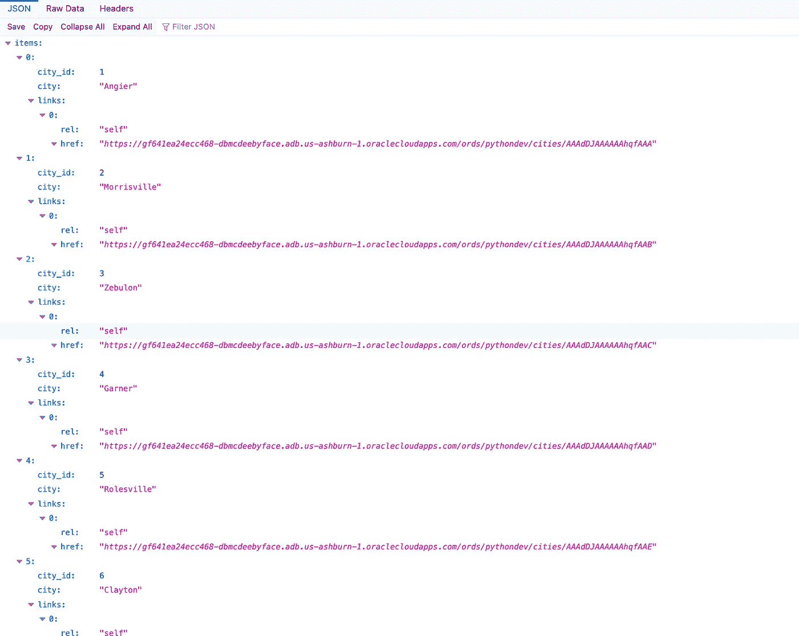
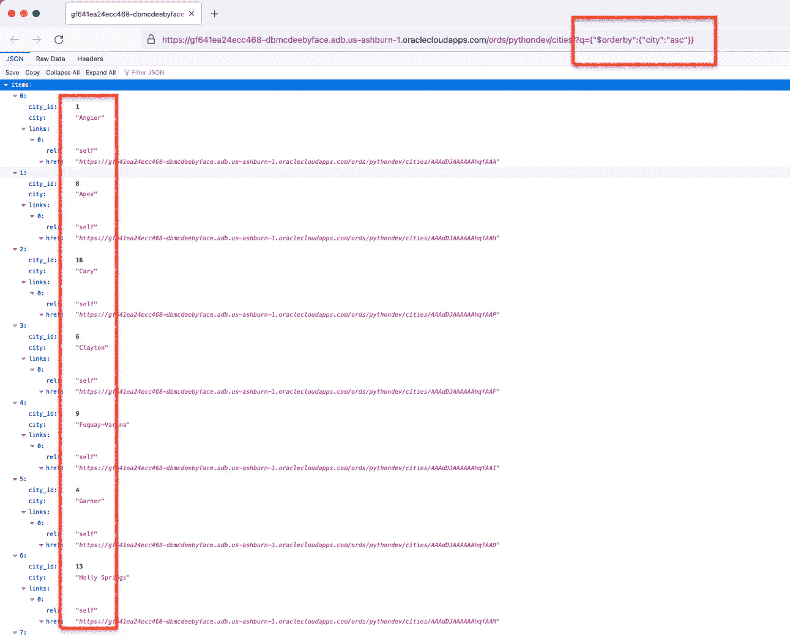

# Python 或查询中的过滤:对来自 Oracle 数据库的 JSON 响应进行排序

> 原文：<https://blog.devgenius.io/python-or-filtering-in-queries-sorting-json-responses-from-an-oracle-database-95cbf023153a?source=collection_archive---------0----------------------->

在[最近的一篇文章](https://followthecoffee.com/wtforms-flask-oracle-rest-apis-ords/)中，我讨论了从我的支持 REST 的数据库表中获取 JSON 响应(如下所示):



在之后对这些城市*进行排序，我执行了一个 GET 请求(使用了一些 python 代码)。然而，经过最近的讨论和来自[jeffsmith](https://www.thatjeffsmith.com/)的建议，我想我应该分享*另一种*方法，你可以从数据源*对这些数据*进行排序。*

# 背景

如果您还记得，我的 python 代码中:

1.  执行 GET 请求，
2.  将城市提取到列表中，并
3.  将它们按升序排序，

…看起来像这样:

```
def city_choices_python(): 
    import requests
    import json 
    city_list = [] URL = 'https://gf641ea24ecc468-dbmcdeebyface.adb.us-ashburn-1.oraclecloudapps.com/ords/pythondev/cities/'

    response = requests.get(URL)
    r = json.loads(response.text)
    for nestedArr in r['items']:
        city_list.append(nestedArr['city'])
    return sorted(city_list)
```

正如你所看到的，在这个版本中，ORDS 提供的 URI 保持不变。我只是使用这个简单的“sorted(city_list)”函数来返回一个按升序排序的城市列表(仅供参考:这是这个代码块的最后一行)。

# 查询中的过滤

这种方法在我的情况下工作得很好，但是我现在…开悟了…

也就是说，我现在意识到我还有其他选择。在 get 请求时，我并没有真正想到可以在查询中过滤*。*

> 筛选是通过在多个页面资源上使用基于请求的动态筛选器定义来限制集合资源的过程，其中每个页面都包含完整集合中的项目子集。过滤可以有效地遍历大型集合。
> 
> [*ORDS 文档*](https://docs.oracle.com/en/database/oracle/oracle-rest-data-services/19.2/aelig/developing-REST-applications.html#GUID-091748F8-3D14-402B-9310-25E6A9116B47)

我喜欢的是，查询中的过滤不需要对原始 URI 进行任何更改。这意味着，您不需要返回(在我的例子中，我使用…)数据库操作来修改任何东西。您只需在 URI 中包含过滤器。

在我的例子中，它看起来像这样:

```
[https://gf641ea24ecc468-dbmcdeebyface.adb.us-ashburn-1.oraclecloudapps.com/ords/pythondev/cities/?q={"$orderby":{"city":"asc"}}](https://gf641ea24ecc468-dbmcdeebyface.adb.us-ashburn-1.oraclecloudapps.com/ords/pythondev/cities/?q={%22$orderby%22:{%22city%22:%22asc%22}})
```

# 暂停！

这会让你头脑混乱，所以听好了。引号(例如“
”)不能通过互联网传输，因此需要转换为 ASCII 字符集。

HTML-5 中的引用在 URL 中将看起来像“%22”。因此，如果您复制上面的 URL，然后再次粘贴它，它可能会在您浏览器的地址栏中显示如下:

```
[https://gf641ea24ecc468-dbmcdeebyface.adb.us-ashburn-1.oraclecloudapps.com/ords/pythondev/cities/?q={%22$orderby%22:{%22city%22:%22asc%22}}](https://gf641ea24ecc468-dbmcdeebyface.adb.us-ashburn-1.oraclecloudapps.com/ords/pythondev/cities/?q={%22$orderby%22:{%22city%22:%22asc%22}})
```

您将从 UTF-8 编码(引号)开始，在某个时候您会看到 ASCII 编码(它是%和十六进制编码的组合)。

我之所以提到这一点，是因为我注意到当我将更新后的 URL 复制到我的 VS 代码编辑器中时，它看起来像这样:

```
def city_choices_ords(): 
    import requests
    import json 
    city_list = [] URL = 'https://gf641ea24ecc468-dbmcdeebyface.adb.us-ashburn-1.oraclecloudapps.com/ords/pythondev/cities/?q={%22$orderby%22:{%22city%22:%22asc%22}}' response = requests.get(URL)
    r = json.loads(response.text)
    for nestedArr in r['items']:
        city_list.append(nestedArr['city'])
    return(city_list)
```

不要惊慌，一切都还正常。但是查询看起来像这样:

```
?q={%22$orderby%22:{%22city%22:%22asc%22}}
```

# 这是什么话？

上面的查询请求根据“城市”列对城市表进行升序(“asc”)排序。如果您将浏览器指向它，就可以看到这一点。它将显示如下:



排序并不是你能做的唯一的过滤类型，它的组合是无限的…


… [看一看](https://docs.oracle.com/en/database/oracle/oracle-rest-data-services/18.3/aelig/developing-REST-applications.html#GUID-091748F8-3D14-402B-9310-25E6A9116B47)。

# 比较性能

最后一件事…我进行了一个非常粗略的 A/B 性能测试，比较了两个代码版本。

简而言之，没有明显的区别。我应该提醒一下，我正在使用一个 ***非常*** 小的数据库对象(一个有 2 列 18 个城市的表)。因此，如果存在这样或那样的差异，那也是微不足道的。

我还是为了好玩录了测试。您将看到十个请求(每个版本五个)，运行时间基本上是相同的。我知道这在统计学上不合理，但这样做是为了满足我自己的好奇心。我们的文档实际上说明了过滤对于遍历大型对象是有利的，所以这可能是一个糟糕的例子。随着请求的增加，我不得不在查询中进行图像过滤。

尽管如此，请自己看看结果:

# 结束了

现在，在使用支持 REST 的表(或其他对象)时，您有了几个排序选项。好的一面是，用 ORDS 设置这些端点仍然可以通过简单的鼠标点击来完成。

此外，请记住，在查询中过滤时，排序不是唯一可以完成的事情。还有很多其他功能，不胜枚举。但是我会把这一页标上书签[,这样你以后可以参考。](https://docs.oracle.com/en/database/oracle/oracle-rest-data-services/19.2/aelig/developing-REST-applications.html#GUID-091748F8-3D14-402B-9310-25E6A9116B47)

我不想说你可以过滤掉*所有的东西*，但是看起来确实如此。对于像我这样的 python 新手来说，这可能是更好的前进方式。

有趣的是，我在代码中添加“sort()”函数的那一天正是我观看“python 技巧”视频的同一天(实际上是那天早上的早些时候)，视频中提到了排序。这纯粹是运气。

如果没有那个视频，我至少还会困在那里一天，去想如何给我的清单排序。

嘿，至少现在我知道我不会被限制在基于我知道或不知道的 python 函数来过滤什么。我不能是唯一一个…对吗？

# 跟随

一定要跟着一起寻找更多乐趣:

*   [我的博客](https://followthecoffee.com/)
*   [推特](https://twitter.com/chrishoina%29)
*   [乳齿象](https://mastodon.technology/web/@chrishoina)
*   [YouTube](https://www.youtube.com/user/chrishoina/)
*   [GitHub](https://github.com/chrishoina)
*   [不和谐](https://discord.gg/seYeAPgq9E)
*   [领英](https://www.linkedin.com/in/chrishoina/)
*   [堆栈溢出](https://stackoverflow.com/users/9552864/chris-hoina)
*   [Tealfeed](https://tealfeed.com/chrishoina)