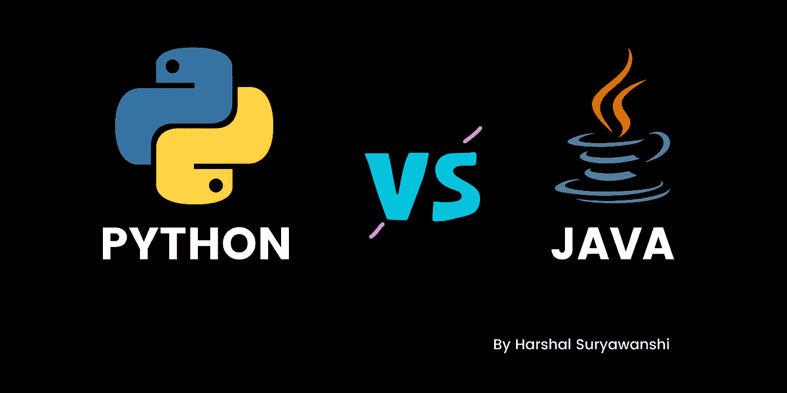
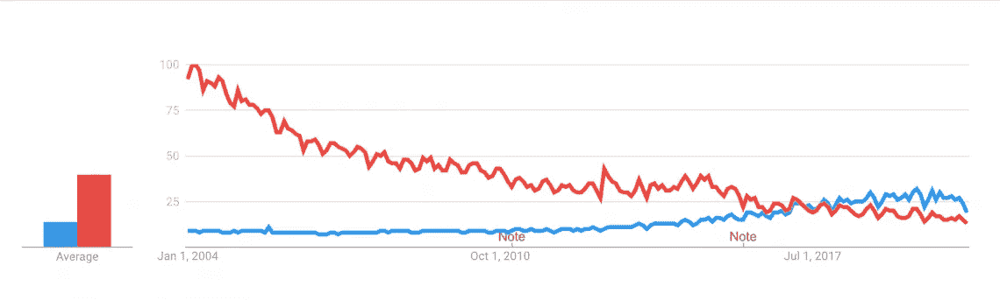

# Python 和 Java——哪个在职业生涯中领先？

> 原文：<https://blog.devgenius.io/python-or-java-which-ahead-in-career-735d12090f94?source=collection_archive---------17----------------------->

根据 Google Trends 的报告，Python 比 Java 显示出了越来越积极的结果。



我的意思是，自 2017 年以来，Python 开始比 java 更受欢迎。作为参考，我在下面加一张图。



在市场中，有两个主导因素，即实验和生产。这种流行趋势很可能是因为 Python 大量用于实验，而 Java 更好地用于生产。原因是实验多于生产。

众所周知，Python 是一种动态类型和解释的语言，而另一方面，java 是一种静态类型和编译的语言，由于 java 是一种静态类型和编译的格式化语言，这个原因就解释了为什么 Java 在运行时更快并且更容易调试。但是，Python 更容易使用、理解和阅读。

我将告诉你为什么 Python 在过去几年中比 java 更受欢迎，并且这个图表可能正增长。

Python 之所以广受欢迎，是因为它在用户/开发者与机器代码之间的交流方式更加简单。这使人们更容易掌握它。Python 有巨大的可用库，所以作为一个新的程序员或初学者，你不必从头开始。相比之下，Java 比较老，并且仍然广泛使用，它也有很多库。

现在，我将向你介绍这两种编程语言的基本语法，然后你就可以了解掌握的程度了。

Python 编程中打印的基本语法。

```
print(3+2)
```

Java 编程中打印的基本语法。

```
public class Print5 {
public static void main(String[] args) {
System.out.println("3+2=" + (Integer.toString(3+2)));
}
}
```

记住:在我看来，一个人应该选择让自己感到舒服的语言。要么是 Python，要么是 Java。是的，我同意两者都有巨大的差异，但两种语言都有自己的优点和缺点。

让我们比较一下这两种编程语言的参数，看看你真正想要的是什么。这里我将解释 Python 和 Java 的不同类型的参数。

1.  **代码—** Python 需要编写较少的代码行，而 Java 有较长的代码行。
2.  **语法—** 正如上面在两种编程语言的语法中所写的，Python 的语法更容易记忆，而 Java 的语法要复杂得多，因为如果您错过了一个花括号或分号，它肯定会让您出错。
3.  **框架—** 相比之下，Python 的框架数量较少，比如 Django 和 Flask。Java 有大量的框架。冬眠和春天。
4.  **速度—** 就速度而言，Python 速度较慢，因为它使用解释器，并且还在运行时配置数据类型。与 Python 相比，Java 更快，因为它是一种编译语言。
5.  **关键特性—** 在 Python 中，代码行更少，开发速度更快，动态类型化更强。在 Java 中，有自内存管理，健壮且独立于平台。
6.  **数据库—** 与其他数据库相比，Python 的数据库较弱。在 Java 中，这也是 python 在企业中较少使用或很少使用的原因。在 Java 中，JDBC (Java Database Connectivity，Java 数据库连接)是最流行的，广泛用于连接数据库，在企业中也有很高的使用率。
7.  **针对 ML 的库—** 在 Python 中，有 TensorFlow 和 Pytorch。Java 里有 Weka，Mallet，Deeplearning4j，MOA。
8.  **敏捷(实用)——**在 Python 中，一直有一个敏捷的空间，并且因为巨大的原因变得越来越受欢迎，包括 DevOps 运动的兴起。在 Java 中，它更多地定义了一致的重构支持，因为它是一个静态类型的系统，这使得自动化重构更加可靠，也是 Java 开发中广泛使用的 ide。

我们可以得出结论或定义，Java 和 Python 语言各有利弊。为你的职业选择一种特定的语言是由你决定的。

从我们的角度来看，Python 的未来非常耀眼，我们认为它的未来是自信的。

Python 简单易读，而 Java 更快，更易移植。Python 代码是动态编码的，而 Java 是静态编码的。

Python 远非完美，但如果我们说 python 是一种未来的新兴语言，那么我们不得不承认 Java 是存在的，它的 API 被广泛使用。