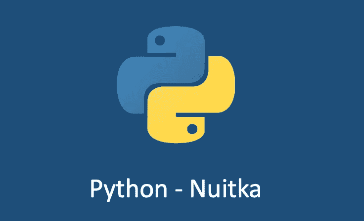

# python——使用 Nuitka 打包工件！

> 原文：<https://blog.devgenius.io/python-packaging-artifact-using-nuitka-195f4719a9db?source=collection_archive---------1----------------------->

## 使用 Nuitka 将 Python 代码打包成二进制文件



你可能已经使用`*pyintaller*` 来打包你的 Python 代码*。*今天我要介绍另一个将你的 Python 代码打包成二进制格式的工具，它叫做“ [Nuikta](https://github.com/Nuitka/Nuitka) ”。取决于您的用例，当涉及到工件打包时，它可能是一个更好的选择。

`Nuitka`是一个 Python 编译器。它是用 Python 写的。它是 Python 解释器的无缝替代或扩展，当它本身运行在那个 Python 版本上时，可以编译 CPython 2.6 ~ 3.10 的所有结构。然后，它以极其兼容的方式一起执行未编译的代码和编译的代码。

可以自由使用所有 Python 库模块和所有扩展模块。`Nuitka`将 Python 模块翻译成 C 级程序，然后使用`libpython`和它自己的静态 C 文件以与 CPython 相同的方式执行。

# pyinstaller vs Nuikta

在以下情况下，您需要将 Python 代码打包成二进制格式:

*   **隐藏源代码:**这里的`pyinstaller`通过设置密钥对源代码进行加密；而`nuitka`则将 python 源代码转换成 C++(这里得到的是二进制 pyd 文件，防止反编译)，然后编译成可执行文件。
*   **易移植**:用户使用方便，不需要安装任何 python，第三方包之类的。
*   **性能:**有时候`pyinstaller`生成的二进制文件特别大，我遇到过这样的情况，pyinstaller 转换出来的最终 exe 文件是 3G，而`Nuikta`只有 7MB！加上打包超级慢，pyinstaller 启动超级慢。

# 努特卡要求

*   C 编译器:你需要一个支持 C11 或者 C++03 的编译器。
*   **Python:** 版本 2.6、2.7 或 3.3、3.4、3.5、3.6、3.7、3.8、3.9、3.10
*   **操作系统:** Linux，FreeBSD，NetBSD，macOS X，Windows (32/64 位)。
*   **架构:** x86、x86_64 (amd64)和 arm，可能还有更多

# 装置

对于大多数系统，在`Nuitka`的[下载页面](https://nuitka.net/doc/download.html)上会有软件包。但是您也可以从源代码安装它，就像任何其他 Python 程序一样，它可以通过普通的`python setup.py install`例程安装。你也可以使用`pip install nuitka`。

```
$ pip install nuitka
Looking in indexes: [https://pypi.python.org/simple](https://pypi.python.org/simple)
Collecting nuitka
  Downloading Nuitka-0.8.3.tar.gz (3.8 MB)
     ━━━━━━━━━━━━━━━━━━━━━━━━━━━━━━━━━━━━━━━━ 3.8/3.8 MB 32.5 MB/s eta 0:00:00
  Preparing metadata (setup.py) ... done
Using legacy 'setup.py install' for nuitka, since package 'wheel' is not installed.
Installing collected packages: nuitka
  Running setup.py install for nuitka ... done
Successfully installed nuitka-0.8.3
```

# 如何使用

## 为 Python 代码创建一个文件夹

*   `mkdir` HelloWorld
*   制作一个名为`hello.py`的 python 文件，内容如下:

```
def talk(message):
    return "Talk " + messagedef main():
    print(talk("Hello World"))if __name__ == "__main__":
    main()
```

## 测试你的程序

像平常一样做。在工作不正常的代码上运行 Nuitka 并不容易调试。

```
$ python hello.py
Talk Hello World
```

## 使用构建它

```
$ time python -m nuitka hello.py
Nuitka-Options:INFO: Used command line options: hello.py
Nuitka-Options:WARNING: You did not specify to follow or include anything but main program. Check options and make sure that is intended.
Nuitka:WARNING: Using very slow fallback for ordered sets, please install 'ordered-set' or 'orderset' PyPI packages for best Python compile time performance.
Nuitka:INFO: Starting Python compilation with Nuitka '0.8.3' on Python '3.10' commercial None.
Nuitka:INFO: Completed Python level compilation and optimization.
Nuitka:INFO: Generating source code for C backend compiler.
Nuitka:INFO: Running data composer tool for optimal constant value handling.
Nuitka:INFO: Running C compilation via Scons.
Nuitka-Scons:INFO: Backend C compiler: clang (clang).
Nuitka-Scons:INFO: Backend linking program (no progress information available).
Nuitka-Scons:INFO: Compiled 10 C files using ccache.
Nuitka-Scons:INFO: Cached C files (using ccache) with result 'cache hit': 9
Nuitka:INFO: Keeping build directory 'hello.build'.
Nuitka:INFO: Successfully created 'hello.bin'.
python -m nuitka hello.py  1.37s user 0.68s system 93% cpu 2.193 total
```

**注意:这将提示您下载一个 C 缓存工具(以加速生成的 C 代码的重复编译)和一个基于 MinGW64 的 C 编译器，除非您安装了合适的 MSVC。这两个问题都说** `**yes**` **。**

运行它:

```
$ ./hello.bin
Talk Hello World
```

# 分配

要分发，使用`--standalone`选项构建，这将不会输出单个可执行文件，而是整个文件夹。将生成的`hello.dist`文件夹复制到另一台机器并运行。

你也可以尝试`--onefile`，它确实创建了一个单独的文件，但是在使用它之前，要确保这个单独的文件正在工作，因为它只会使调试更加困难，例如在丢失数据文件的情况下。例如:

```
$ python -m nuitka hello.py --standalone --onefile
Nuitka-Options:INFO: Used command line options: hello.py --standalone --onefile
...
Nuitka:INFO: Keeping dist folder 'hello.dist' for inspection, no need to use it.
Nuitka:INFO: Keeping build directory 'hello.build'.
Nuitka:INFO: Created binary that runs on macOS 12.0 (x86_64) or higher.
Nuitka:INFO: Successfully created 'hello.bin'.
```

**注意:如果你正在做跨平台的构建和发布，你可以使用 Docker image + Dockerfile 来确保环境的一致性。**