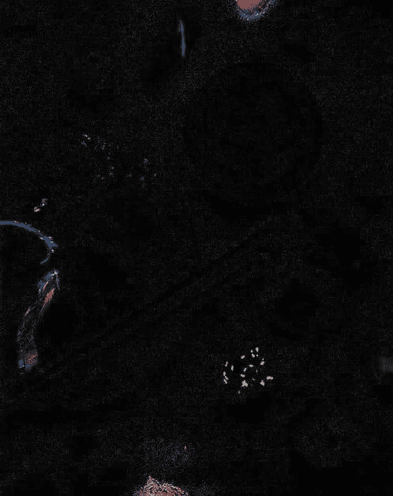
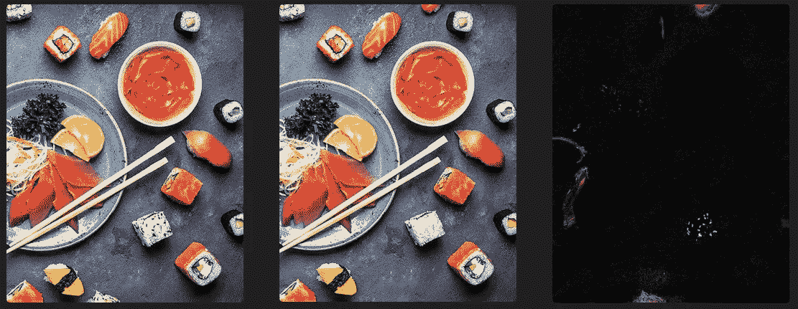

# Python 程序来比较两幅图像之间的差异

> 原文：<https://blog.devgenius.io/python-program-to-compare-the-differences-between-two-images-55fa248d5102?source=collection_archive---------0----------------------->

在本文中，我们将使用 python pillow 库来比较和查找两幅图像之间的差异。

与我平常的周末不同，这个周末我太自由了。我没有太多的工作要做，我只是在跟进我所有的办公室邮件，这时我意识到我的办公室里实际上有一个星期五娱乐日计划，每周都会组织一些有趣的比赛，并将奖励获胜者。因此，在一封这样的邮件中，我发现了一个竞赛，我们必须突出两个图像之间的 6 个差异，谁做得快，谁就能获奖。

所以在看到这封邮件后，我想为什么我不能开始为所有这些比赛编写 python 程序，这将是有趣的，并为我提供了学习许多东西的机会。这就是我如何尝试解决这个 90 年代甚至 20 岁出头的竞赛


作者图片

所以处理图像对我来说是件新鲜事，在网上冲浪之后，我在枕头图书馆发现了这个功能——image chops。

PILLOW 中的 ImageChops 为我们提供了各种功能，例如添加两个图像、混合、叠加、叠加、相减以及找出两个图像之间的差异。

可以在这里参考官方 ImageChops 链接—[https://pillow . readthe docs . io/en/stable/reference/image chops . html](https://pillow.readthedocs.io/en/stable/reference/ImageChops.html)

所以现在，毫不拖延地，让我们开始我们的代码—

## 安装:

可以使用 pip 安装枕头，如下所示—

```
pip install pillow
```

## 加载库

```
from PIL import Image, ImageChops
```

## 密码

所以如上所述，我们将从 pillow 中使用 **ImageChops** 库。

```
# Loading images
img1 = Image.open("img1.jpg")
img2 = Image.open("img2.jpg")# finding difference
diff = ImageChops.difference(img1, img2)# saving the result
diff.save("result.jpg")
```

就是这样，这 5 行代码会给我们输出，使用它我们可以识别两个图像之间的差异。



输出

因此，通过比较这张图片和其他两张图片，我们可以很容易地找到不同之处。



作者图片

这就是它的工作原理。我会试着写一系列这种类型的文章来解决这些有趣的竞赛。

正如巴里·艾伦在 Flash 系列中所说——“我们必须决定我们是谁”，我决定这是我处理这些竞赛的方式。

快乐编码…

## 参考资料:

*   [https://pillow . readthe docs . io/en/stable/reference/image chops . html](https://pillow.readthedocs.io/en/stable/reference/ImageChops.html)
*   [https://www . geeks forgeeks . org/spot-the-difference-two-images-using-python/](https://www.geeksforgeeks.org/spot-the-difference-between-two-images-using-python/)