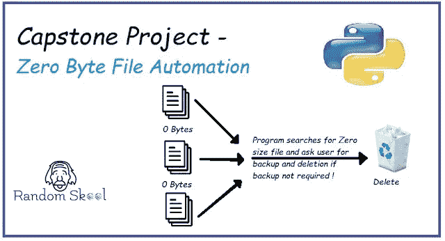

# Python 编程 101 —顶点项目|零字节文件自动化

> 原文：<https://blog.devgenius.io/python-programming-101-capstone-project-zero-byte-file-automation-511cbc1b0771?source=collection_archive---------20----------------------->

今天，我们正在开发我们的第一个顶点项目*零字节文件自动化*程序。

查看完整代码 [***此处***](https://github.com/talk2div/ZeroByteFileAutomation) ***。***

# 这个程序是做什么的？

[它在我们系统的文件和文件夹中进行深度搜索，仅列出大小为
零字节的文件并删除它们。](https://randomskool.blogspot.com/2020/07/python-programming-101-capstone-project.html)

# 这个程序对用户友好吗？

是的，零字节文件搜索自动化项目是非常结构化和用户友好的。用户友好的意思是说，它会提示用户每次当它要采取任何关键步骤，如删除等。

# 这个项目的主要功能是什么？

**项目有四大功能:**

1.  [***查找文件***](https://randomskool.blogspot.com/2020/07/python-programming-101-capstone-project.html) *:首先，我们需要传递要进行文件查找的目录或驱动器位置。位置是必填字段。*
2.  [***要求备份***](https://randomskool.blogspot.com/2020/07/python-programming-101-capstone-project.html)***:****一旦搜索完成，程序将要求将所有这些文件备份到单独的目录中。* ***为什么备份很重要？*** *有时文件名对于安装程序或可执行文件很重要。*
3.  [***要求删除***](https://randomskool.blogspot.com/2020/07/python-programming-101-capstone-project.html)***:****如果要删除文件，按是或否*
4.  [***消息显示***](https://randomskool.blogspot.com/2020/07/python-programming-101-capstone-project.html)***:****一旦删除成功，会显示一条消息。*

# 代码解释:

[***下面是项目拆机:***](https://randomskool.blogspot.com/2020/07/python-programming-101-capstone-project.html)

*1。输入文件中你想要遍历(搜索零字节文件的数量)的完整路径。
2。在 excel 中粘贴文件路径和文件名。*

*3。提示用户选择是或否进行备份。*

*4。提示用户删除所有文件或选择其中一个文件。*

*5。显示消息文件已删除。*

***下面是项目中用到的模块:***

*1。Python OS 模块(用于操作系统相关任务)*

*2。Python Openpyxl(用于 excel 操作任务)*

*3。Python Shutil(用于文件操作任务)*

***下面是项目中用到的函数:***

*该功能用于输入我们想要搜索零大小文件的文件路径。*

*该功能将备份保存到 excel 文件中。*

*此功能备份文件，为此，我们需要输入指定的目录。*

*此功能删除文件，删除后显示删除成功的消息。*

[***主函数*** *负责调用所有相关的方法如文件删除、备份，并显示消息。*](https://randomskool.blogspot.com/2020/07/python-programming-101-capstone-project.html)

Github repo 中提供的代码。点击 [***这里。***](https://github.com/talk2div/ZeroByteFileAutomation/)

Python 编程相关教程。在这里点击*。*

*直到那时快乐编码！！！*

**原载于*[*https://randomskool.blogspot.com*](https://randomskool.blogspot.com/2020/07/python-programming-101-capstone-project.html)*。**