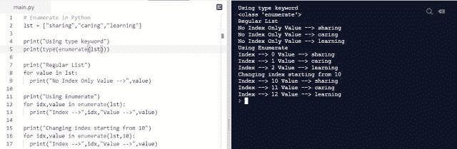

# Python 编程 101 —装饰器|枚举函数|连接|索引/切片

> 原文：<https://blog.devgenius.io/python-programming-101-decorators-enumerate-functions-join-indexing-slicing-f0d12296cd65?source=collection_archive---------28----------------------->

# 加入我们的电报频道和群组:)

*电报组:*[*https://t.me/randomskoolQnA*](https://www.google.com/url?q=https://t.me/randomskoolQnA&sa=D&ust=1594623016888000&usg=AFQjCNE5T_NWsraccKOtT_dJAOsXW-B_6A) *电报通道:*[*https://t.me/randomskool*](https://www.google.com/url?q=https://t.me/randomskool&sa=D&ust=1594623016888000&usg=AFQjCNEkuYtnTltcNcUG5toujo4OYS88uw)

在本教程中，您将学习三个有趣的主题，即装饰器、枚举函数、连接和额外主题索引/切片。

主题摘要:

1. [**装饰者**](https://randomskool.blogspot.com/2020/07/python-programming-101-decorators.html) : *修改了一个类或函数的行为。*

2. [**枚举函数**](https://randomskool.blogspot.com/2020/07/python-programming-101-decorators.html) : *它有助于记录迭代次数。*

3. [**Join**](https://randomskool.blogspot.com/2020/07/python-programming-101-decorators.html) : *它将使用字符串分隔符连接元素的字符串。*

4. [**索引/切片**](https://randomskool.blogspot.com/2020/07/python-programming-101-decorators.html) : *根据这个概念，我们将能够访问列表中的单个元素。*

让我们用例子详细讨论每个主题。

# Python 中的装饰器

装饰器在不改变数据的情况下向类或函数添加额外的行为。

python 中 decorator 的特性:

1.[类似地，当我们在 python 编程中使用 decorators 时，我们为我们的原始函数提供了额外的功能，而没有任何改变。](https://randomskool.blogspot.com/2020/07/python-programming-101-decorators.html)

让我们讨论下面的例子:

在上面的例子中，我们声明了一个名为 like an option()的函数，在这个函数中我们只打印了一条欢迎消息(欢迎使用 Random Skool)。还有， [***我们在上面的选项函数***](https://randomskool.blogspot.com/2020/07/python-programming-101-decorators.html) ***中用@符号命名为帮助来声明装饰者。*** *在 decorator 中，我们将函数名作为参数传递，并在 decorator 下声明另一个名为 inner 的函数，在这个函数中，我们在 option 函数前后打印了两条语句。*

***工作:*** *在第一次调用函数时，装饰器将调用并继续执行这组语句，一旦完成，它将返回调用函数，之后实际函数将执行这组语句。*

2.装饰器有助于异常处理，例如被零除场景、登录密码检查场景等等。

3.装饰函数使用参数传递——我们也可以在装饰器中传递参数，以执行逻辑推理和计算任务。

下面我们借助例子来讨论以上几点:

*当登录成功后*

在上面的例子中，我们在装饰器中传递参数来交叉检查登录凭证是否正确。这种错误处理方式确保了如果有人输入不正确的凭证，我们的原始功能不会受到影响。 [***最佳用例*** *—避免回溯错误(任何类型的回溯错误，如被零除、溢出错误等等)。*](https://randomskool.blogspot.com/2020/07/python-programming-101-decorators.html)

*登录被拒绝时*

4.[***decorator 在链接中使用意味着我们可以在一个函数中使用多个 decorator 或者可以多次使用一个 decorator。我们需要记住的事情*顺序很重要。**](https://randomskool.blogspot.com/2020/07/python-programming-101-decorators.html)

***例如:***

*def first decorator(func):*

*def inner():*

*打印(“我是第一”)*

*func()*

*打印(“我是第一”)*

*返回内部*

*def second decorator(func):*

*def inner():*

*打印(《我是第二》)*

*func()*

*打印(《我是第二》)*

*返回内部*

***@ first decorator***

【T4*@ second decorator*

*def ChainingExp():*

*打印(“顺序很重要”)*

***chaining exp()***

***输出:***

*我是第一名*

*顺序很重要*

*我是第一名*

我是第二名

*顺序很重要*

*我是第二*

让我们改变调用的装饰顺序。

**@ second decorator**

**@ first decorator**

*def ChainingExp():*

*打印(“顺序很重要”)*

***chaining exp()***

***输出:***

*我第二*

*顺序很重要*

*我第二*

*我第一*

*顺序很重要*

*我是第一个*

现在，在这个例子的帮助下，我们明白了调用 decorator 的顺序在 python 编程中起着至关重要的作用。在上面的例子中，我们首先调用两个 decorators，然后，当我们改变顺序并检查结果时，我们将知道顺序被颠倒了。

那都是关于装修工的。

现在让我们继续列举函数。

# Python 中的枚举函数

[主要是用来枚举 ***的迭代次数。***](https://randomskool.blogspot.com/2020/07/python-programming-101-decorators.html)

*在列表或元组等可迭代对象中使用枚举，将创建具有索引和值的枚举对象。*

让我们用一个例子来详细理解这个列举。

在下面的例子中，我们使用了 4 种不同的枚举情况。

首先，我们声明一个名为 lst 的简单列表，它有三个值。

***案例 1。*** [*使用 type 关键字将列表转换为枚举并检查类型。*](https://randomskool.blogspot.com/2020/07/python-programming-101-decorators.html)

***案例二。*** [*循环一个常规列表，演示显示没有索引值的常规列表。*](https://randomskool.blogspot.com/2020/07/python-programming-101-decorators.html)

***案例三。*** [*使用 enumerate 关键字，我们将一个常规列表转换为枚举类型，并通过枚举循环打印索引和值。*](https://randomskool.blogspot.com/2020/07/python-programming-101-decorators.html)

***案例四。*** [*类似于情况 3，现在我们也在列表名称后传递起始索引。*](https://randomskool.blogspot.com/2020/07/python-programming-101-decorators.html)

# 加入 Python

[python 中的 Join 用于在字符串分隔符的帮助下组合列表中的字符串元素。](https://randomskool.blogspot.com/2020/07/python-programming-101-decorators.html)

***语法:***

***【列表】***

str:字符串分隔符。例如，"-"，"，" & "等等。

让我们借助一个简单的例子来讨论这个问题。

在这个例子中，我们声明了一个字符串列表，在 join 函数的帮助下，我们以三种不同的形式连接元素列表。

字符串分隔符为" "(无空格)的第一种形式。

字符串分隔符为“-”(连字符)的第二种形式。

第三种形式，其中字符串分隔符是“%”(百分比符号)。

注意: [Join 只能在字符串类型列表中使用。否则，它会引发一个错误(下面会提到)。](https://randomskool.blogspot.com/2020/07/python-programming-101-decorators.html)

***回溯(最近一次调用最后一次):***

***文件“main.py”，第 3 行，在<模块>*** 中

***打印(")。*** 【加入(lst))

***类型错误:序列项 0:预期的 str 实例，int 找到***

# Python 中的索引\切片

***python 中的索引用于访问列表中的单个元素。***

让我们借助一个例子来讨论索引。

[我们可以通过索引从左到右(+active index)和从右到左(-active index)访问元素。](https://randomskool.blogspot.com/2020/07/python-programming-101-decorators.html)

***切片在 python 中用于从列表*** ***中访问*** [***范围内的元素。***](https://randomskool.blogspot.com/2020/07/python-programming-101-decorators.html)

让我们借助一个例子来讨论切片。

在下面的例子中，所有的场景都在打印语句的帮助下进行了解释。

注意:使用" **:** 访问所有元素

在切片中，有一件事我们都需要知道，那就是切片步骤。

## 什么是阶梯切片？

[*在切片中，我们只指定元素的范围，但如果我们需要范围内的每一个交替元素或每三个元素，我们可以使用步进切片。*](https://randomskool.blogspot.com/2020/07/python-programming-101-decorators.html)

***语法:***

lst = [1，2，3，4，5，6，7，8，9，10]

***常规切片***

李斯特[2:5]

*lst[2:5:2]*

*旧约全书[2:8:3]*

*lst[::-3]*

*lst[3:5:-1]*

*在下一个教程中，我们将学习一些小主题，如内置和外部模块、f 字符串、dunder 变量、requirement.txt 和 virtual env。*

# *加入我们的电报频道和群组:)*

**电报组:*[【https://t.me/randomskoolQnA】T21](https://www.google.com/url?q=https://t.me/randomskoolQnA&sa=D&ust=1594623016888000&usg=AFQjCNE5T_NWsraccKOtT_dJAOsXW-B_6A)*

**电报通道:*[*https://t.me/randomskool*](https://www.google.com/url?q=https://t.me/randomskool&sa=D&ust=1594623016888000&usg=AFQjCNEkuYtnTltcNcUG5toujo4OYS88uw)*

# *直到那时快乐编码！！！*