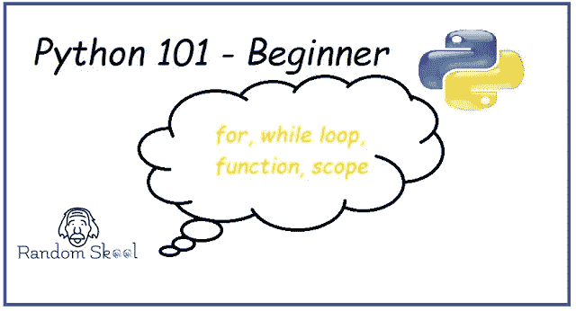
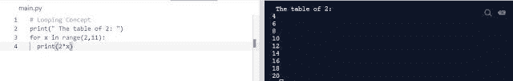
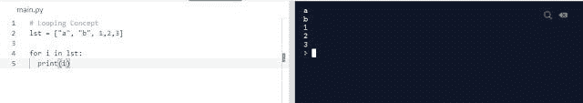
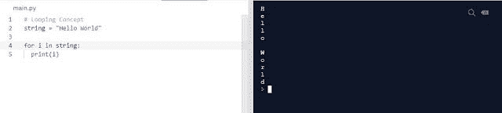
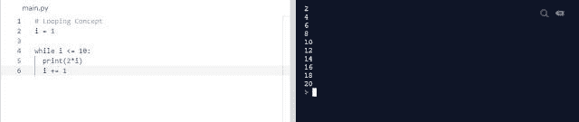
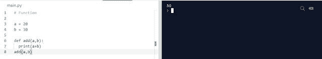
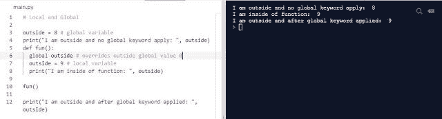

# Python 编程 101—For | While | Loop | Function | Scope

> 原文：<https://blog.devgenius.io/python-programming-101-for-while-loop-function-scope-11f758e04e60?source=collection_archive---------38----------------------->

在本教程中，我们将学习 python 中的循环概念，以及如何使用函数减少 python 中的工作量，并通过不同的方法使用范围(如局部和全局范围)来限制变量的可访问性。

[**我们为什么需要循环？**](https://randomskool.blogspot.com/2020/07/python-programming-101-for-while-loop.html)

尽量减少不必要的努力。假设我们需要连续地将两组不同的数字相乘。在传统的方法中，我们将一个接一个地做乘法，但是使用循环概念，我们只需要写 2 或 3 行代码就可以在几分钟或几秒钟内完成乘法。

[**传统方式:**](https://randomskool.blogspot.com/2020/07/python-programming-101-for-while-loop.html)

[**编码者使用循环概念的方式:**](https://randomskool.blogspot.com/2020/07/python-programming-101-for-while-loop.html)

在上面的例子中，我们定义了数字的范围，并为一个循环放置了一个。
就是这样，一旦达到范围结束值，for 循环以下的所有内容都将执行。

有两种类型的循环语句:

[1。 **For loop** :量程已知时。
2。 **While 循环**:条件满足时。](https://randomskool.blogspot.com/2020/07/python-programming-101-for-while-loop.html)

让我们看看 for 和 while 循环的例子和解释。

[**对于循环的解释:**](https://randomskool.blogspot.com/2020/07/python-programming-101-for-while-loop.html)

当起始数和结束数已知时，我们就可以借助 range 函数使用 for 循环。
[**注**:我们可以对任何可迭代对象使用 for 循环，比如列表、元组、字典等等。](https://randomskool.blogspot.com/2020/07/python-programming-101-for-while-loop.html)

字符串迭代也可以用于 for 循环。

**例如:**

**用于范围为**的循环

[**While 循环解释:**](https://randomskool.blogspot.com/2020/07/python-programming-101-for-while-loop.html)
[While 循环是我们在处理条件时使用的，如果条件满足或者满足，循环将会一直运行，否则在中间停止。](https://randomskool.blogspot.com/2020/07/python-programming-101-for-while-loop.html)

此外，在下面的例子中，我们使用 while 循环，以便使用 while 循环有效地在条件后首先初始化变量，并递增我们在第一次初始化的变量，否则 while 循环将运行无限次。

**函数**
下面是 python 编程中函数的主要特性:-

[*1。函数使代码可重用*
*2。函数作用于模块化编程的现象。*
*3。函数可以使用作用域来限制其他不同函数或变量的可访问性。*](https://randomskool.blogspot.com/2020/07/python-programming-101-for-while-loop.html)

1.  [***功能语法:***](https://randomskool.blogspot.com/2020/07/python-programming-101-for-while-loop.html)

***加法(数量 _1，数量 _2)***

***2。*** [***传递参数***](https://randomskool.blogspot.com/2020/07/python-programming-101-for-while-loop.html)***:***参数传递很重要，因为如果我们声明了函数，却没有传递函数所要传递的值，那么它就没有任何用处。
括号()之间传入的参数如(number_1，number_2)。
有两种类型的参数:
a)形参:当我们在函数调用时将实际值传递给某个其他标识符或变量时。
b)实参:当我们传递函数调用时的实参值。

**3。** [***函数调用* :**](https://randomskool.blogspot.com/2020/07/python-programming-101-for-while-loop.html) 当我们通过传递实参或形参来调用函数执行指定的任务时。

[**函数如何复用？**](https://randomskool.blogspot.com/2020/07/python-programming-101-for-while-loop.html)

在上面的例子中，我们显式地传递 a 和 b。但是我们可以通过使用 input 函数并接受用户的输入来动态地改变这些值。
如果有人需要执行减法，那么我们只需要创建一个新的减法函数。就是这样。

[***让我们借助有趣而令人难以置信的例子来讨论局部和全局范围。***](https://randomskool.blogspot.com/2020/07/python-programming-101-for-while-loop.html)

该程序由 12 行组成，其中有几行是空白的，可以忽略。我将尝试简要解释每一行。

我们开始吧。

1.使用#进行注释。
2。将名为 outside 的全局变量声明为，并将值作为 8 传递。
3。打印更改前的全局变量值，它在控制台中显示为 8。
4。将名为 fun()的函数声明为。
5。在 fun()函数中，我们在外部用不同的值(9)声明了相同的变量，但是这个值只在 fun()函数的范围内定义和访问。这种在函数范围内或局部可访问的变量称为局部变量。
6。在 fun()函数中，我们使用了 global 关键字，因为我们想覆盖现有的值为 8 的全局变量，并希望我们的值为 9 的新局部变量在程序中被进一步视为全局变量。
7。fun()正在调用函数
8。最后，我们打印外部变量的值，并且知道它现在被一个局部变量覆盖，我们已经使用 global 关键字转换了这个局部变量。

在下一篇教程中，我们将学习更多有趣的 python 概念，如 lambda、map、filter、reduce 和*args & **kwargs。

直到那时快乐编码:)

*原载于 https://randomskool.blogspot.com***。**