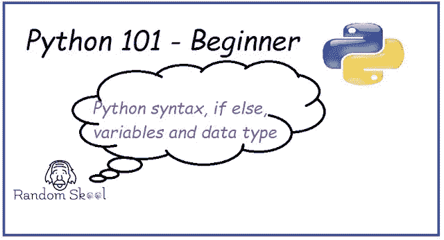
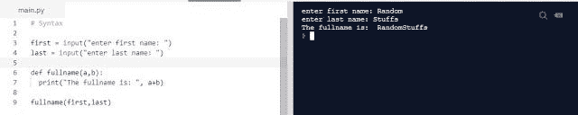
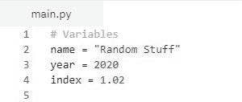
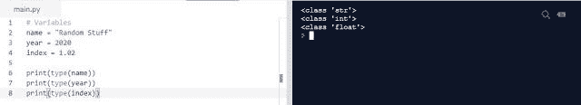
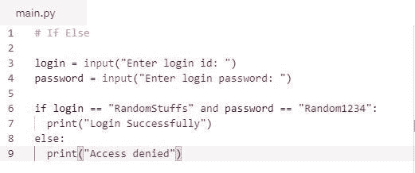
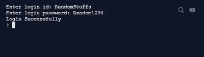
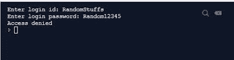
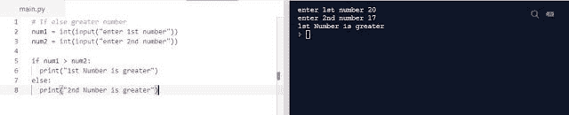

# Python 编程 101 — If Else |语法|变量

> 原文：<https://blog.devgenius.io/python-programming-101-if-else-syntax-variables-df44b570d49a?source=collection_archive---------38----------------------->

在本教程中，我们开始了解变量的[重要性，if-else 条件，以及最重要的是我们应该如何为这些语法知识编写 python 程序。](https://randomskool.blogspot.com/2020/07/python-programming-101-if-else-syntax.html)

众所周知，python 易于维护、编写和阅读，因为 python 的这种能力，我们能够用简单流畅的英语编写代码。没有必要在行尾放任何分号、句号符号。我们可以忽略 python 中的分号，我们只需要专注于编写良好而精确的代码。

[让我演示一下用 python 写代码的方法](https://randomskool.blogspot.com/2020/07/python-programming-101-if-else-syntax.html)，当我们遇到这个话题时，我会在教程的后面部分解释所有的细节。

1.在第一行和第二行代码中，我们从用户那里获取输入，并存储在变量 first name 和 last name 中(默认情况下，输入总是字符串类型)

2.在第四行中，我们定义了一个传递两个参数的函数，稍后我们将详细研究这个函数是什么。

3.在第五行中，我们通过将两个变量连接成一个来打印语句。

4.在第七行，我们简单地调用函数来执行连接任务。

我们也可以通过简单地使用内置函数将七行减少到 2 或 3 行。但是为了便于解释，我需要使用这种编写程序的方式。

编写程序因人而异，最重要的是如何在不影响复杂性和运行时行为的情况下减少代码行。

在上面的例子中，您可以看到用 python 编写程序是多么容易，不用太担心分号和其他编程语言中仍然存在的其他语法术语。

***1。*** [***Python 区分大小写***](https://randomskool.blogspot.com/2020/07/python-programming-101-if-else-syntax.html)

变量只是一个占位符，我们可以在这里存储一些值。

从**派生的变量 vary ( to change)** 意味着我们可以在程序中不时地改变变量的值。

我们可以使用变量来存储任何类型的值，无论是字符串还是数字。

注意:我们可以用数字和特殊字符来初始化变量

数据类型意味着我们正在处理什么类型的值。值可以是字符串、整数、浮点、双精度等等。

[数据类型在 python 编程中的重要性](https://randomskool.blogspot.com/2020/07/python-programming-101-if-else-syntax.html):

假设我们正在创建一个用户友好的计算器程序，其中用户需要从键盘输入数据，我们知道输入函数总是认为一切都是字符串数据类型，然后为了执行某种计算，我们需要将字符串类型转换为整数类型。在这种情况下，我们必须了解数据类型的概念。

我们可以使用 python 内置函数轻松了解数据类型:

当我们处理两个值之间的某种比较时，If-Else 条件是广泛使用的语句之一。

我们在日常活动中使用 if else 的几个场景

假设我们登录脸书，Instagram，Twitter 和任何需要登录凭证的网站，如果-否则的概念将被使用。

*当登录成功后。*

*当访问被拒绝时。*

假设我们想比较数字，想知道所有数字中最大的。我们可以在那里使用 if-else 概念。

在下面的例子中，我们使用类型转换将字符串转换为整数。

在 if-else 中，我们可以使用不同的运算符，如 ***大于、小于、与、或、*** 等等，以获得更好的比较结果。

*此外，* [*还有许多 if-else 条件的变体，例如 if-else-if 梯形，我们可以使用多个条件来检查 if 是否失败，然后转移到另一个 if，最后 else 条件语句显示结果*](https://randomskool.blogspot.com/2020/07/python-programming-101-if-else-syntax.html) *。此外，还有嵌套 if，我们希望将不同的集合与数字进行比较，或者当需要在比较中进行比较时，我们可以使用嵌套 if。*

在下一个教程中，[我们将学习不同类型的运算符，什么是集合，等等。](https://randomskool.blogspot.com/2020/07/python-programming-101-operators-set.html)

请通过电子邮件订阅我们，并对更多问题发表评论。

直到那时快乐编码！！！！

*原载于*[*https://randomskool.blogspot.com*](https://randomskool.blogspot.com/2020/07/python-programming-101-if-else-syntax.html)*。*