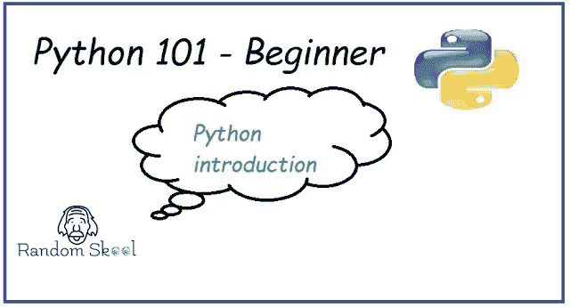

# Python 编程 101 —简介

> 原文：<https://blog.devgenius.io/python-programming-101-introduction-70ed359443ea?source=collection_archive---------41----------------------->

# Python 简介

Python 总是排在十大编程语言之下，当我出于研究目的在谷歌搜索时，哪种编程语言最适合 2020 年？在谷歌上出现的第一个结果是“ [***Python 是 2020 年*** 的最佳语言”。](https://randomskool.blogspot.com/2020/07/python-programming-101-introduction.html)

# 是什么让 python 这么出名，大家都想和 python 合作？

python 有很多优点，比如 python 有一个最大的开源社区，python 可以很容易地与其他项目集成。

*[***根据 python 包索引，Python 库有 118932 个，不知道市场上有多少第三方库。现在你可以想象 python 开源社区有多大了。***](https://randomskool.blogspot.com/2020/07/python-programming-101-introduction.html)*

# ***在哪里我们可以使用 Python 编程语言？***

***1.Web 开发
2。游戏开发
3。软件开发。机器学习
5。取证
6。医学
7。航空学。自动化。汽车
10。物联网
11。几乎所有可以使用 python 的地方。***

# ***python 有哪些重要的模块？***

***1.Django 和 Flask——用于 web 开发
2。Matplotlib 用于图形和绘图
3。NumPy、Pandas 和 SciPy——用于数据科学、数据操作和机器学习
4。美丽的声音和刮削——用于网络刮削
5。PyGame —用于游戏开发
6。前端—用于测试
7。更多…***

# ***Python 的定义-***

***Python 是简单易学且功能强大的编程语言。它有助于自动化日常任务以及使用 OOPS 概念开发项目。***

***以下是 Python 的特点:***

***1.[解释](https://randomskool.blogspot.com/2020/07/python-programming-101-introduction.html) : Python 在运行时运行代码，无需编译每一段代码。***

***2.[交互](https://randomskool.blogspot.com/2020/07/python-programming-101-introduction.html):可以直接从命令行运行代码，不需要安装任何专门的编码软件。***

***3.[哎呀](https://randomskool.blogspot.com/2020/07/python-programming-101-introduction.html) : Python 附带了丰富的面向对象编程概念集合。***

# ***Python 的创始人-***

***Python 由 Guido Van Rossum 于 1991 年创建。***

***当他开始实现 Python 时，吉多·范·罗苏姆也在阅读“蒙蒂·Python 的飞行马戏团”的出版脚本，这是一部 BBC 世纪 70 年代的喜剧系列片。Van Rossum 认为他需要一个简短、独特且略带神秘的名字，所以他决定将这种语言称为 Python。***

***阅读[常见问题](https://docs.python.org/2/faq/general.html#:~:text=Why%20is%20it%20called%20Python%3F,-%C2%B6&text=When%20he%20began%20implementing%20Python,to%20call%20the%20language%20Python.)了解更多信息。***

***python 有许多优点，例如:***

***3.友好(使阅读更简单)***

# ***其他资源-***

***要了解 python 及其应用，没有什么比它自己的官方文档更好的了。***

***请访问 [python doc。](https://www.python.org/doc/)***

***点击[下一个教程(Python 编程 101 —安装)](https://randomskool.blogspot.com/2020/07/python-programming-101-installation.html)***

****最初发表于*[*https://randomskool.blogspot.com*](https://randomskool.blogspot.com/2020/07/python-programming-101-introduction.html)*。****