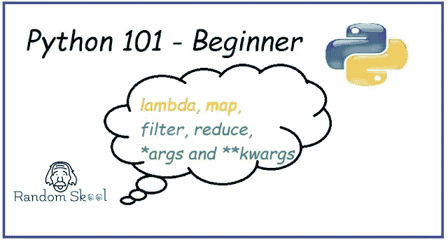
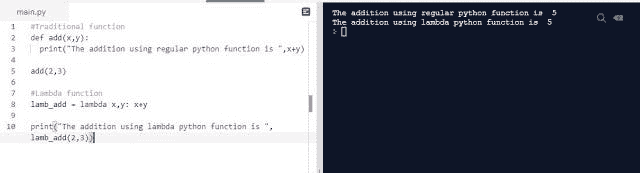
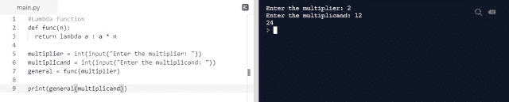
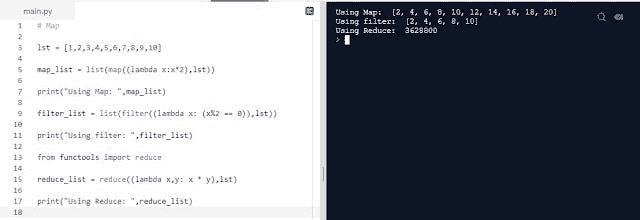
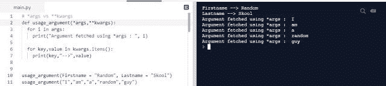
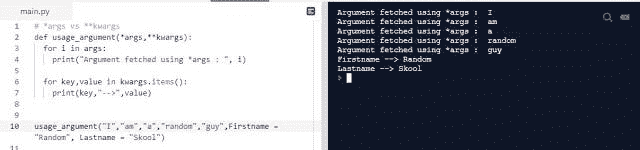
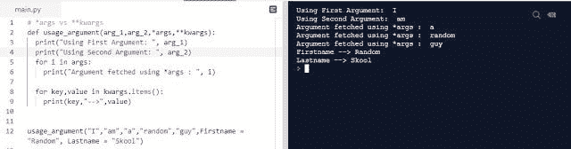

# Python 编程 101—Lambda | Map | Filter | Reduce | * args 和**kwargs

> 原文：<https://blog.devgenius.io/python-programming-101-lambda-map-filter-reduce-args-and-kwargs-9589287c5336?source=collection_archive---------47----------------------->

在开始教程之前，我谦卑地请求加入我们的电报频道和小组。

**电报组:**[*https://t.me/randomskoolQnA*](https://www.google.com/url?q=https://t.me/randomskoolQnA&sa=D&ust=1594623016888000&usg=AFQjCNE5T_NWsraccKOtT_dJAOsXW-B_6A) **电报通道:**[*https://t.me/randomskool*](https://www.google.com/url?q=https://t.me/randomskool&sa=D&ust=1594623016888000&usg=AFQjCNEkuYtnTltcNcUG5toujo4OYS88uw)

在本教程中，[我们将了解在 python 编程中起着至关重要作用的有趣话题之一，即 lambda 函数](https://randomskool.blogspot.com/2020/07/python-programming-101-lambda-map.html)。Lambda 函数改变了我们日常生活中使用的传统函数的定义。

然而，在 lambda 函数的帮助下，我们能够涵盖三个子主题，如映射、过滤和减少。

# λ函数

Lambda 函数可以作为[匿名/单行函数调用。](https://randomskool.blogspot.com/2020/07/python-programming-101-lambda-map.html)

**lambda 函数如何有用？**

[1。当我们想用简洁的方式或一行程序编写函数时，Lambda 会很有用。
2。当我们希望一个函数成为另一个函数的一部分时，Lambda 函数会很有用。或者我们可以说，当我们想要一个函数传递参数给另一个函数时，我们可以使用 lambda 函数。](https://randomskool.blogspot.com/2020/07/python-programming-101-lambda-map.html)

让我们用一个例子来理解 lambda 函数的范例。

这段代码解释了 lambda 函数的紧凑本质。你可以在代码中看到，首先在传统或常规 python 函数的情况下，编写代码 1 所需的步骤是什么。需要使用 def 关键字*(def function _ name(parameter))*2 定义函数。在函数下，定义需要写函数的语句或体。3.最后一步函数调用和参数传递。整个 python 正则函数是三步过程，当我们需要一些紧凑的结构化方法时，我们可以使用 lambda 函数来减少时间。

在 Lambda 函数中，我们只声明变量，然后使用 ***lambda 关键字*** 编写实际运行的代码，最后，我们传递参数。lambda 函数就是这么简单。

**让我们看看 lambda 函数的另一个例子。**

在这个例子中，我们使用 lambda 函数的另一个概念，将 lambda 函数参数传递给另一个函数。我们使用两个变量，并使用类型转换从被乘数和乘数的用户处获取输入，以将字符串转换为 int 类型。然后将乘数值传递给λ函数，将被乘数值传递给常规函数，并将这两个值用于一般乘法。在这个例子的帮助下，我们都意识到我们可以在参数传递中使用 python 函数。

# 地图

映射用于在列表中的每个元素中应用函数。

# 过滤器

过滤器用于过滤函数返回 true 的列表。

# 减少

Reduce 用于通过对列表对执行重复操作来缩减列表。Reduce 位于 functools 模块下。

# 映射、过滤和减少示例:

# *args vs **kwargs

[***重要点(两者都是在我们处理不可预测的数据集或数值时使用)***](https://randomskool.blogspot.com/2020/07/python-programming-101-lambda-map.html)

***args** — *用于传递大型参数列表或不可预测的参数列表*

****kwargs** — *关键字参数*

*args 和**kwargs 的工作方式是相同的，它们之间唯一的主要区别是，当我们处理一系列元素时，我们需要使用*args，而当我们处理关键字参数时，例如像数据类型的字典，我们需要使用**kwargs。

**让我们借助一个例子来讨论一下。**

[在这个例子中，我们声明了两个具有不同参数集的函数，一个用于参数列表，另一个用于关键字参数。语法是不言自明的，我们使用简单的 python 函数语法进行参数传递和函数调用，除了当我们传递简单的参数列表时，我们使用*args，当我们传递关键字参数字典时，我们使用**kwargs。](https://randomskool.blogspot.com/2020/07/python-programming-101-lambda-map.html)

**使用*args 和**kwargs 的不同场景:**

***1。两者可以在同一个功能中用不同的功能调用***

***2。两者可以在同一个函数中用同一个函数调用***

**注:**
[*我们在使用*args 和**kwargs 时都要遵循排序的概念，都严格遵循顺序的性质。*](https://randomskool.blogspot.com/2020/07/python-programming-101-lambda-map.html)
*第一个(正常参数)>第二个(*args) >第三个(**kwargs)*

在下一个教程中，我们将学习装饰器、枚举函数、连接和索引/切片。

告诉然后快乐编码！！！

*原载于*[*https://randomskool.blogspot.com*](https://randomskool.blogspot.com/2020/07/python-programming-101-lambda-map.html)*。*