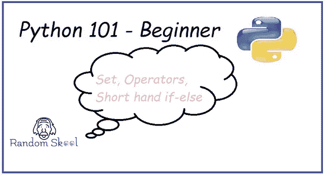

# Python 编程 101 —运算符|集合|简写 If Else

> 原文：<https://blog.devgenius.io/python-programming-101-operators-set-short-hand-if-else-6d5d5cef3b22?source=collection_archive---------39----------------------->

在本 python 教程中，我们将学习 python 编程的三个新的不同概念——集合、运算符、简写 if-else。

**Python 概念概述:**

1. [***集合***](https://randomskool.blogspot.com/2020/07/python-programming-101-operators-set.html) ***:*** 集合未排序和未索引的项目
2 .*[***运算符***](https://randomskool.blogspot.com/2020/07/python-programming-101-operators-set.html)***:***数学运算适用于加、减等变量。
3。 [***简写 if else***](https://randomskool.blogspot.com/2020/07/python-programming-101-operators-set.html)***:***将 if-else 条件简化为内联形式。*

***python 中的集合是什么？***

**集合是未排序和未编制索引的项目的集合。*
*集合中不存在重复元素。*
*集合是可变的，即可以添加、删除或更新集合。**

*[让基础 python 程序为集合](https://randomskool.blogspot.com/2020/07/python-programming-101-operators-set.html):*

**

*在第二行中，我们使用方括号[ ]声明列表。我有意将重复值放入列表中，以证明集合中不包含重复值。
一旦声明 list = [1，2，3，3，4，5]我们需要使用 set 关键字将列表转换为集合，即 set(lst)或 set([1，2，3，3，4，5])。
之后，我们在控制台中打印结果，可以看到器械包中没有重复的物品。*

*让我们通过 python 基础程序来看看 Set 的[几个内置函数](https://randomskool.blogspot.com/2020/07/python-programming-101-operators-set.html)。*

**

*   *首先，我们用初始值{1，2，3，4，5}声明名为 org_set 的集合*
*   *其次，我们使用添加函数添加一个新数字 6 **，并打印集合的结果。***
*   ****集合中的更新功能，用于更新集合*** 中的多个项目，也就是我们这里正在做的。我们用在更新功能中指定的新集合更新整个集合，只有原始值会更新到集合中，并打印结果以供验证。*
*   ****使用移除功能，我们从原始集合中移除 6 和 7 值。****
*   *将具有一些初始值的第二集合声明为{5，6，7，8，9，10}*
*   *程序最后三行显示 ***第二个集合与第一个集合的并、交、不交。****

*[***应用于变量中的数学运算***](https://randomskool.blogspot.com/2020/07/python-programming-101-operators-set.html) ***称为运算符。****

*Python 由下面提到的各种操作组成:*

*1.算术运算(+，-，*，/，* * %，//)*

*注:**(指数运算)//(除法运算后给出 int 值)*

*2.赋值(+=，=，等等)*

*5.身份(是，不是)*

*6.成员资格(加入，不加入)*

*让我们看看下面的 python 基础程序的例子，在这里我试图涵盖大部分的 python 操作。*

*在下面的例子中，我们从用户那里获取两个输入，并在传递输入时将字符串类型转换为整数。之后，我们在 if-else if 梯形中使用比较运算符。如果条件满足，则执行所需的操作，例如加法、减法和乘法。*

**

***简写 If-Else 符号***

*由于这个话题很小，我将借助一个例子来解释这个话题。关于简写 if-else 符号，我们需要知道的是，当需要在一行中使用 if else 或者需要将一个条件放在一个较小的变量集中时，简写 if-else 是更好的选择。*

**

*在下一个教程中，我们将学习循环、函数和作用域(局部/全局)。*

*在那之前，快乐的编码人们！！！*

**原载于【https://randomskool.blogspot.com】**。****