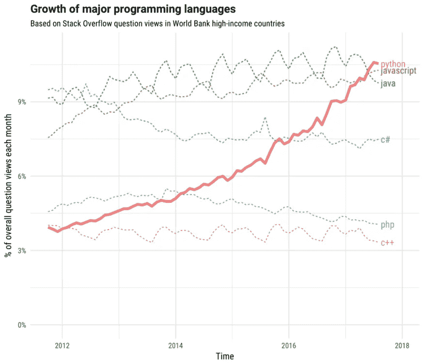

# Python 初学者编程技巧。

> 原文：<https://blog.devgenius.io/python-programming-tips-for-beginners-ac19a0711cc3?source=collection_archive---------3----------------------->

马丁·w·柯斯特在 [Unsplash](https://unsplash.com?utm_source=medium&utm_medium=referral) 上的照片

## 成为更好的程序员的 Python 技巧

P ython 是免费开源的，与其相关的大部分产品也是如此。此外，它还有一个由程序员和其他用户组成的大型、专注且友好的社区。它用于数据科学和机器学习、许多领域的科学计算、后端 Web 开发、移动和桌面应用程序等等。许多知名公司都使用 Python:谷歌、Dropbox、脸书、Mozilla、IBM、Quora、亚马逊、Spotify、NASA、网飞、Reddit 等等。

其语法的设计考虑了简单性、可读性和优雅性。

从专业上来说，python 主要可以用于:

*   后端 web 开发
*   数据科学
*   人工智能
*   科学计算。
*   机器学习
*   开发游戏和许多其他这样的领域是一个人想要工作并创造未来的领域

由于上面的使用，我们可以说，难怪 python 成为世界上使用最多的编程语言之一，我们甚至可以检查下面提到的堆栈溢出的统计数据。

来自堆栈溢出的图像

在本文中，我们将讨论从初级到高级 python 程序员所需的技巧，这是我多年来一直在尝试实现和遵循的。我们努力提高英语交流和写作技能的方式对我们来说，在日常生活中提高编程技能同样重要。

# 技巧#1 →每天编码

当我们学习一门新语言时，连贯性是非常重要的。我们建议每天对代码做出承诺。可能很难相信，但是肌肉记忆在编程中起着很大的作用。致力于每天编码将真正有助于开发肌肉记忆。虽然一开始看起来令人畏惧，但是可以考虑从每天 25 分钟开始，一天至少 2 小时。

一旦你很好的掌握了基础知识，你就可以在下面给出的平台上练习编码

1.  [顶部编码器](https://www.topcoder.com/challenges/?pageIndex=1)
2.  [黑客排名](https://www.hackerrank.com/domains)
3.  [代码厨师](https://www.codechef.com/)
4.  [Leet 代码](https://leetcode.com/)

# 技巧#2 →写下代码

一旦你掌握了任何编程语言的基础知识，写下代码并坚持练习可能会显得非常无聊和令人畏惧，但是你应该这样做！事实上，研究表明，手写笔记最有利于长期记忆。这对那些致力于成为全职开发人员的人来说尤其有益，而且对你的编码面试也有帮助。

> “学习一门新的编程语言的唯一方法是用它来编写程序”~丹尼斯·里奇

# 技巧# 3→成为一名虫子赏金猎人

一旦我们开始编程，我们显然会陷入错误，开始深入寻找它们，并试图找出问题，直到你找到解决方案或核心。调试时，重要的是要有一种方法来帮助您找到问题出在哪里。按照代码执行的顺序仔细检查代码，确保每个部分都能正常工作是一个很好的方法

这发生在我们每个人身上！不要让错误挫败你。相反，自豪地拥抱这些时刻，把自己想象成一个虫子赏金猎人。

# 技巧# 4→教与学

据说学东西最好的方法是教它。有很多方法可以做到这一点，比如我们可以和其他 Python 爱好者一起使用白板，写我个人最喜欢的博客文章来解释新学到的概念，录制视频来解释你学到的东西。这些策略中的每一个都将巩固你的理解，并暴露你理解中的任何差距。

> 菲尔·柯林斯“在学习中你会教，在教中你会学”

# 技巧#5 →开始构建项目

对于初学者来说，有很多小项目会真正帮助你变得自信。一旦你牢固掌握了基本的数据结构(字符串、列表、字典、集合)。您可以从许多中级和高级项目开始。

建设之旅是真正能教会你最多的东西。你的大部分学习将来自于使用 Python 来构建一些东西。你将要解决的问题会教会你很多

你可以看看我以前关于初级 python 项目的博客，它可以帮助你了解如何使用 Python 创建各种有趣和创新的东西。

 [## 面向初学者的五个 Python 项目

### 你刚刚学完 python 的基础知识吗？那么是时候用这些有趣的迷你项目来展示你的技能了。

medium.com](https://medium.com/swlh/five-python-projects-for-beginners-f87dbfe43593) 

# 技巧 6 →尝试结对编程

结对编程是一种简单的方式，两个开发人员坐在一起，其中一个人编写代码，另一个人审查代码，并使用各种方法(如时间和空间复杂度)找出更好的代码编写方法，反之亦然。

结对编程有很多好处:它不仅让你有机会让别人审查你的代码，还能让你看到其他人是如何思考问题的。接触多种想法和思维方式将有助于你在回到自己编码的时候解决问题。

# 秘诀 7 →休息一小会儿

当我们学习新东西时，重要的是离开并吸收概念。[番茄工作法](https://en.wikipedia.org/wiki/Pomodoro_Technique)应用广泛，可以帮助我们工作 25 分钟，然后短暂休息，然后重复这个过程。调试时，中断尤其重要。如果你碰到了一个 bug，却不知道到底是哪里出了问题，那就休息一下。离开你的电脑，去散步，或者和朋友聊天。

在编程中，你的代码必须完全遵循语言和逻辑的规则，所以即使少了一个引号也会破坏一切。新鲜的眼睛有很大的不同

# 技巧 8→为开源做贡献

为开源代码做贡献是创造有价值的学习经历的好方法。在开源模式中，软件源代码是公开的，任何人都可以对其做出贡献。这也是与有相似兴趣的人交流的一种极好的方式，也是向程序员群体传授新事物的一种很好的方式。在一个共享的平台上与他人互动和工作也将有助于你从参与其中的每个人那里学到新的概念。当你查看源代码时。

你将学习事物是如何工作的，你将得出你的结论，你将通过阅读别人的代码来练习。

# 技巧 9 →让你周围都是正在学习的人

虽然编码看起来像是一项单独的活动，但实际上当你们一起工作时效果最好。当你学习用 Python 编程时，你周围的人也在学习是非常重要的。这将允许你分享你一路上学到的技巧和诀窍。

不认识人也不用担心。有很多方法可以认识其他热衷于学习 Python 的人！寻找当地的活动或聚会，或者加入 [Pythonista Cafe](https://www.pythonistacafe.com/) ，这是一个面向像您一样的 Python 爱好者的点对点学习社区。

# 技巧# 10→参加在线课程，阅读各种关于 Python 的书籍

学习一门编程语言看起来相当困难，是一项具有挑战性的任务。这就是在线课程和书籍通过帮助您开始编码之旅来拯救您的地方。

在线课程教给你基本的和高级的概念，并给你深入的知识，这样你就可以掌握你的编码技能，为了更深入地了解它，你必须阅读一些高级书籍，以培养对该主题的强大动手能力。

# 结论

由于编码越来越受欢迎，编程行业见证了试图学习如何编码的人数激增。如果你也决定以程序员为职业，那么一定要利用所有这些技巧来学习 Python，以充分利用你的编程技能。

如果您在选择 python 职业道路时需要任何帮助，请随时联系我，我会尽快回复您。您可以在下面发表评论，也可以通过下面的我的网站链接发表评论。

**’**

**领英 Id:*[*https://www.linkedin.com/in/manan-b-shah-b6a9b2184/*](https://www.linkedin.com/in/manan-b-shah-b6a9b2184/)*

# *参考*

1.  *[https://stack overflow . blog/2017/09/06/incredible-growth-python/](https://stackoverflow.blog/2017/09/06/incredible-growth-python/)*
2.  *[https://realpython.com/](https://realpython.com/)*
3.  *[https://www . nau kri . com/blog/learn-python-best-tips-for-初学者-covid-article3/](https://www.naukri.com/blog/learn-python-best-tips-for-beginners-covid-article3/)*