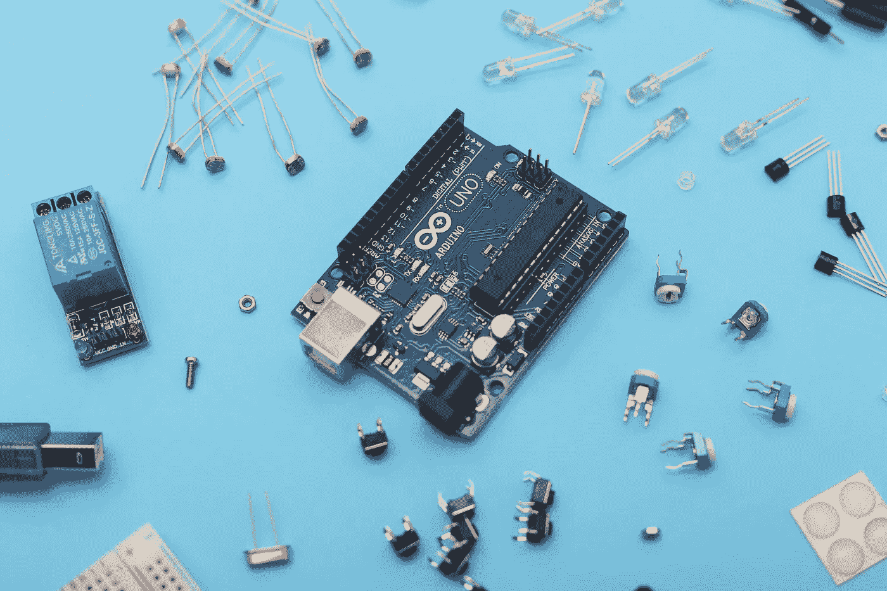

# Python 编程教程:使用类的面向对象编程

> 原文：<https://blog.devgenius.io/python-programming-tutorial-object-oriented-programming-using-classes-1de04f027611?source=collection_archive---------5----------------------->



摄影师:unsplash.com 的萨汉德·巴巴里

面向对象编程(OOP)是一种基于对象的概念编程范式。OOP 的工作方式是创建一个对象，然后它描述这个东西以及它能做什么。在 Python 中，使用**类定义对象。**

> 这篇文章是我的 [Python 编程教程](https://arc-sosangyo.medium.com/list/introduction-to-python-programming-80e79264dcad)系列的一部分。

在本教程中，我们将创建一个包含不同超能力的物体。

# 性能

属性是类中的一个[变量](https://arc-sosangyo.medium.com/introduction-to-python-programming-variables-and-data-types-ef29710fad9e)。

例如

```
*class* SuperPowers:
  powerOne = 'Super Strength'
  powerTwo = 'Super Speed'
  powerThree = 'Flight'showPower = SuperPowers()print(showPower.powerThree)
```

输出将是:

```
Flight
```

在上面的例子中，我们使用属性来声明不同类型的超能力。然后为了显示这些超能力之一，我们在一个变量中调用 superpowers 类，然后打印它的一个属性。

# 方法

方法是一个类中的[函数](https://arc-sosangyo.medium.com/python-programming-tutorial-functions-and-lambda-1d0729097f37)。

例如

```
*class* SuperPowers:
  powerOne = 'Super Strength'
  powerTwo = 'Super Speed'
  powerThree = 'Flight'
  numberOfPowers = 3 *def* learnNewPowers(*self*, *newPower*):
    return *newPower*superPowers = SuperPowers()
newPower = superPowers.learnNewPowers(*newPower*='Heat Vision')print('I learned', newPower)
```

> **注意:**说到创建方法，在一个参数中使用 **self** 很重要。它用于访问属于该类的内容。它需要是方法的第一个参数。

输出将是:

```
I learned Heat Vision
```

在这个例子中，我们通过 **learnNewPowers** 给了我们的超能力职业学习新能力的方法。

# 初始化

初始化也称为 init，是一种在调用类时强制运行的方法。它通过使用 **__init** __ 来声明。

例如

```
*class* SuperPowers:
  powerOne = 'Super Strength'
  powerTwo = 'Super Speed'
  powerThree = 'Flight'
  numberOfPowers = None *def* __init__(*self*, *NumberOfPowers*):
    numberOfPowers = *NumberOfPowers* print(numberOfPowers, 'powers so far.')superPowers = SuperPowers(*NumberOfPowers*=3)superPowers
```

输出将是:

```
3 powers so far.
```

# 遗产

使用继承允许您从其他类继承属性和方法。这是为了避免在处理具有相同属性或方法的多个类时编写相同的代码。源类称为**超类**，继承属性和方法的称为**子类**。

可以使用以下语法声明继承。

```
class SubClass(SuperClass):
```

在这个例子中，我们将授予一个人超能力。

例如

```
#This is the superclass
*class* SuperPowers:
  powerOne = 'Super Strength'
  powerTwo = 'Super Speed'
  powerThree = 'Flight'
  numberOfPowers = None *def* __init__(*self*):
    print('Superpowers granted') *def* learnNewPowers(*NewPower*):
    return *NewPower*#This is the subclass
*class* Person(SuperPowers):
  knownQuality = 'Brave'newHero = Person()print('Our new hero is', newHero.knownQuality)
```

输出将是:

```
Superpowers granted
Our new hero is Brave
```

上面的例子显示了子类 Person 在使用超类 SuperPowers 的 init 时使用了自己的方法 knownQuality。

我们也可以从超类中编辑现有的方法或初始化。

例如

```
#This is the superclass
*class* SuperPowers:
  powerOne = 'Super Strength'
  powerTwo = 'Super Speed'
  powerThree = 'Flight'
  numberOfPowers = None *def* __init__(*self*):
    print('Superpowers granted') *def* learnNewPowers(*NewPower*):
    return *NewPower*#This is the subclass
*class* Person(SuperPowers):
  knownQuality = 'Brave' *def* __init__(*self*):
    super().__init__()
    print('This person is now a superhero')newHero = Person()newHero
```

> **注意:**既然我们覆盖了初始化，我们也必须声明 super()。__init__()让程序知道这是来自超类。

输出将是:

```
Superpowers granted
This person is now a superhero
```

愿法典与你同在，

*   弧

*更多内容请看*[*blog . dev genius . io*](http://blog.devgenius.io)*。*