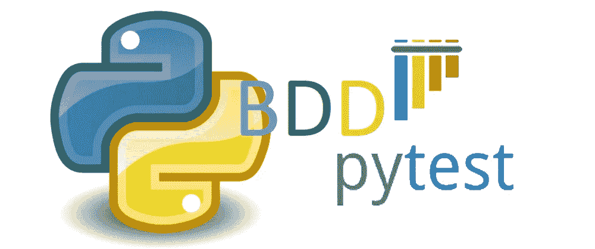

# Python Pytest 行为驱动框架— pytest-bdd

> 原文：<https://blog.devgenius.io/python-pytest-behaviour-driven-framework-pytest-bdd-77b3211538dc?source=collection_archive---------3----------------------->



Pytest 是目前自动化领域广泛使用的框架，具有很大的灵活性和易用性。为了将代码可读性扩展到业务涉众，我们可以使用 pytest-bdd 作为支持库来创建新的或升级现有的框架。

*行为 vs pytest-bdd :*

为什么不表现是任何人在开始使用 python 进行自动化时都会想到的事情。我做了研究，发现作为测试开发人员，任何人都希望测试结果越早越好。到目前为止，Behave 不支持测试的并行执行(根据我的研究)，而 pytest profile 工具可以实现同样的功能，这可能是选择 pytest 而不是 behave 的主要原因。此外，pytest 夹具还有一个额外的优势。

*入门:*

安装 pytest-bdd

```
pip install pytest
pip install pytest-bdd
pip install pytest-html
```

*文件夹结构:*

您可以在方便时遵循任何文件夹结构，但要确保所有文件夹都有 __init__。py 文件可用于跨文件夹访问文件。并将 conftest.py、requirement.txt 和 pytest.ini 文件保存在根文件夹中。您的文件夹结构可能如下所示:

```
project 
  features
       feature1.feature
       feature2.feature
  step_defs
       test_testname1.py
       test_testname2.py 
  conftest.py   
  pytest.ini   
  requirements.txt
  README.md
```

*特征文件:*

```
#login.featureScenario:  Login to Application
  Given User is on login page
  When User fills valid username and password
  And clicks on submit button
  Then User is able to login and view landing page
```

*生成实现函数:*

```
pytest --generate-missing --feature feature
```

生成的代码将如下所示

```
[@given](http://twitter.com/given)('User is on login page')
def user_is_on_login_page():
    """User is on login page."""
    raise NotImplementedError[@when](http://twitter.com/when)('User fills valid username and password')
def user_fills_valid_username_and_password():
    """User fills valid username and password."""
    raise NotImplementedError[@when](http://twitter.com/when)('clicks on submit button')
def clicks_on_submit_button():
    """clicks on submit button."""
    raise NotImplementedError[@then](http://twitter.com/then)('User is able to login and view landing page')
def user_is_able_to_login_and_view_landing_page():
    """User is able to login and view landing page."""
    raise NotImplementedError
```

实现各自的函数，并将其添加到您的测试 python 文件中。此外，您必须给出各个场景文件的路径，如下所示:

```
from pytest_bdd import scenarios, given, thenscenarios('/path/to/feature/file/login.feature') [@given](http://twitter.com/given)('User is on login page')
def user_is_on_login_page():
    """User is on login page."""
    pass[@when](http://twitter.com/when)('User fills valid username and password')
def user_fills_valid_username_and_password():
    """User fills valid username and password."""
    pass[@when](http://twitter.com/when)('clicks on submit button')
def clicks_on_submit_button():
    """clicks on submit button."""
    pass[@then](http://twitter.com/then)('User is able to login and view landing page')
def user_is_able_to_login_and_view_landing_page():
    """User is able to login and view landing page."""
    pass
```

现在你可以走了。

```
# To start execution run below command from project root
python -m venv venv 
source venv/bin/activate
pip install -r requirements.txt
python -m pytest --html=report.html
```

pytest bdd 提供的其他广泛使用的特性包括单独场景执行、并行执行、参数化等。

参考:

 [## pytest-html

### 注意，ANSI 代码支持依赖于 ansi2html 包。由于使用了不太宽松的许可证，这个包…

pytest-html.readthedocs.io](https://pytest-html.readthedocs.io/en/latest/user_guide.html) [](https://pypi.org/project/pytest-bdd/) [## pytest-bdd

### pytest-bdd 实现了 Gherkin 语言的一个子集，使项目需求测试自动化，并且…

pypi.org](https://pypi.org/project/pytest-bdd/) [](https://docs.pytest.org/en/6.2.x/) [## 帮助你编写更好的程序

### pytest 和数以千计的其他软件包的维护者正在与 Tidelift 合作，以提供商业支持和…

docs.pytest.org](https://docs.pytest.org/en/6.2.x/)