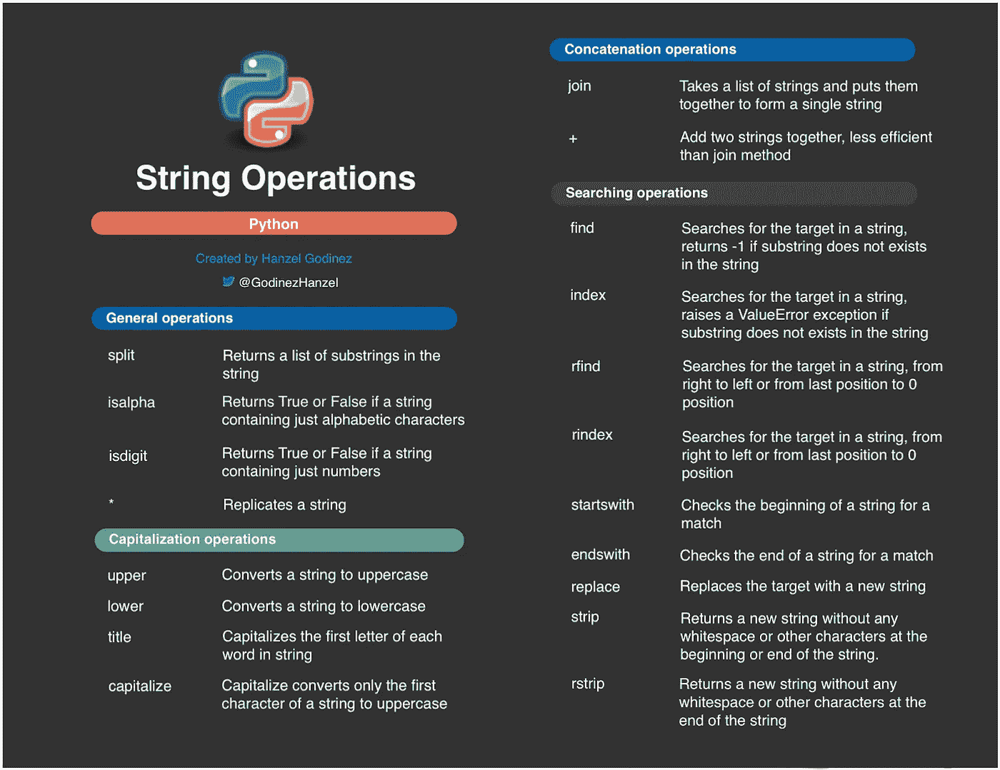

# Python 字符串操作

> 原文：<https://blog.devgenius.io/python-string-operations-f8eeabf8eb71?source=collection_archive---------7----------------------->

Python 中最常见的字符串操作



在开始 Python 中字符串支持的操作之前，我想推荐文章 [Python 数据类型](https://medium.com/dev-genius/python-data-types-4959eb84635f)，这是一篇好文章，在开始稍微高级一些的文章之前。

Python 中的字符串是一种常用的数据类型，至少由一个或多个字符组成。有许多分隔字符串的选项:

*   "当一个字符串包含“单引号”时，可以使用双引号."
*   当字符串包含“双引号”时，可以使用单引号。
*   ' ' \t 当字符串以制表符(\ t)开始，以换行符(\n)结束时，使用三个单引号。' ' \n ' ' '
*   " " "当你有一个可以包含换行符的字符串时，你可以使用三重双引号."""

字符串示例:

```
x = "DevGenius"y = "H"i = "a1b2c3"
```

现在，我们更好地理解了字符串，让我们看看 Python 中支持这些字符串的不同操作。

# 字符串操作

需要记住的是字符串的不可变属性，但这是什么意思呢？很简单，对字符串的每一个操作都会创建一个新版本的字符串，考虑到这一点我们可以看到字符串操作:

## 1.加入

这个方法获取一个字符串列表，并将它们放在一起形成一个字符串。放入新的单个字符串中的每个字符串都由表示连接方法的特定字符分隔。

示例:

```
x = “ ”.join([“Join”, “with”, “spaces”, “between”, “elements”])print(x)Output:Join with spaces between elementsy = “-”.join([“Join”, “with”, “-”, “between”, “elements”])print(y)Output:Join-with-spaces-between-elements
```

*Join 是大量字符串连接*的完美操作，比“+”操作更有效。

## 2.使分离

Split 返回字符串中子字符串的列表。这个方法使用空格作为它要分割的字符串的分隔符，但是您可以用一个可选的参数来改变这个分隔符。

示例:

```
x = "a b c d"print(x.split())Output:['a', 'b', 'c', 'd']y = "a-b-c-d"print(y.split("-"))Output:['a', 'b', 'c', 'd']
```

有时，您需要对字符串进行特定次数的拆分，在这种情况下，您可以将该次数指定为第二个可选参数，split 方法会对输入字符串进行 n 次拆分，或者拆分完所有字符串。

示例:

```
x = "a b c d"print(x.split(" ", 1))Output:['a', 'b c d']y = "a-b-c-d"print(y.split("-", 2))Output:['a', 'b', 'c-d']
```

## 3\. +

该操作将两个或多个字符串相加。

示例:

```
x = "Hello " + "world"print(x)Output:Hello world
```

对于大量的字符串拼接，最好使用 join 方法而不是"+"操作，原因，*"+"操作不如 join 方法有效。*

## 4\. *

该操作按照您指定的次数复制字符串。

示例:

```
x = "Python " * 4print(x)Output:Python Python Python Python
```

## 5.上面的

将字符串转换为大写字符串。

示例:

```
x = "DevGenius"print(x)Output:DEVGENIUS
```

## 5.降低

将字符串转换为小写字符串。

示例:

```
x = "DevGenius"print(x)Output:devgenius
```

## 6.利用

大写仅将字符串的第一个字符转换为大写。

示例:

```
x = "devgenius"print(x)Output:Devgenius
```

## 7.标题

Title 将字符串中每个单词的首字母转换为大写。

示例:

```
x = "hello world"print(x)Output:Hello World
```

## 8.查找/索引

Find 和 Index 取第一个必需的参数，在字符串中搜索子串，并返回第一个出现在字符串中的位置，*如果这个子串不存在于字符串中，****返回-1，但是* **index** *会引发 ValueError 异常。***

**示例:**

```
x = "muumuu"print(x.find("uu"))print(x.index("uu"))Output:11print(x.find("ss"))print(x.index("ss"))Output:-1ValueError: substring not found
```

**您还可以为 find 和 index 方法指定两个可选参数，第一个是开始位置，第二个是结束位置，这将导致 find 和 index 忽略此范围之外的字符。如果这些参数中有一个不存在，find 和 index 方法将把零位置作为开始位置，或者把最后一个位置作为结束位置。**

**示例:**

```
x = "muumuu"print(x.find("uu", 3))print(x.index("uu", 3))Output:44print(x.find("uu", 0, 1))Output:-1ValueError: substring not found
```

**默认情况下，find 和 index 方法从左到右或从零位置到最后一个位置进行搜索，这就是为什么我们有 **rfind 和 rindex 方法** *允许我们从右到左或从最后一个位置到零位置进行搜索。***

**示例:**

```
x = "muumuu"print(x.rfind("uu"))print(x.rindex("uu"))Output:44
```

## **9.星形带/星形带**

**这两种方法都返回 True 或 False 结果，你只需要指定一个子串作为参数，这个子串将在字符串的开头或结尾进行搜索，这取决于你使用的方法。**

**示例:**

```
x = "muumuu"print(x.startswith("mu"))print(x.startswith("Mu"))Output:TrueFalseprint(x.endswith("uU"))print(x.endswith("uu"))Output:FalseTrue
```

**另一方面，使用这些方法，我们有可能一次搜索多个字符串，在这种情况下，我们需要使用一个字符串元组作为参数，如果找到其中任何一个，两个方法都返回 True。**

**示例:**

```
x = "muumuu"print(x.startswith(("m", "p")))print(x.endswith(("p", "a")))Output:TrueFalse
```

## **10.替换**

**用新字符串(第二个参数)替换字符串(第一个参数)中出现的子字符串。**

**示例:**

```
x = "muumuu"print(x.replace("mu", "ru"))Output:ruuruux = "muumuu"print(x.replace("Mu", "ru"))Output:muumuu
```

## **11.strip/rstrip/lstrip**

**这些方法从字符串中删除空白或其他字符。您可以传递一个包含要删除的字符的字符串，如果您没有指定这个参数，缺省值是一个空格。以下列表解释了这些方法之间的差异:**

*   ****strip** :返回一个新字符串，该字符串的开头或结尾没有任何空格或其他字符。**
*   ****rstrip** :返回一个新字符串，该字符串末尾没有任何空格或其他字符。**
*   ****lstrip** :返回一个新字符串，该字符串的开头没有任何空格或其他字符。**

**示例:**

```
x = "  Hello    World  "print(x.strip())Output:Hello    Worldy = "--Hello World--"print(y.lstrip("-"))print(y.rstrip("-"))Output:Hello World----Hello World
```

## **12.isdigit**

**这是一个非常有用的方法，尤其是如果你想知道一个字符串是否只包含数字。**

**示例:**

```
x = "15907"print(x.isdigit())Output:Truey = "a1b2c3"print(y.isdigit())Output:False
```

## **13.伊萨法**

**与 isdigit 方法类似，当您需要知道一个字符串是否只包含字母字符时，此方法会有所帮助。**

**示例:**

```
x = "a1b2c3"print(x.isalpha())Output:Falsey = "a@htl-"print(y.isalpha())Output:Falseh = "Python"print(h.isalpha())Output:True
```

**这些是一些与 Python 字符串相关的最常见和最重要的操作，从我的角度来看，详细了解它们是非常有帮助的，因为你通常会使用字符串，当然还有它们的操作。**

**请在本文中随意评论任何没有提到的细节。**

**在说再见之前，我留下下面的[链接](https://github.com/hgodinez89/string-operations-cheat-sheet)，在那里你可以得到一个包含所有列表操作的备忘单。**

**非常感谢你来到这里。😊 👈**

**这篇文章是受这本书的启发📖"[快速蟒书](https://books.google.co.cr/books/about/The_Quick_Python_Book.html?id=urVEzQEACAAJ&source=kp_book_description&redir_esc=y)"📖如果你想了解这门语言的基本概念，同时想了解其他高级主题，我向你广泛推荐。**