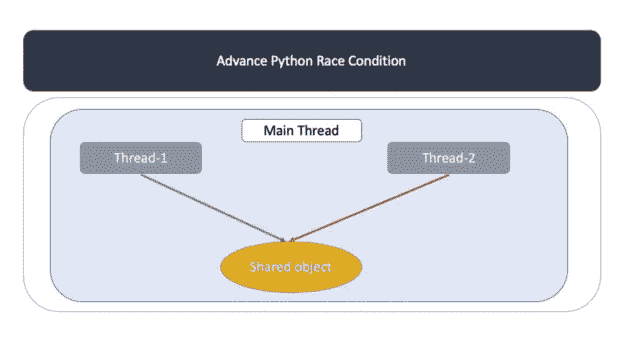

# python——python 3 中的线程，第二部分

> 原文：<https://blog.devgenius.io/python-threading-in-python3-part-two-c711c17409ce?source=collection_archive---------12----------------------->

## Python3 线程游戏攻略


# 竞态条件

上接“[Python—Python 3 中的线程化，第一部分](https://medium.com/@tonylixu/python-threading-in-python3-part-one-cfadc174ceb8)”，你认为有了“ThreadPoolExecutor”就足以管理 Python 线程了吗？编写线程代码时经常会遇到的一个常见问题是:竞争条件！



“竞争条件”是软件或其他系统的条件，其中系统的实质性行为取决于其他不可控事件的顺序或时间。在 Python 中，当两个或多个线程访问一个共享资源时，会发生争用情况。让我们首先创建一个竞争条件:

```
import concurrent.futures
import time

class ShoppingCart:
    def __init__(self):
        self.items = 0
        # self._lock = threading.Lock()

    def update(self, name):
        print(f'Customer-{name}: starting update')
        # with self._lock:
        #    print(f'Customer-{name} has lock')
        local_cart = self.items
        local_cart += 1
        time.sleep(1)
        self.items = local_cart
        #    print(f'Customer-{name} releases lock')
        print(f'Customer-{name}: finishing update')

def main():
    print(f'Main: Before starting shopping')
    shopping_cart = ShoppingCart()
    print(f'Start shopping, the cart is {shopping_cart.items}')
    with concurrent.futures.ThreadPoolExecutor(max_workers=3) as customer:
        customer.map(shopping_cart.update, range(2))
    print(f'Finish shopping, the cart is {shopping_cart.items}')
    print(f'Main: After finishing shopping')

if __name__ == '__main__':
    main()
```

如果运行上述代码，您将看到以下输出:

```
Main: Before starting shopping
Start shopping, the cart is 0
Customer-0: starting update
Customer-1: starting update
Customer-0: finishing update
Customer-1: finishing update
Finish shopping, the cart is 1
Main: After finishing shopping
```

那么，这到底是怎么回事！？我们有三个顾客在我们的网站上购物，都购买了 1 件商品，但是为什么购买的商品总数仍然是 1 件！！！这意味着一个顾客丢失了他/她购买的物品，这是不好的。现在让我们更深入地看看发生了什么。

# 有根据的猜测

首先，我想让你根据事实猜测一下为什么其中一位顾客丢失了他们购买的物品？一个提示是 Python3 中的线程不会同时运行，即使它们有时看起来是同时运行的。其次，每个线程都有自己的变量本地副本，当一个线程运行时，它不知道另一个线程在它们自己的空间里有什么。比如下图:


两个线程都引用同一个 shopping_cart 对象。很有可能，thread1 和 thread2 被同一个对象的“self.items”值覆盖。

# 详细解释:

现在我来说明一下真实情况。当两个线程被初始化时，它们都有自己的“local_cart”版本，但是都引用同一个 ShoppingCart 对象，如上图所示。

现在让我们假设“线程 1”首先运行，它将自己版本的“local_cart”初始化为“shopping_cart”对象“self.items”，此时，“local _ cart”=“self . items”= 0


现在“线程 1”将“local_cart”从 0 增加到 1，然后休眠 1 秒钟。然后“线程 2”开始运行，类似于“线程 1”，它将自己版本的“local_cart”初始化为“shopping_cart”对象“self.items”，此时，“local _ cart”=“self . items”= 0


现在“线程 2”进入睡眠，“线程 1”醒来并将其“local_cart”的副本写入“self.items”，现在“shopping_cart”对象“self.items”为 1。然后“线程 1”完成它的运行。


“线程 2”再次醒来，现在是有趣的部分，“线程 2”不知道“线程 1”刚刚将“self.items”更新为 1，它将自己版本的“local_cart”存储到同一对象的“self.items”中。“self.items”值保持为 1。

这两个线程交叉访问单个共享对象，覆盖彼此的结果。当一个线程在另一个线程完成访问之前释放内存或关闭文件句柄时，也会出现类似的争用情况。

# 如何解决竞态？

解决竞态条件有几种不同的方法。但是它们背后的思想都是一次只允许一个线程共享资源。我们将在本文中重点讨论`Lock`。

## 锁

这里的想法是实现对资源的“锁定”,并且一次只允许一个线程进入代码的读取/更新部分。在 Python3 线程中，完成这项工作的基本函数是`.acquire()`和`.release()`。`.acquire()`被调用以获取锁，如果锁已经被给定，请求线程将等待直到它被释放。在某些情况下，这可能导致一个`deadlock`的情况，如果一个线程由于某种原因没有返回锁，你的线程将被卡住。为了避免`deadlock`，请始终使用`with`上下文管理器。

现在回到我们的程序，让我们删除注释并启用锁:

```
import concurrent.futures
import threading
import time

class ShoppingCart:
    def __init__(self):
        self.items = 0
        self._lock = threading.Lock()
    def update(self, name):
        print(f'Customer-{name}: starting update')
        with self._lock:
            print(f'Customer-{name} has lock')
            local_cart = self.items
            local_cart += 1
            time.sleep(1)
            self.items = local_cart
            print(f'Customer-{name} releases lock')
        print(f'Customer-{name}: finishing update')

def main():
    print(f'Main: Before starting shopping')
    shopping_cart = ShoppingCart()
    print(f'Start shopping, the cart is {shopping_cart.items}')
    with concurrent.futures.ThreadPoolExecutor(max_workers=2) as customer:
        customer.map(shopping_cart.update, range(2))
    print(f'Finish shopping, the cart is {shopping_cart.items}')
    print(f'Main: After finishing shopping')

if __name__ == '__main__':
    main()
```

运行它:

```
Main: Before starting shopping
Start shopping, the cart is 0
Customer-0: starting update
Customer-0 has lock
Customer-1: starting update
Customer-0 releases lock
Customer-0: finishing update
Customer-1 has lock
Customer-1 releases lock
Customer-1: finishing update
Finish shopping, the cart is 2
Main: After finishing shopping
```

由于我们使用了`with`上下文管理器:`with self._lock`，锁将在解锁状态下初始化，并自动锁定/释放。始终建议使用上下文管理器，以避免`deadlock`。