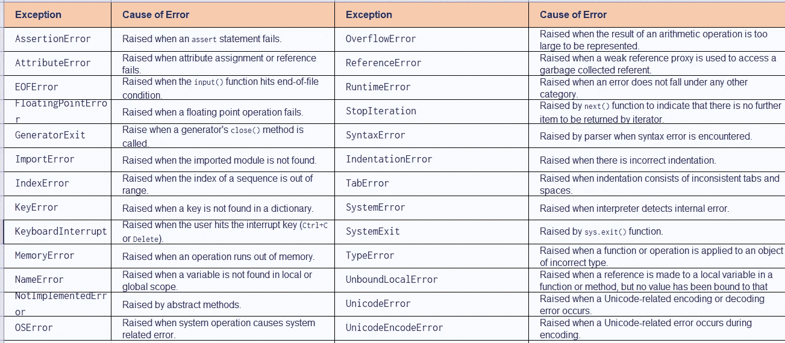

# Python try-except 块

> 原文：<https://blog.devgenius.io/python-try-except-block-ec37bcf5b37?source=collection_archive---------14----------------------->

Python 有许多内置的异常，当您的程序遇到错误时(程序中的某个地方出错了)，就会引发这些异常。

当这些异常发生时，Python 解释器会停止当前进程，并将它传递给调用进程，直到它得到处理。如果不处理，程序会崩溃。

```
var = un_var
print(var)
Output- 
File "C:/Users/vivek.awasthi/PyPractice/Test.py", line 1, in <module>
    var = un_var
NameError: name 'un_var' is not defined
```

这里我们有一个未定义的变量“un_var ”,因此我们得到了 NameError。

为了处理这种情况，python 中有一个 try-except 块。

在 try 中，我们必须编写我们怀疑会抛出 exception 和 except 的代码，我们将处理同样的问题。

```
try:
    var = un_var
    print(var)
except Exception:
    print("Sorry, Something went wrong")
Output-
Sorry, Something went wrong
```

在上面的代码中，我们已经处理了异常，所以我们得到的不是错误，而是自定义的异常消息。

我们在 python 上有多个预定义的异常，下面是相同的列表。



我们可以使用 try 块定义多个异常，但是在定义异常时，顺序应该是特定于泛型的。

因为如果我们在顶部定义更多的一般异常，那么下面定义的异常将永远不会被执行。

```
try:
    var = un_var
    print(var)
except Exception:
    print("Sorry, Something went wrong")
except NameError:
    print("Generic exception")
Output-
Sorry, Something went wrong
```

在这段代码中，异常块将始终被执行，代码永远不会到达 NameError 块。

将执行 else 块，当 try 块中没有出现异常时，将执行 else 块中的代码。

```
try:
    var = "Hi"
    print(var)
except Exception:
    print("Sorry, Something went wrong")
else:
    print("else block code is executing")
Output-
Hi
else block executing
```

最后，块代码将总是被执行，所以当我们想要关闭一个数据库连接或者需要执行一些强制操作时，代码应该被写在 finally 块中。

```
try:
    var = "Hi"
    print(var)
except Exception:
    print("Sorry, Something went wrong")
else:
    print("else block code is executing")
finally:
    print("Finally")
Output-
Hi
else block code is executing
Finally
```

当您想要记录异常并再次引发相同的异常时，引发异常用于手动引发异常。在这种情况下，可以使用 raise 语句而不指定 exception 对象。

```
try:
    var = "Hi"
    print(var)
    raise("Raising manual exception")
    print("after raise")
except Exception:
    print("Sorry, Something went wrong")
Output-
Hi
Sorry, Something went wrong
```

因为我们已经使用 raise 语句引发了手动异常，所以它正在执行，但块代码除外。将不会执行 print("after raise ")语句。