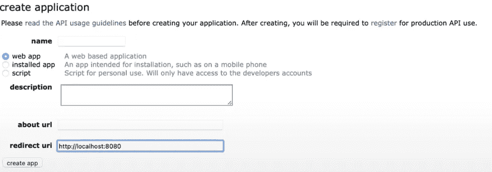

# Python 编程—发布和获取 Reddit 数据(Reddit Bot)

> 原文：<https://blog.devgenius.io/python-tutorial-for-beginners-reddit-script-to-post-and-fetch-reddit-data-ff6781ac982e?source=collection_archive---------14----------------------->

有没有想过从事 Web 开发、机器学习、数据挖掘或者只是简单的应用程序和脚本编写？那么 Python 就是适合你学习的语言！近年来，Python 因其灵活性和易学的语法而成为世界上最流行的编程语言之一。在本文中，我们将开发一个简单的 Python 脚本，允许我们发布和获取 Reddit 数据。

对 IT 专业人员的需求不断增长，无论是软件工程、网络开发、网络安全还是网络管理，这个清单几乎是无穷无尽的。从 Vinsloev Academy 中发现符合您在 IT 领域的个人学习目标的内容。——【https://vinsloev.com/#/discoveryCenter 


本文中编写的代码可以用作 Reddit 机器人的第一个组件，但是，完整的 Reddit 机器人不在本文的讨论范围之内。如果你在写这段代码的时候有问题，我已经做了一个视频版本，涵盖了这里介绍的内容:【https://youtu.be/JsWlJeeEdzY

如果你是 python 的新手，或者想更深入地理解本文中的语法和代码，我制作了一个完整的 Python 课程，可以在 YouTube 上免费获得:

所以没有进一步的介绍，让我们开始吧。为了让下面的代码工作，你需要安装/导入包 **Praw** ，因为我们将使用它作为我们与 Reddit 集成的基础。

想了解更多文斯洛夫学院的故事，请注册成为会员并支持我们的工作:[https://vinsloev.medium.com/membership](https://vinsloev.medium.com/membership)

接下来，我们需要使用我们自己的 Reddit 帐户在 Reddit 上创建一个个人应用程序，以获得有效的客户端密钥。可以使用以下链接在 Reddit 上创建个人应用程序:

[https://www.reddit.com/prefs/apps](https://www.youtube.com/redirect?event=video_description&redir_token=QUFFLUhqbXpDN3p2VndYVTJrNGktc3JXTTI4Q3dGek1xd3xBQ3Jtc0tsbjMxRkRSMDV2bFo5dzd6MlJOWmR5cU9MTGFkUHF6TlZWeU8wTW5UUGxRNWIxRGtHek05SW1Ndm9iejBld09zNTdzQTlEMGNKdXY4UmVkeUVsR3ZMNGRERzVHZ3ZDMVBhMlhJVm9ncTJYV2drT3IxZw&q=https%3A%2F%2Fwww.reddit.com%2Fprefs%2Fapps)

创建应用程序时，选择 **Web App** ，重定向 URL 设置为 [http://localhosy:8080](http://localhosy:8080) ，类似下图。



## Reddit 连接

接下来，您将获得一个客户端密钥，可以在 Python 脚本中用于 reddit 集成。我们将使用以下 Python 代码创建 redditConnect()方法。记住，如果你也想发布到 reddit，那么你需要提供用户名和密码。通过使用 client_id 和 client _ secrect，您只能从 reddit 中读取内容。

```
def redditConnect():
    reddit = praw.Reddit(
        client_id="Your client id",
        client_secret="Your client secured",
        user_agent="my user agent",
        username="",
        password="",
    )
    print(reddit.read_only)
    return reddit
```

如果你不提供用户名和密码，redditConnect()应该使用 *print(reddit.read_only)在控制台中打印 *True* 。*

## 从子编辑中读取

接下来，我们将创建用于从给定子编辑中打印 Post 的方法。

```
def printPostFromSubreddit(redditCon, subreddit):
    for submission in redditCon.subreddit(subreddit).hot(limit=*10*):
        print(submission.title)
```

上面的方法 printPostFromSubreddit()接受两个输入，即由我们的方法 reddit connection()提供的 Reddit 连接和作为字符串提供的 Subreddit。

当被调用时，它将打印子编辑热门类别中前 10 篇文章的**标题**。

## 发布到子编辑

我们将创建的最后一个方法是允许我们发布到 Subreddit 的方法。这个方法称为 postToReddit，有 4 个输入参数。它需要一个 Reddit 连接(Reddit connection()的输出)、一个要发布的有效子编辑、一个帖子标题和一个 url。

```
def postToReddit(redditCon, subreddit, title, url):
    redditCon.validate_on_submit = *1* subreddit = redditCon.subreddit(subreddit)
    subreddit.submit(title, url=url)
    print("Post submitted")
```

当提供有效输入时，该方法将创建一个 Post 并打印提交给控制台的 Post。当开发这个脚本时，你可以使用 subreddit **r/test** ，因为这个 subreddit 没有任何提交规则，允许你测试你的脚本，而不会被阻止或删除你的帖子。