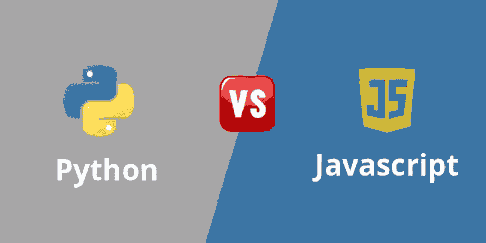
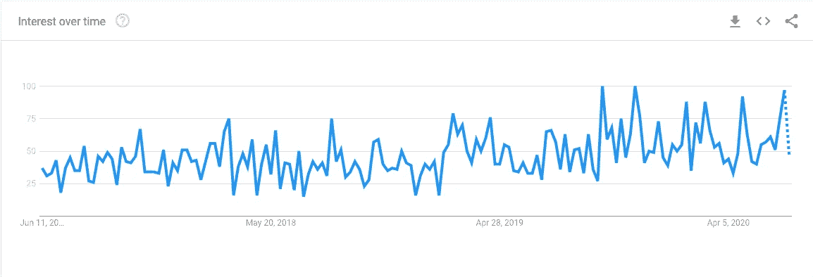
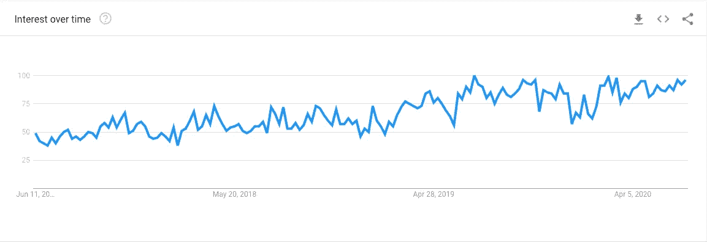

# Python vs Javascript

> 原文：<https://blog.devgenius.io/python-vs-javascript-4c2a03fe8a17?source=collection_archive---------2----------------------->

如果你对 web 开发**很认真，那么你需要在某个时候学习一下 **JavaScript** 。年复一年，无数的调查表明，JavaScript 是世界上最流行的编程语言之一，拥有庞大且不断增长的开发者群体。就像 Python 一样，现代 JavaScript 几乎可以在任何地方使用，包括前端，后端，桌面，移动，以及[物联网](https://en.wikipedia.org/wiki/Internet_of_things) (IoT)。有时，在 Python 和 JavaScript 之间可能没有明显的选择。**

**如果您以前从未使用过 JavaScript，或者对其近年来的快速发展感到不知所措，那么本文将带您走上正确的道路。**

# **JavaScript 是什么？**

**许多人，尤其是一些 IT 招聘人员，认为 JavaScript 和 Java 是同一种语言。不过，很难责怪他们，因为发明这样一个听起来耳熟的名字是一种营销伎俩。**

**JavaScript 最初被称为**摩卡**，后来被更名为 **LiveScript** ，最终在发布前不久更名为 **JavaScript** 。更令人困惑的是，由于缺乏许可权，微软开发了自己的语言版本，称之为 **JScript** ，用于 Internet Explorer 3.0。今天，人们经常把 JavaScript 称为 **JS** 。**

**虽然 Java 和 JavaScript 在类似 C 的语法和标准库中有一些相似之处，但它们用于不同的目的。Java 从客户端发展成为一种更通用的语言。JavaScript 尽管简单，但足以验证 HTML 表单和添加小动画。**

**已经有很多尝试用其他技术取代 JavaScript，并且这种尝试还会继续下去，这些技术包括:**

*   ****富互联网应用:** Flash，Silverlight，JavaFX**
*   **Transpilers: Haxe，Google Web Toolkit，pyjs**
*   ****JavaScript 方言:** CoffeeScript，TypeScript**

**在 HTML5 出现之前，这些尝试不仅受到个人喜好的驱动，也受到网络浏览器的限制。在那个时代，你不能使用 JavaScript 来完成计算密集型任务，比如绘制矢量图形或处理音频。**

**要为浏览器编写 Python 代码，可以使用一个可用的 transpilers，比如 [Transcrypt](https://www.transcrypt.org/) 或 [pyjs](http://pyjs.org/) 。后者是 Google Web Toolkit (GWT)的一个端口，这是一个非常流行的 Java-to-JavaScript transpiler。另一个选择是使用像 [Brython](https://brython.info/) 这样的工具，它运行纯 JavaScript 的 Python 解释器的精简版本。然而，这些好处可能会被糟糕的性能和缺乏兼容性所抵消。**

**一个明显的例外是微软的 [TypeScript](https://www.typescriptlang.org/) ，它在最近几年越来越受欢迎。这是一个完全兼容的 JavaScript 超集，增加了可选的静态类型检查。如果这听起来很熟悉，那是因为 Python 的类型提示受到了 TypeScript 的启发。**

****

**从 Google Trends 搜索对 TypeScript 的兴趣**

**虽然现代 JavaScript 已经成熟并得到了积极的发展，但 transpiling 仍然是确保向后兼容旧浏览器的常用方法。即使您没有使用 TypeScript，这似乎是许多新项目的首选语言，您仍然需要将您的新 JavaScript 转换成该语言的旧版本。否则，您可能会遇到运行时错误。**

**看来，经过这么多年，JavaScript 不会很快消失。**

# **Python 是什么？**

**Python 由吉多·范·罗苏姆创建，并于 1991 年发布。**

**Python 用于:**

*   **web 开发(服务器端)，**
*   **软件开发，**
*   **数学，**
*   **系统脚本。**

**Python 经常被描述为“粘合语言”，这意味着它可以让不同的代码(通常是具有 C 语言接口的库)进行互操作。它在数据科学和机器学习中的使用就是这样，但这只是总体思想的一种体现。如果您有想要挂接的应用程序或程序域，但是不能直接相互通信，那么您可以使用 Python 来连接它们。**

**初创公司需要精益运营才能生存，这意味着当他们构建数字产品(无论是网站、移动应用还是软件程序)时，这些产品需要在预算内提前完成。因为 Python 有能力帮助实现这两个目标，所以它是创业界青睐的编程语言。**

**Python 的效率和易用性意味着更少的开发时间、简化的 QA 和调试过程，以及比更难导航的编码替代方案更大的总体投资回报。初创公司是获得第一份工作和开始积累行业经验的好地方，了解 Python 会让你更有吸引力。**

**尽管 Python 是一门功能强大、用途广泛的语言，但你可能认为学习 Python 需要很多年。不是这样的！[业内专业人士表示](https://medium.com/@meenakshi052003/how-many-days-will-it-take-to-master-python-programming-503f26ac3140)如果你有编码语言的经验，Python 基础知识(比如 Python 的语法、关键字和数据类型)可以在短短 6-8 周内学会。**

**学习 Python 代码不仅能让你适应未来的互联网开发，还能让你为未来的技术工作做好准备。**

**为什么？因为 Python 不仅仅用于传统开发。事实上，Python 是新兴数据科学领域的顶级语言，包括:**

*   **[数据分析](http://www.data-analysis-in-python.org/)**
*   **[人工智能](https://djangostars.com/blog/why-python-is-good-for-artificial-intelligence-and-machine-learning/)**
*   **[机器学习](https://realpython.com/tutorials/machine-learning/)**

****

**从 Google Trends 搜索对 Python 的兴趣**

**这有道理吗？现在我们来对比一下！**

# **JavaScript vs Python**

## **用例**

**Python 是一种**通用**、多范例、高级、跨平台、解释型编程语言，具有丰富的标准库和平易近人的语法。**

**因此，它被广泛用于各种学科，包括计算机科学教育、脚本和自动化、原型制作、 [s](https://realpython.com/python-testing/) 软件测试、 [w](https://realpython.com/learning-paths/become-python-web-developer/) eb 开发、嵌入式设备编程和科学计算。尽管这是可行的，但你可能不会选择 Python 作为视频游戏或移动应用程序开发的主要技术。**

**另一方面，JavaScript 最初只是一种**客户端**脚本语言，让 HTML 文档更具交互性。它有意地简单，并且有一个唯一的焦点:向用户界面添加行为。尽管它的能力有所提高，但今天仍然如此。使用 Javascript，您不仅可以构建 web 应用程序，还可以构建桌面程序和移动应用程序。定制的运行时环境让您可以在服务器甚至物联网设备上执行 JavaScript。**

## **哲学**

**Python 以牺牲表达能力为代价，强调代码的可读性和可维护性。毕竟，你甚至不能在不破坏代码的情况下对代码进行过多的格式化。你也不会像在 C++或 Perl 中那样找到深奥的操作符，因为大多数 Python 操作符都是英语单词。有些人开玩笑说 Python 是可执行的伪代码，因为它的语法简单明了。**

**稍后你会发现，JavaScript 提供了更多的灵活性，但也带来了更多的麻烦。例如，在 JavaScript 中创建自定义数据类型没有唯一正确的方法。此外，即使新语法解决了问题，这种语言也需要保持与旧浏览器的向后兼容。**

## **运行时间**

**要运行一个 Python 程序，你首先需要下载、安装，并可能为你的平台配置它的**解释器**。一些操作系统提供了开箱即用的解释器，但它可能不是您想要使用的版本。还有替代的 Python 实现，包括 [CPython](https://realpython.com/cpython-source-code-guide/) 、 [PyPy](https://www.pypy.org/) 、 [Jython](https://www.jython.org/) 、 [IronPython](https://ironpython.net/) ，或者 [Stackless Python](https://github.com/stackless-dev/stackless/wiki) 。您还可以从多个 Python **发行版**中进行选择，比如 [Anaconda](https://www.anaconda.com/) ，它们带有预装的第三方包。**

**JavaScript 则不同。没有独立的程序可以下载。取而代之的是，每个主流的网络浏览器都带有某种 JavaScript 引擎和 API，它们共同构成了运行时环境。在上一节中，您了解了 Node.js，它允许在浏览器之外运行 JavaScript 代码。您还知道在其他编程语言中嵌入 JavaScript 的可能性。**

## **内存模型**

**这两种语言都利用自动堆内存管理来消除人为错误并减少认知负荷。尽管如此，这并不能完全避免内存泄漏的风险，而且还会增加一些性能开销。**

**正统的 CPython 实现使用**引用计数**以及非确定性**垃圾收集** (GC)来处理引用周期。有时，当您冒险编写自定义 C 扩展模块时，可能会被迫手动分配和回收内存。**

**在 JavaScript 中，内存管理的实际实现也留给您的特定引擎和版本，因为它不是语言规范的一部分。垃圾收集的基本策略通常是**标记和清除**算法，但是也存在各种优化技术。**

**例如，堆可以组织成几代，将短期对象和长期对象分开。垃圾收集可以并发运行，以卸载执行的主线程。采用增量方法有助于避免在清理内存时程序完全停止。**

# **结论**

**如果你只是在学习一门语言，那么没有比 Python 更好的了。这是一种容易掌握的语言。有据可查。它与一个庞大的、活跃的、友好的社区联系在一起。由于它是一种脚本语言，您可以很容易地尝试，并立即看到结果。你也可以从编程基础开始，从学习函数开始，然后进入类。**

**但 JavaScript 已经成为 2017 年 web 开发的一个至关重要的需求。**

**哪个更好？你会选择哪一个？**

**就看你的选择了！**

**感谢您的关注，敬请关注。**