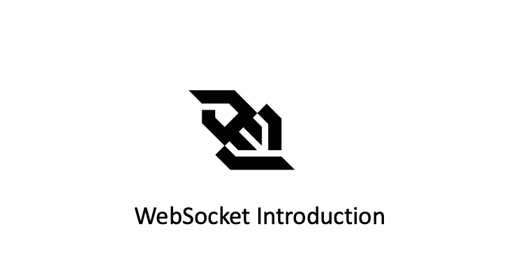
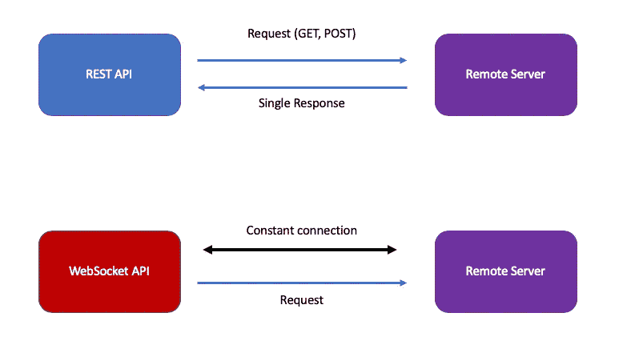

# Python — WebSocket 简介和实现

> 原文：<https://blog.devgenius.io/python-websocket-introduction-and-implementation-b2bb996558fb?source=collection_archive---------0----------------------->

## 什么是 WebSocket，如何用 Python 实现？



WebSocket 是 HTML5 提供的一种网络技术，用于浏览器和服务器之间的全双工通信。这是一种先进的技术，它使得开启一种双向互动交流成为可能。

使用 WebSocket API，您可以向远程服务器发送消息并接收事件驱动的响应，而不必轮询服务器以获得回复。与非持久性协议 HTTP 相比，WebSocket 是一种用于持久性网络通信的协议。



如上图所示，它不仅允许客户端请求服务器，还允许服务器主动向客户端推送数据。是一种**真正的**双向平等对话，属于一种服务器推送技术。

# WebSocket 功能

*   基于 TCP 协议，服务器端的实现相对容易。
*   与 HTTP 协议兼容性好。默认端口也是 80 和 443，握手阶段使用 HTTP 协议，握手过程中不容易屏蔽，可以通过各种 HTTP 代理服务器。
*   数据格式相对轻量，性能开销小，通信高效。
*   文本和二进制数据都可以发送。
*   没有同源限制，客户端可以与任何服务器通信。
*   协议标识符为`ws`(如果加密则为`wss`)，服务器 URL 为 URL，例如:`ws(s)://test.com:80/some/path`

# 为什么选择 WebSocket

## 无国籍的

在 Web 应用程序体系结构上下文中，HTTP 是在客户机/服务器模型中使用的请求-响应协议，在这种模型中，客户机向服务器提交 HTTP 请求，服务器用请求的资源进行响应。

然而，HTTP 协议是无状态的，也就是说，它将每个请求视为唯一和独立的单元。无状态协议有一些优点，例如，服务器不需要保存关于会话的信息，因此不需要存储数据。

这也意味着关于请求的冗余信息在每个 HTTP 请求和响应中被发送，比如使用 cookies 来验证用户状态。

随着客户机和服务器之间交互的增加，HTTP 协议在客户机和服务器之间通信所需的信息量也在迅速增加。

## 半双工

另一个缺点是 HTTP 也是半双工协议，即同一时刻的信息流只能是单向的:客户端向服务器发送请求，服务器响应请求。这种半双工协议使得通信效率较低。

## 客户端初始化

同时，HTTP 协议有一个缺陷:通信只能由客户端发起。因此，如果服务器发生状态变化，它将无法通知客户端。

## 变通办法

为了提高 HTTP 协议的通信效率，实现了以下方法:

*   **轮询**:每隔一段时间，就会发出一个请求，询问服务器是否有新的信息。
*   **长轮询**:客户端向服务器请求信息，并在设定的时间内保持连接。
*   **流技术**:客户端发送请求，服务器发送并维护一个持续更新并保持开放的开放响应。

然而，上述方法都没有提供接近实时的通信，并且它们还引入了大量额外的和不必要的报头数据和延迟。

于是，[米迦勒·卡特](https://en.wikipedia.org/wiki/Michael_Carter_(entrepreneur)) a 一群人提出了 WebSocket，这是一种天然的全双工、双向、单套接字连接，解决了 HTTP 协议不适合实时通信的问题。

# WebSocket 握手

典型的 HTTP 握手如下所示:

```
GET / HTTP/2
Host: google.com
user-agent: curl/7.79.1
accept: */*
HTTP/2 301
location: [https://www.google.com/](https://www.google.com/)
content-type: text/html; charset=UTF-8
date: Mon, 03 Oct 2022 17:50:02 GMT
expires: Wed, 02 Nov 2022 17:50:02 GMT
cache-control: public, max-age=2592000
server: gws
content-length: 220
x-xss-protection: 0
x-frame-options: SAMEORIGIN
```

虽然 WebSocket 本身也是一个新的应用层协议，但是它不能独立于 HTTP 而存在。具体来说，我们在客户机上构建一个 WebSocket 实例，并将其与需要连接的服务器地址绑定。当客户端连接到服务器时，它将向服务器发送类似于以下内容的 http 消息:

```
*Host: 127.0.0.1:8081* ***Upgrade: websocket
Connection: Upgrade*** *Sec-WebSocket-Key: 1wX9ZDz+x2c+7PoKBhr+eA==
Sec-WebSocket-Version: 13
Sec-WebSocket-Extensions: permessage-deflate; client_max_window_bits
User-Agent: Python/3.10 websockets/10.3*
```

您可以看到，这是一个 HTTP get 请求消息。请注意，消息中有一个升级标头。它的作用是告诉服务器，通信协议需要切换到 WebSocket。如果服务器支持 WebSocket 协议，则该协议会切换到 WebSocket，同时会向客户端发送类似以下内容的响应头:

```
***Upgrade: websocket
Connection: Upgrade*** *Sec-WebSocket-Accept: yBKlMEVMvp6dGL6qj4OH/T6zd5o=
Sec-WebSocket-Extensions: permessage-deflate; server_max_window_bits=12; client_max_window_bits=12
Date: Mon, 03 Oct 2022 18:29:32 GMT
Server: Python/3.10 websockets/10.3*
```

您可以看到返回的状态代码是 101，表明该协议被转换为 WebSocket。上面的过程是使用 HTTP 通信来完成的，这种通信称为 WebSocket 协议握手。此后，客户端和服务器建立 WebSocket 连接，随后的通信基于 WebSocket。

# WebSocket Python 实现

现在您已经了解了 WebSocket 的工作原理，让我们尝试使用 Python 实现一个 WebSocket 服务器。

## 安装 websockets 库

我们需要先安装`websockets` Python 库:

```
$ pip install websockets
Collecting websockets
  Downloading websockets-10.3-cp310-cp310-manylinux_2_5_x86_64.manylinux1_x86_64.manylinux_2_12_x86_64.manylinux2010_x86_64.whl (111 kB)
     ━━━━━━━━━━━━━━━━━━━━━━━━━━━━━━━━━━━━━━━━ 111.5/111.5 kB 1.9 MB/s eta 0:00:00
Installing collected packages: websockets
Successfully installed websockets-10.3web_server.py
```

## 计算机网络服务器

```
import asyncio
import websocketsasync def handler(ws, path):
    data = await ws.recv()
    reply = f"Data received: {data}"
    await ws.send(reply)if __name__ == "__main__":
    start_server = websockets.serve(handler, "127.0.0.1", 8081)
    asyncio.get_event_loop().run_until_complete(start_server)
    asyncio.get_event_loop().run_forever()
```

## 客户

```
import asyncio
import websocketsasync def connect():
    async with websockets.connect("ws://127.0.0.1:8081/") as websocket:
        await websocket.send("hello world")
        print(f"Reuqest headers:\n{websocket.request_headers}")
        response = await websocket.recv()
        print(f"Response headers:\n{websocket.response_headers}")
        print(response)if __name__ == "__main__":
    asyncio.get_event_loop().run_until_complete(connect())
```

作为服务器运行:

```
$ python web_server.py 
```

作为客户:

```
$ python web_client.py 

*Reuqest headers:
Host: 127.0.0.1:8081
Upgrade: websocket
Connection: Upgrade
Sec-WebSocket-Key: 1wX9ZDz+x2c+7PoKBhr+eA==
Sec-WebSocket-Version: 13
Sec-WebSocket-Extensions: permessage-deflate; client_max_window_bits
User-Agent: Python/3.10 websockets/10.3**Response headers:
Upgrade: websocket
Connection: Upgrade
Sec-WebSocket-Accept: yBKlMEVMvp6dGL6qj4OH/T6zd5o=
Sec-WebSocket-Extensions: permessage-deflate; server_max_window_bits=12; client_max_window_bits=12
Date: Mon, 03 Oct 2022 18:29:32 GMT
Server: Python/3.10 websockets/10.3**Data received: hello world*
```