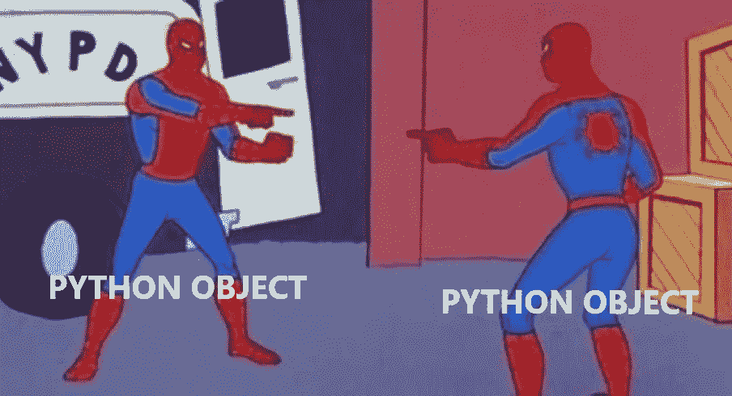

# Python3:一切都是对象！

> 原文：<https://blog.devgenius.io/python3-everything-is-object-220de0c3bf99?source=collection_archive---------4----------------------->



图片来源 [**布伦南·D·巴拉班**](https://medium.com/@bdov_?source=user_profile-------------------------------------)

最近，我开始学习 Python。来自 C 编程语言，起初 Python 感觉超级简单。不再有半列、分段错误、内存分配和释放……不再有指针！！然后，我们开始学习对象、类、实例属性…这时候事情开始变得复杂起来。在这篇文章中，我想分享我到目前为止学到的东西，希望它能帮助所有现在和未来的 Python 学生——所以，让我们开始吧！

# Python 的简单介绍

> Python 是一种解释性的、交互式的、面向对象的编程语言。它包含模块、异常、动态类型、非常高级的动态数据类型和类。— [Python 软件基础常见问题解答](https://docs.python.org/3/faq/general.html#general-information)

Python 由吉多·范·罗苏姆在 20 世纪 80 年代末开发，并于 1991 年首次发布。它是以英国广播公司的节目“巨蟒”命名的，而不是以这种动物命名的。🐍

Python 是当今最常用的编程语言之一。它以易用、易读和紧凑而闻名(Python 脚本通常比 C 语言短得多)。它也是可扩展的，可以用于各种各样的应用程序，从 web 和软件开发到数学和系统脚本等等。

Python 的最新版本是 Python 3，这也是我将在这篇博客中使用的。

# 什么是面向对象编程语言？

**面向对象编程(OOP)是一种计算机编程模型，其中软件设计是围绕数据或对象组织的，而不是围绕功能和逻辑。**

在 OOP 中有 4 个构建块:

*   类——它们是由用户定义的数据类型，充当单个对象、属性和方法的蓝图。
*   对象—它们是具有专门定义的数据的类的实例。
*   方法——它们是在类内部定义的函数，描述对象的行为。
*   属性—它们是在类模板中创建的，代表对象的状态。

今天我们将把重点放在物品上。

# Python 中的对象

在 Python 中，一切都被当作一个对象！Python 中的对象可以定义为具有唯一属性和行为的数据字段。如果类是一个想法，那么对象就是它的执行。

每个对象都有三个属性:

*   身份(或 id) —它是对象在内存中的地址
*   类型—创建的对象的种类—例如整数、字符串、列表
*   值-是对象存储的数据值。例如`list = [1, 2, 3]`保存整数 1、2 和 3

一旦创建了对象，就不能更改 Id 和类型。值可以更改，但只适用于可变对象。

# 可变 vs 不可变**对象**

Python 中的对象要么是**可变的，要么是**不可变的。

韦氏词典词典对这两个形容词的定义如下:

> 易变——易于改变，能够改变或被改变，能够或易于突变
> 
> 不可变——不能够或不容易改变

在 Python 的上下文中，可变是对象改变其值的能力。可变对象的值可以随着时间而改变。然而，不可变对象的值不能随时间改变。一旦创建，这些对象的值是永久的。

**常见易变类型**(几乎所有其他类型):

*   可变序列:`list()`，`bytearray()`
*   设定类型:`set()`
*   映射类型:`dict()`
*   类，类实例
*   等等(那几乎是其他的一切！)

**普通不可变类型**:

*   编号:`int()`、`float()`、`complex()`
*   不可变序列:`str()`、`tuple()`、`frozenset()`、`bytes()`

注意:元组和冻结集是特例，因为它们是不可变的，但是它们可以包含可变对象——后面会详细介绍！

## 你是什么类型的()？

要检查变量的类型，可以使用内置函数`type()`

内置函数`type()`返回作为参数传递的变量(对象)的类类型。

```
>>> a = 1
>>> type(a)
<class ‘int’>
```

注意，还有另一个内置函数也检查对象的类型`isinstance()`，它有两个参数，您想要检查的对象和您想要检查的类型。它相应地返回一个布尔值。另一个区别是`isinstance()`另外检查子类，而`type()`没有。

但是我们如何测试一个变量是可变的还是不可变的呢？为此，我们需要使用`id()`内置函数和`is`和`is not`操作符。让我们看看它们是如何工作的。

# 对象一样不一样？

> 每个对象都有标识、类型和值。对象的标识一旦被创建就永远不会改变；你可以认为它是对象在内存中的地址。“is”运算符比较两个对象的标识；id()函数返回一个表示其身份的整数。Python 语言参考[数据模型](https://docs.python.org/3/reference/datamodel.html#objects-values-and-types)

## 如何找到一个对象标识:id()

在对象的生命周期中，对象的 id 是唯一的和不变的。生存期不重叠的两个对象可能具有相同的 id。每次运行程序时，对象的 id 都会不同。除了少数例外，我们将在博客的后面触及。

为了检查一个对象的 id，我们可以使用 Python 的`**id()**`内置函数，它接受一个参数并返回一个表示对象身份的整数。

```
 >>> a = 1
>>> b = 2
>>> id(a)
4373702960
>>> id(b)
4373702992
```

你可以在上面的例子中看到`a`和`b`有不同的`id`值。

## 是还是不是——这是个问题！

`is` 操作符将比较两个名字是否指向同一个对象，如果是，则返回 true(`is not` 将执行相反的操作。)

在不可变对象的情况下，比如整数和字符串，Python 通过使引用同一个字符串值的两个名称引用同一个对象来优化资源。

```
>>> a = 1
>>> b = 2
>>> a is b
False
>>> id(a)
4339826928
>>> id(b)
4339826960>>> a = 1
>>> b = 1
>>> a is b
True
>>> id(a)
4339826928
>>> id(a)
4339826928>>> s_1 = "Hello"
>>> s_2 = "Hello"
>>> s_1 is s_2
True
>>> id(s_1)
4344344816
>>> id(s_2)
4344344816
```

重要信息——`is`运算符不同于`==`比较运算符。

`==`操作符只会检查对象是否有相同的值，而不会检查它们是否是同一个对象。如果它们有相同的值，它将返回 True，否则返回 False。

```
>>> a = 1
>>> b = 2
>>> a == b
False>>> b = 2
>>> a == b
True >>> s_1 = "Hello"
>>> s_2 = "Hello"
>>> s_1 == s_2
True
```

从下面的例子可以看出，当`==`操作符返回`True`时，id 号也将是相同的。当它返回`False`时，反之亦然

然而，列表的行为是不同的:list_a 和 list_b 具有相同的值，但是不引用同一个对象

```
>>> list_a = [4, 5, 6]
>>> list_b = [4, 5, 6]
>>> list_a == list_b
True
>>> list_a is list_b
False
```

## 别名

当我们给同一个变量取另一个名字时，这就叫做别名。对一个别名的更改会影响另一个别名。

```
**>>>** a = [7, 8, 9]
**>>>** b = a
**>>>** a is b
True
```

注意:别名在处理不可变对象时很有用，但是在处理可变对象时最好避免，因为它可能会以意想不到的方式运行。

# 不变性的例外

每个规则都有例外！在这种护理中，他们是:

*   介于-5 和 256(含)之间的整数。

它们有一个不变的唯一 id，因此它们总是指向内存中已经存在的同一个对象。更多信息，请看这篇文章[堆栈溢出:“is”操作符对整数的行为出乎意料](http://stackoverflow.com/questions/306313/is-operator-behaves-unexpectedly-with-integers)

*   一些字符串

```
>>> a = "Python is cool!"
>>> b = "Python is cool!"
>>> a is b
False
```

这是 Python 中*字符串实习*工作方式的产物。字符串滞留是一种机制，在内存中只存储一个字符串值的副本，以便在比较值相同的字符串时节省内存空间和时间。简而言之，如果字符串“非常”长，Python 认为不需要节省时间来比较它，所以它会创建另一个副本。要了解更多关于字符串实习的知识，请查看[这篇非常有用的文章](https://medium.com/techtofreedom/string-interning-in-python-a-hidden-gem-that-makes-your-code-faster-9be71c7a5f3e#:~:text=What%20Is%20the%20String%20Interning,same%20object%20in%20the%20memory.)

*   空元组

元组是不可变类型，但包含可变对象！元组中的列表和其他可变对象可能会改变，但是它们的 id 总是相同的。所以元组即使有相同的值也会指向不同的对象。除了空元组将引用相同的对象。这是代码证明👇🏾

```
>>> a = (1, 2)
>>> b = (1, 2)
>>> a is b
False>>> a = ()
>>> b = ()
>>> a is b
True
```

要了解更多关于元组行为的信息，这里有一篇由卢西亚诺·拉马尔霍撰写的精彩博文。

# =和+=运算符的区别

## 分配和引用

让我们看看代码示例:

```
>>> list_a = [0, 2, 4]
>>> id(list_a)
4310781760
>>> list_a = list_a + [6]
>>> id(list_a)
4310785408
>>> list_a
[0, 2, 4, 6]>>> list_b = [1, 3, 5]
>>> id(list_b)
4310763904
>>> list_b += [7]
>>> id(list_b)
4310763904
>>> list_b
[1, 3, 5, 7]
```

你看到刚才发生的事了吗？当我们使用运算符`+` 给`list_a`赋值时，我们创建了一个新对象，而当我们使用`+=`时，对象保持不变！

为了理解为什么会发生这种情况，我们需要理解两个操作符之间的区别。

`+`操作符调用了`__add__`魔法方法，它不会修改任何一个参数。所以`list_a + [6]` 用值[0，2，4，6]创建了一个新对象，现在左手边的`list_a`引用了这个值。*

然而，`+=`操作符(相当于`list_a.append(x)_ )`调用`__iadd__`来就地修改参数。

*注意:与许多编程语言一样，**在赋值语句中，左边的名字与右边的值相关联。**首先评估右侧。然后创建一个新对象或检索一个现有对象。只有在创建或检索对象后，才会为其分配名称。在 Python 中，我们说名称引用值，或者名称是对值的引用。

在结束这篇博客之前，我还想谈一件事，那就是…

# 传递可变和不可变对象

您可能想知道参数是如何传递给函数的，这对可变和不可变对象意味着什么？Python 对待可变和不可变对象有什么不同？

**不可变对象**

让我们考虑下面这个例子:

```
def increment(n):
    n += 1

a = 1
increment(a)
print(a)
1
```

在这种情况下，我们有一个变量 `a = 1.`函数 increment(n)有一个引用同一个对象的局部变量 n。然而，由于整数是不可变的，我们不能将 object 的值改为 2:我们必须创建一个值为 2 的新对象。这就是为什么调用`increment()`后`*a*`的值不变。

然而，我们可以通过向函数添加返回值来修改不可变对象的值:

```
def increment(n):
    n += 1
    return na = 1
increment(a)
2
```

**可变对象**

然而，可变对象，比如一个列表，可以被修改——这就是下面例子中的`.append()`方法所做的。

```
def increment(n):
    n.append(4)

list_a = [1, 2, 3]
increment(list_a)
print(list_a)
[1, 2, 3, 4]
```

没有创建新的对象，而是在对象的位置发生了变化——所以当打印`list_a`时，我们得到了修改后的列表！

然后…就这样结束了！

资料来源:Flat-icons.com[Giphy](https://giphy.com/flaticons/)

我希望这篇文章对你有所帮助。如有任何问题、评论或你想打招呼，请通过 LinkedIn[联系我，或通过 Medium 关注我。](https://www.linkedin.com/in/chiara-caprasi/)

*保持快乐，继续编码！*👩🏻‍💻

*有用的资源*

[](http://www.openbookproject.net/thinkcs/python/english2e/ch09.html#objects-and-values) [## 9.列表——如何像计算机科学家一样思考:学习 Python 第二版文档

### 列表是一组有序的值，每个值由一个索引标识。组成列表的值是…

www.openbookproject.net](http://www.openbookproject.net/thinkcs/python/english2e/ch09.html#objects-and-values) [](http://foobarnbaz.com/2012/07/08/understanding-python-variables/) [## 理解 Python 变量和内存管理

### 你有没有注意到 Python 和 C 语言中变量的区别？例如，当你做一个像…

foobarnbaz.com](http://foobarnbaz.com/2012/07/08/understanding-python-variables/) [](http://radar.oreilly.com/2014/10/python-tuples-immutable-but-potentially-changing.html) [## Python 元组:不可变但可能变化

### Python 元组有一个令人惊讶的特性:它们是不可变的，但是它们的值可能会改变。这可能发生在元组…

radar.oreilly.com](http://radar.oreilly.com/2014/10/python-tuples-immutable-but-potentially-changing.html) [](https://nedbatchelder.com/text/names.html) [## 关于 Python 名称和价值的事实和神话

### 该页面也有土耳其语版本。Python 中名称和值的行为可能会令人困惑。像…的许多部分一样

nedbatchelder.com](https://nedbatchelder.com/text/names.html) 

[https://medium . com/techtofreedom/string-interning-in-python-a-hidden-gem-that-makes-your-code-faster 9 be 71 c 7 a5 f3e #:~:text = What % 20 is % 20 the % 20 string % 20 interning，same % 20 object % 20 in % 20 the % 20 memory](https://medium.com/techtofreedom/string-interning-in-python-a-hidden-gem-that-makes-your-code-faster-9be71c7a5f3e#:~:text=What%20Is%20the%20String%20Interning,same%20object%20in%20the%20memory)。