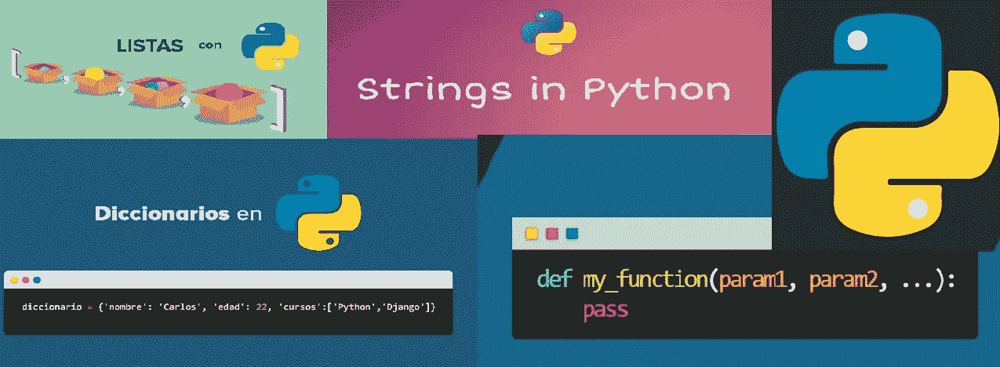
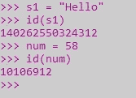
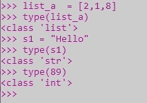
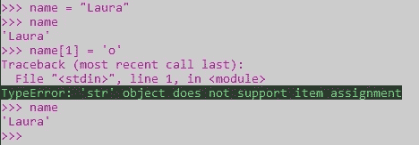
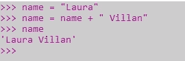
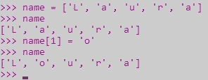
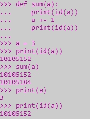
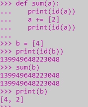

# Python3:可变的，不可变的...todo 是 objeto！

> 原文：<https://blog.devgenius.io/python3-mutable-immutable-everything-is-object-f6f94a6e4ad9?source=collection_archive---------2----------------------->

# **简介**

quizás conozcas la siguiente frase "***todo en Python es un objecto***。一个目标？你有什么目标？一个明确的目标是对数据进行抽象。

蟒蛇是由各种各样的动物组成的，它们都是由不同的动物组成的，包括动物，动物，动物和动物

蟒蛇有一个独特的地方，它有着多变或不变的特征，它的价值在于它是可变的，它的目的在于它是不可变的。

# **Carné de identidad ()**

**id ()** 函数接收一个对象作为参数，并返回另一个对象作为第一个对象的唯一标识符。返回值是一个整数，表示存储对象的内存地址。

> ***Sintax:*** id(对象)

# **类型()**

**type ()** 函数根据内置模块类型返回对象的类型，它定义了标准解释器中所有已知类型符号的名称。

> **Sintax:** *类型(对象)*

如上所述，python 处理可变和不可变数据类型，现在我们将更好地理解前面两个表达式指的是什么。

# 不可变对象

类型是不可变的意味着它在被创建后不能被改变。

## 不可变类型

1.数字
2。琴弦
3。元组

让我们看一个例子

在本例中，我们将字符串**“Laura”**赋给了变量名。然后，我们试图改变字符串的第二个字母，这给了我们一个错误。

错误信息如下:“**‘str’对象不支持项目分配**”

这是因为我们试图改变一个不可变对象的值，因为 Python 中的字符串是不可变的。

我们能做的是给变量赋一个新值，这和改变字符串是不一样的

看起来我们在改变字符串，但实际上我们所做的是给它赋一个新值，因为如果你意识到了，我们传递的是=号和我们希望这个变量拥有的新值。那么不变性可以用来确保一个对象在整个程序中保持不变

# **可变对象**

可变对象值可以在创建后随时随地更改。

## 可变类型

1.列表
2。设置
3 .字典

**让我们看一个例子**

在本例中，我们为列表名称分配了字符“L' 'a' 'u' 'r' 'a”。

然后我们试图改变列表中的第二个字母，这是成功的。

发生这种情况是因为我们试图改变可变对象的值，因为 Python 中的列表是可变的。

# 为什么这很重要，Python 对待可变对象和不可变对象有什么不同？

Python 以不同的方式处理可变和不可变对象。不变量比可变对象访问起来更快。此外，不可变对象从根本上来说“改变”是昂贵的，因为这样做涉及到创建一个副本。改变可变对象的成本很低。

当您需要调整对象大小时，可变对象非常有用，也就是说，它将被动态修改

[链接](https://realpython.com/learning-paths/perfect-your-python-development-setup/)

# 参数如何传递给函数，这对可变和不可变对象意味着什么？

**Python 不可变函数参数**

python 中的不可变对象(如数字、字符串或元组)是作为函数中的参数传递的，这些参数在函数块中被更改，因此它的行为就像对象的副本。在功能块的范围内创建和操作调用对象的新的本地副本。调用对象将保持不变。因此，调用块不会注意到在功能块范围内对不可变对象所做的任何改变。

该值仅在功能块中修改，在功能块之外，它继续使用相同的值。

**Python 可变函数参数**

如果一个人对他的作品进行了修改，那么他的作品就不会被修改。

**一个小时后，一个节目主持人和一个演员来到了剧院**

