# Python 和熊猫的应用数据科学

> 原文：<https://blog.devgenius.io/pytyhapplied-data-science-with-python-and-pandas-419e63302e79?source=collection_archive---------11----------------------->


数据科学是一项非常重要的技能，已经成为 21 世纪的必备技能。随着数据的增加，对数据科学家的需求也增加了。说到学习数据科学，Python 是首选的编程语言。Python 附带了大量工具来帮助数据科学过程，其中最突出的工具之一是 Pandas。在本文中，我们将了解如何使用 Pandas 库处理数据，以便它可以用于其他任务，如分析或机器学习。

## 什么是数据科学？

令人惊讶的是，这个问题没有正确的答案。人们只以处理数据的方式来定义数据科学。事实上，数据科学是一个通用术语，涵盖了我们应用于数据的所有技术和程序。这就是为什么在寻找数据科学工作时，您会发现作为工作要求的各种工具可能彼此相关，也可能不相关，例如 **SQL、Python、R 或 Power BI** 。

从事提取数据和 ETL 工作的人会精通 SQL，但可能会也可能不会 Python。相反，一个建立机器学习模型的人会精通 Python，但可能会也可能不会 SQL。然而，这两个人都可以称自己为数据科学家，因为他们处理数据，但职责不同。

在本文中，我将解释数据清理和过滤是数据科学领域的一部分。如果你对[机器学习](https://writersbyte.com/datascience/ai-for-beginners-2/?swcfpc=1)感兴趣，那么你可以在这里开始阅读[。](https://writersbyte.com/datascience/implementing-multi-variable-linear-regression-algorithm-in-python/?swcfpc=1)

[](https://writersbyte.com/datascience/implementing-multi-variable-linear-regression-algorithm-in-python/?swcfpc=1) [## 多元线性回归 Python 实现。

### 机器学习算法在过去十年中获得了巨大的普及。今天，这些算法被用于…

writersbyte.com](https://writersbyte.com/datascience/implementing-multi-variable-linear-regression-algorithm-in-python/?swcfpc=1) 

## 下载数据

如果你得到了一份数据科学的工作，那么无论你为哪个组织工作，你都将与收集的真实世界一起工作。您必须使用…您猜对了…SQL 从 SQL 数据库中提取数据！。然而，出于本教程的目的，我将从 Kaggle 下载一个开源数据集。

我们将使用“世界能源消耗”数据集，您可以从[这里](https://www.kaggle.com/pralabhpoudel/world-energy-consumption)下载。

## 熊猫入门

你将首先安装熊猫开始工作。只需在命令提示符下运行以下命令，就可以做到这一点。

```
pip install pandas
```

如果您不熟悉使用命令提示符或者只是一般地安装 python 的包，您可以从这里的开始阅读[。](https://writersbyte.com/programming/python-for-absolute-beginners-in-3-easy-steps/?swcfpc=1)

[](https://writersbyte.com/programming/python-for-absolute-beginners-in-3-easy-steps/?swcfpc=1) [## Python 适合初学者，只需 3 个简单的步骤

### 随着人工智能和数据获得越来越多的能力，Python 变得越来越…

writersbyte.com](https://writersbyte.com/programming/python-for-absolute-beginners-in-3-easy-steps/?swcfpc=1) 

一旦 Pandas 安装完毕，我们就可以加载数据集了。

先进口熊猫。

```
import pandas as pd
```

请注意，我们在上面的 import 语句中写了‘as PD ’,这是我们在 Python 中为导入设置别名的方式。因为很难在你使用本库的任何地方写出完整的术语 Pandas，你可以简单地用术语‘PD’来引用它。

Pandas 允许您从各种来源加载数据，如 excel 表、CSV(逗号分隔值)文件、文本文件，甚至 SQL 表。我们的数据是 CSV 文件的形式，所以我们将使用下面的函数来加载我们的数据集。

```
world_power_data = pd.read_csv()
```

让我们看看数据中有什么。

```
world_power_data.head()
```

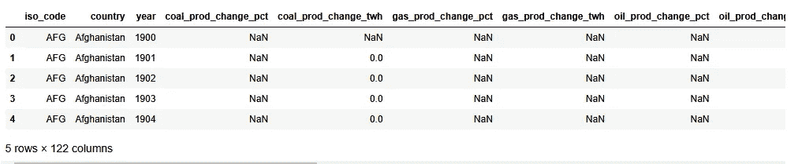

数据集的前 5 行

**。head()** 函数为我们提供了数据集的前 5 行(数据集的头)。我们可以在括号中输入任意数字作为参数传递，函数将返回与传递的数字相等的行数。

反过来，我们也有一个**。tail()** 函数的作用正好相反，即返回数据集的最后 5 行。

看起来我们在这个数据集中有 122 列，让我们了解一下数据的概况。

```
world_power_data.info()
```

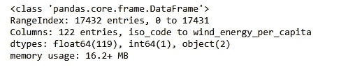

好的，我们有 119 列浮点值，1 列整数，2 列对象。Pandas 中的对象数据类型仅仅意味着列包含多种数据类型的值。

我们现在还知道数据集已经占用了 ***16.2+ MB 的内存。***

所以这是一个非常庞大的数据集。

## 什么是数据框？

在我们继续进行数据分析之前，了解什么是数据框及其结构是很重要的。数据帧有 3 个基本部分。

1.  有标题行
2.  索引
3.  数据

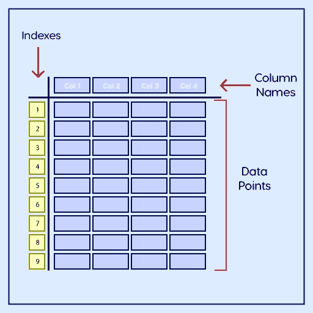

数据帧的结构

**标题行**定义数据的列名。**索引**为每一行提供一个标识符，而**数据**是数据帧的主要关键，即具有意义的数字数据。

我们可以使用索引和列跳转到数据集的任何行或列。

**按索引**

```
world_power_data.loc[45:50] #return data rows from index no. 45 to 50
```

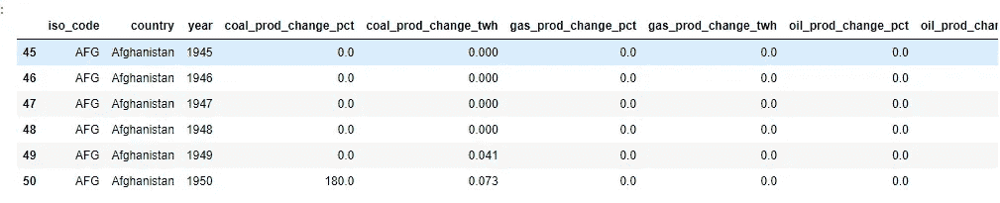

索引数据帧

**按列**

```
world_power_data[["country", "year", "coal_prod_change_pct", "coal_prod_change_twh" ,"gas_prod_change_pct"]].head() #show only certain columns
```

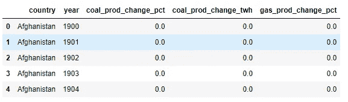

显示的特定列

**删除 2020 年数据**

看起来这个数据集只包含到 2019 年的值。让我们删除 2020 年的所有稀疏数据行。我们将在下面的步骤中做到这一点。

*   获取 2020 年数据行的索引

```
twentytwenty_idx = world_power_data[world_power_data['year'] == 2020].index
```

现在告诉熊猫删除带有这些索引的列。

```
world_power_data.drop(index = twentytwenty_idx, inplace = True)
```

我们已经删除了数据，但是我们弄乱了索引，因此为了保持整个数据框的一致性，我们需要重置索引。

```
world_power_data.reset_index(inplace = True)
```

## 仅保留重点国家

现在我们只想对一些特定的发达国家进行分析，因为这些国家是世界上主要的能源消费国。

```
#our focus countries
focus_countries = ['United States', 'Canada', 'Russia', 'United Kingdom', 'China']#filter for focus countries
power_data = world_power_data[world_power_data["country"].isin(focus_countries)]power_data
```

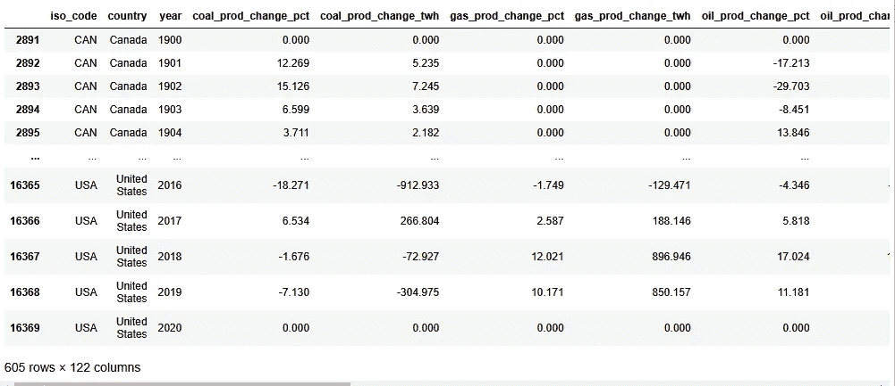

仅限重点国家

## 基于年份过滤数据

我们有自 1900 年以来的数据(这确实对这个数据集 XD 的可信度提出了质疑)。我们只想分析 21 世纪的数据，所以让我们开始过滤。

```
power_data = power_data[power_data["year"] >= 2000] #return data for only years greater than or equal to 2000power_data
```

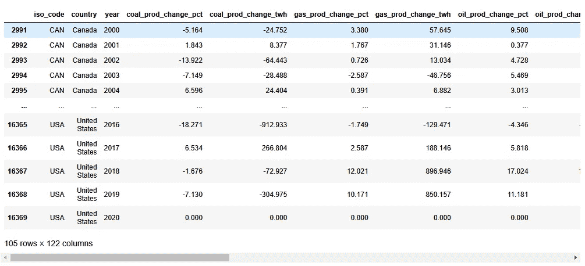

过滤的年份

## 列过滤

在这个数据集中，我们总共有 122 列。我们只对能源消耗数据感兴趣，所以我们只想保留那些列。

我们将首先创建一个包含术语' **consumption** '的所有列名的列表。

```
#get column names with the word consumption in them
consumption_cols = [col for col in power_data.keys()[power_data.keys().str.contains('consumption')]]
```

接下来，我们仍然需要国家名称和年份的标识符。

```
consumption_cols.append('country') #append country column
consumption_cols.append('year') #append year columnconsumption_cols
```

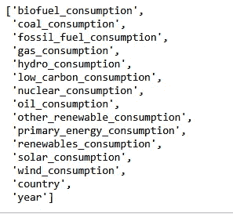

焦点列

让我们缩小数据集，只显示这些列。请注意，由于年份和国家被附加在列表的末尾，它们将作为最后一列出现，这对于我们的分析来说是没问题的，但是如果您出于美观的原因想要解决这个问题，那么您可以有几种变通方法。

```
power_data = power_data[consumption_cols]power_data
```

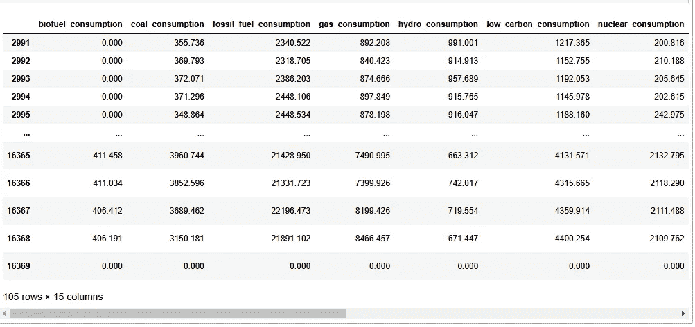

只剩下 15 列了

## **总能耗**

我们的下一个问题陈述是找出这些国家在过去 20 年中每种能源消耗的总能量。为此，我们将使用 group by 语句，group by 是一个非常有用和重要的聚合工具。

```
#group by country and sum the values in the remainig columns
total_power_consumed = power_data.groupby(['country']).sum()
```

上面的语句告诉 pandas 使用“country”列按数据分组，然后对其余列中的值求和。插图更好地解释了它。

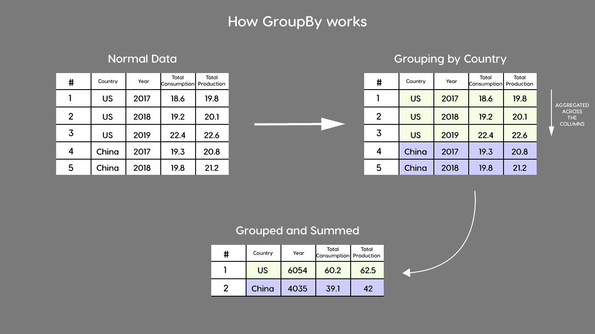

分组依据

您可以使用任何类型的聚合，例如平均值、计数等。year 列的聚合没有意义，它甚至与我们的情况无关，因此我们可以忽略该列，甚至可以删除它。

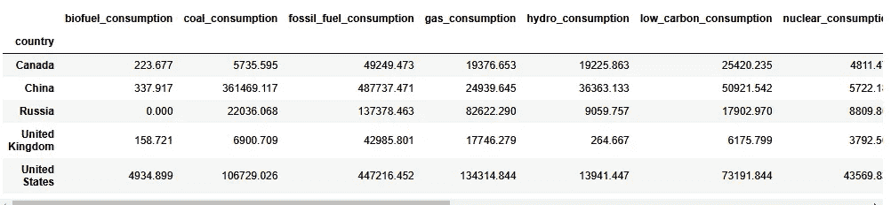

按国家分组

我们现在有了每个国家每种资源类型的总耗电量。我们希望单独保存这些数据，这样我们就不必每次都进行分析。

```
total_power_consumed.to_csv('Total_Power_Consumed.csv') #save as csv
```

上面的函数将我们的数据保存为一个单独的 CSV 文件。

让我们进行更多的分析。假设我们想回答以下问题。

***哪种资源在各国能源消费中使用最广泛？***

在回答这个问题之前，我们需要注意一个问题。在我们的数据中有一个名为'*primary _ energy _ consumption*的列，它给出了一个模糊的总能耗数字，但因为我们想要具体到单个能源资源的数据。所以我们将放弃这个专栏。

```
total_power_consumed.drop(columns = ['primary_energy_consumption'],inplace = True)
```

现在我们将首先看看哪个国家使用哪种能源最多。为此，我们将按列对数据集求和，并返回求和值最高的列的名称。

```
total_power_consumed.idxmax(axis = 1) #which resource is consumed most
```

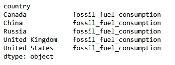

最大消耗量

看起来每个人都使用 ***化石燃料*** 作为他们的主要能源发生器。

现在我们来看看这些消耗了多少。为此，我们将简单地返回按列求和的最大值。

```
print(total_power_consumed.max(axis = 1))
```

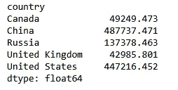

所以我们看到中国实际上只利用了 ***化石燃料*** 的**48k+TW**电力！！

现在是最后一个问题，让我们来回答一下在过去的二十年里，太阳能、风能、核能和化石燃料发电在美国的使用趋势是如何变化的。

首先，我们只过滤美国的数据。

```
united_states = power_data[power_data["country"] == "United States"]
united_states.reset_index(drop = True, inplace =True)
```

接下来，我们绘制各个列的数据。尽管我们有专门的工具来绘制 Python，但是，Pandas 本身也允许您直接从数据框中绘制数据。想学习 python 中的绘图，可以看下面。

[](https://writersbyte.com/programming/data-visualization-in-python-using-matplotlib/?swcfpc=1) [## 使用 MatPlotLib - WritersByte 在 Python 中进行数据可视化和分析

### 人们经常提出的一个问题是“数据科学 vs 数据分析”。我们已经在许多其他方面讨论了数据科学…

writersbyte.com](https://writersbyte.com/programming/data-visualization-in-python-using-matplotlib/?swcfpc=1) 

对于熊猫，我们做以下事情。

```
united_states.plot('year',\
                   ['solar_consumption','wind_consumption', 'nuclear_consumption', 'fossil_fuel_consumption'],\
                   logy = True ,figsize= (16,12), title = "Trend of Energy Consumption in America")
```

这里我们指定了以下项目。

1.  “年份”应该用于 x 轴。
2.  用于 y 轴值的列。
3.  使用对数 y 轴(以清楚地看到趋势)
4.  将图形大小设置为[16x12]
5.  给情节起个标题。

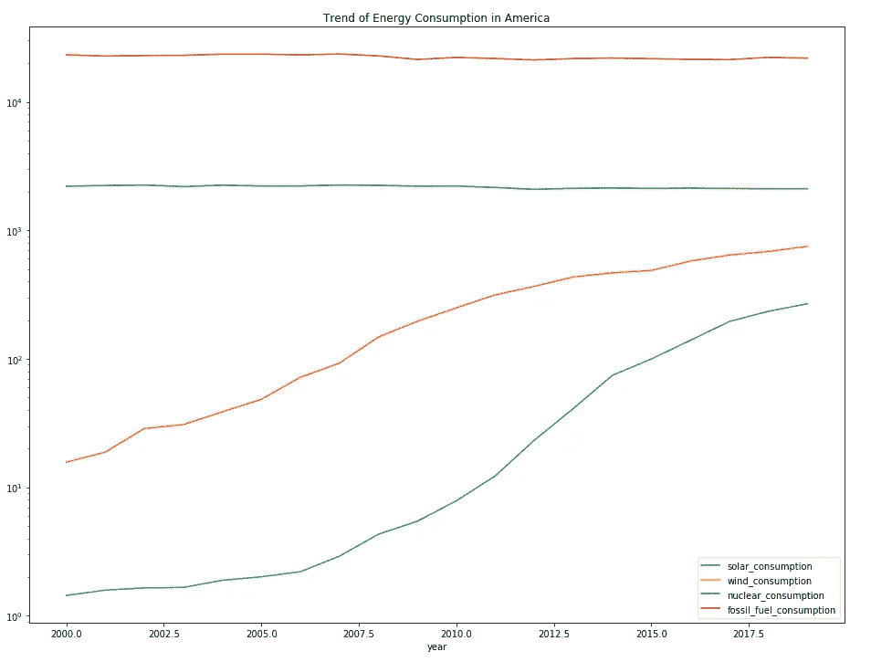

看起来化石燃料和核能的使用一直很稳定，然而风能和太阳能的使用却急剧上升。这很可能是因为电力需求的增加。

## 最后的想法

所以你上面看到的只是数据科学的一部分。这就是我们所说的数据处理。你问自己想从数据中获得什么样的洞察力，然后应用不同的处理技术来获得这种洞察力。本文旨在向您展示一些技术，您可以在数据集上应用这些技术来获得有价值的视觉效果。