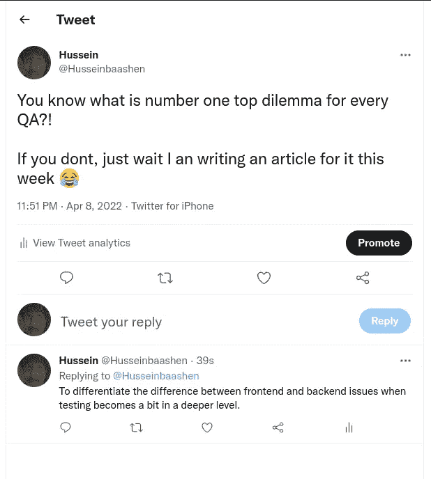
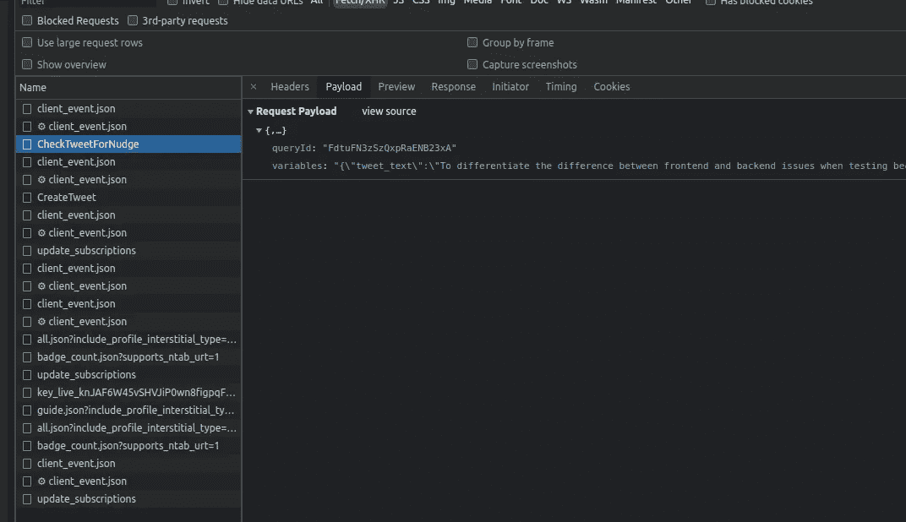

# QA 的头号困境

> 原文：<https://blog.devgenius.io/qas-top-dilemma-715aeee3d5f6?source=collection_archive---------5----------------------->

我注意到一件重要的事情，任何 QA 开始工作时，总是面临一个特殊的困境，无论教育背景如何。

你需要理解必须测试产品的概念，这意味着你需要测试前端和后端，这意味着你将测试客户在用户界面和功能方面以及 API 和验证方面看到的任何东西。

开始时，我不知道从哪里开始，或从哪里提出我的问题，或分配给谁，这些事情需要练习。具有信息技术或系统教育背景的人会认为很容易指出它是后端还是前端。

但根据我的经验和不断的技术升级，这变得越来越难识别，因为前端技术正在跨越前端和后端的障碍，后端技术也是如此。

现在让我们分解当前的差异，然后从那里我们可以尝试指出我们如何以及为什么认为一些问题是前端的，为什么一些是后端的。

# 什么是前端测试？

前端测试是一种检查三层架构表示层的测试。

通俗地说，你是在检查图形用户界面(GUI)任何在屏幕上、客户端可见的东西。对于一个 web 应用程序来说，前端测试将包括检查表单、图形、菜单、报告等功能。以及相关的 Javascript。前端测试是一个涵盖各种测试策略的术语。测试人员需要很好地理解业务需求来执行这种类型的测试。

但这还不是全部，你需要知道作为一个 QA，我们还应该知道前端向后端发送请求，这将触发某些操作和验证。

换句话说，前端可以独立工作，但当它与后端集成时效果最好。但是从我的理解来看，后端无论如何都不能单独工作，因为如果这样做了，你的客户看到的将是代码，而不是吸引他们眼球的视觉图形。

# 什么是后端测试？

后端测试是一种检查 3 层架构的应用程序和数据库层的测试。

在像 ERP 这样复杂的软件应用程序中，后端测试需要检查应用层的业务逻辑。对于简单的应用程序，后端测试检查服务器端或数据库。这意味着在前端输入的数据将在后端数据库中进行检查。数据库格式可以是 SQL Server、MySQL、Oracle、DB2 等。数据将作为记录组织在表格中。

检查数据库的 ACID 属性、CRUD 操作、它们的模式和业务规则一致性。还会检查数据库的安全性和性能。

在后端测试中，不需要使用 GUI。您可以使用带有函数所需参数的浏览器直接传递数据，以某种默认格式获得响应。比如 XML 或者 JSON。您还可以直接连接到数据库，并使用 SQL 查询来验证数据。

# 关键的区别

*   前端测试检查 3 层架构的表示层，而后端测试检查 3 层架构的应用程序和数据库层。
*   前端测试总是在 GUI 上执行，而后端测试涉及数据库和业务逻辑测试。
*   前端测试不需要在数据库中存储任何信息，但是后端测试需要在数据库中存储信息。
*   前端测试对于检查应用程序的整体功能至关重要，而后端测试对于检查死锁、数据损坏、数据丢失等也很重要。
*   前端测试人员必须了解业务需求和自动化框架工具，而后端测试人员必须在数据库和结构化查询语言(SQL)概念方面有很强的背景知识。
*   前端测试的例子是单元测试、验收测试、可访问性测试和回归测试，而后端测试的例子是 SQL 测试、API 测试等。

让我们给你一个例子，现在你试图知道我的意思，但在技术术语。下面你可以看到我刚刚发的推文。

现在，如果我们测试简单的测试用例，前端测试将测试下图中的功能和用户界面。

但这并不是前端测试的全部，当你看到下图时，你会明白前端的每一个动作都直接告诉后端做一些事情。

就像现在我们写上面的推文，然后当你点击推文按钮时，看到下面的图片，它显示了当我点击推文时的有效载荷。

那么有效载荷到底是什么？

请求有效负载——或者更准确地说:HTTP 请求的有效负载主体。**是通过 POST 或 PUT 请求**正常发送的数据。它是 HTTP 请求的报头和 CRLF 之后的部分。

因此，用 Laymann 的术语来说，它的意思是前端将有效载荷请求发送到后端，然后后端给出将我写的文本发布到 tweet 的操作。并如上图所示显示。

我希望上面提供的以下信息，能让你更好地理解它们的区别，希望从现在开始你能区分它们。

> QA 和开发应该一起工作来保证系统的质量。