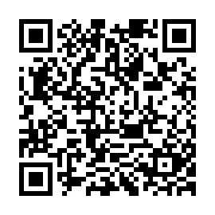
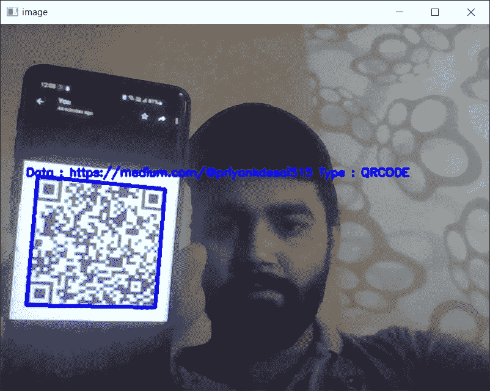

# Python 中的二维码生成器和扫描器

> 原文：<https://blog.devgenius.io/qr-code-generator-and-scanner-in-python-75fc21e554a8?source=collection_archive---------5----------------------->

如今，从分享应用到营销和支付，二维码几乎被用于所有领域。Python 使得生成你的**二维码**和扫描仪变得很容易。


我们将在这个项目中使用 [**Python 3.9.7**](https://www.python.org/downloads/release/python-397/) 和 [**OpenCV 4.6.0**](https://opencv.org/opencv-4-6-0/) 。

# QR 码生成器

让我们看看如何创建您的二维码。我们将使用一个名为[**py QR code**](https://pypi.org/project/PyQRCode/)**的 python 包，它允许我们从任何文本片段创建 QR 码。我们还准备使用[**pypng**](https://pypi.org/project/pypng/)**将我们的二维码保存为 **PNG** 。****

****安装这两个软件包。****

```
**pip install PyQRCode pypng**
```

****现在创建一个新的 python 文件并导入两个包，用它们来创建一个 QR 码。这是代码。****

****pyqrcode 有一个函数 create，它可以获取任何文本并从中创建一个 QR 码。****

******png** 采用多个参数，如**名称、比例、模块颜色和背景**来创建一个 png 图像。****

****这是您将获得的 **PNG 图像**。****

********

****code.png****

# ****二维码扫描仪****

****要扫描二维码，首先需要接入摄像头。 **OpenCV，**打开我们的相机，从中拍摄照片和视频。****

****下面是我们打开相机的方法。****

******cv2.imshow()** 显示从您的相机拍摄的一帧图像。按下 **Q** 将关闭相机。****

****我们现在想知道摄像头是否正对着二维码。为此 python 有一个名为 [**pyzbar**](https://pypi.org/project/pyzbar/) 的包。这个包可以**解码**条码**在帧中的位置**。****

**将这个包导入到我们的 Scanner.py 文件中，并创建一个名为**解码器**的新函数。这个函数将在 cv2.imshow()之前被调用。**

**该解码器功能接收帧并将其转换为灰度图像，因为在灰度图像中检测 QR 码很容易。然后，从 **pyzbar** 导入的解码器接收灰度图像，并给出一些输出，如**多边形、矩形、数据**和**类型**。**

*   ****Polygon** 将为我们提供点，这些点将有助于在 QR 码周围创建一个框。**
*   ****Rect** 将给我们 X 轴、Y 轴、高度和宽度。**
*   ****Data.decode** 会返回附加在二维码上的文字/链接。**
*   ****Type** 将返回它是什么类型的代码。**

**最后，我们将创建一个将在 **cv2.putText()** 中使用的字符串。我们还会在终端上打印出来。**

**这是最终文件的样子。**

****最终结果。****

****

**这里你可以看到一个**框**围绕着二维码、**文字、**和**类型。****

# **附加动作**

**QR 码生成器和扫描仪的创建已经完成。但是，如果您想为您的扫描仪添加更多的功能，比如在扫描时打开链接，那么在 decoder 函数中添加以下代码。**

# ****结论****

**Python 使得创建和扫描二维码变得很容易。你可以在很多方面利用它来改进你的网站和应用。源代码([【https://github.com/Priyank010/QR-code-Generator-and-Scanner】T21](https://github.com/Priyank010/QR-code-Generator-and-Scanner))**