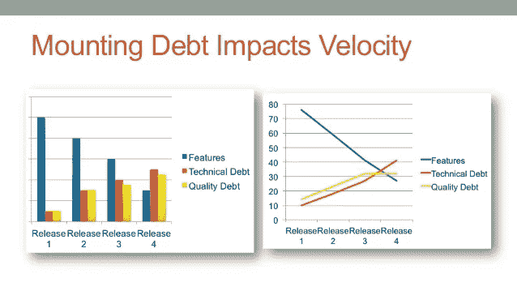

# 质量与速度

> 原文：<https://blog.devgenius.io/quality-vs-speed-9a46a6254a4e?source=collection_archive---------2----------------------->

同一枚硬币的两面

[兔子和乌龟](https://www.freepng.es/png-8bwa0q/)

> 在软件工程的上下文中， [**软件质量**](https://en.wikibooks.org/wiki/Introduction_to_Software_Engineering/Quality) 测量软件设计得有多好(*设计质量*)，以及软件符合那个设计的有多好(*一致性质量*)，尽管有几个不同的定义。它通常被描述为一个软件的“适用性”。

在软件开发中，质量和速度通常被定义为对立的事物。如果你的代码有质量，你将交付较少的特性到产品中，反之，如果你的团队有很高的速度，你将有低质量。

根据我的经验，这是不正确的，质量和速度只是同一件事的价值，即速度。

例如，尤塞恩·博尔特能够跑得比任何人都快，但他跑步的方式是为了避免受伤。我们可以说他跑得很有质量。我觉得不应用质量，这么多年都在顶级，不可能这么快。

让我们回到软件上来，如果你一直在一家有遗留产品的公司工作，你知道质量差的后果是什么。公司最终会决定用更高的水平或质量重写所有的代码。你认为还有比重写所有代码更昂贵的事情吗？。

为什么一个一年前的项目与一个绿地项目相比很难更新，为什么我们在那里比在新项目中需要更多的时间。这不是因为人，我们在队里也是一样的。真正的问题是代码的质量，基本上是我们所做的工作，以保持良好的质量水平。

[科技债的影响](https://www.slideshare.net/kenpower/understanding-the-impact-of-technical-debt-on-the-capacity-and-velocity-of-teams-and-organizations)

如果我们有太多的技术债务，我们会花更多的时间来修复错误，试图协调人们开会以避免已知的问题。最后，我们代码的低质量是我们低性能的原因吗？

## 功能的成本

在这个视频[中，☕ J. B .瑞恩斯伯格](https://medium.com/u/15a4253804f1?source=post_page-----9a46a6254a4e--------------------------------)定义了一个特性的成本:

7 分 26 秒，以及敏捷软件开发的基本定理

> [功能的成本是基本和意外并发症的函数:](http://softwaredevelopmenttoday.com/2015/05/accidental-complication-why-estimates-dont-work/)
> 
> *特征成本= f(g(e)，h(a))*
> 
> 本质复杂性:一个问题本身有多难。例如，实现税务处理很难，因为税法本身就很复杂。
> 
> 意外的复杂情况或 h(a):由于“我们在工作中表现糟糕”而悄悄进入工作中的复杂情况。或者更外交地说，来自我们的组织结构的复杂性(一个新的测试环境需要多长时间获得批准？)以及如何编写程序(没有人是完美的，因此有些东西需要改变以适应新的功能)。

意外并发症通常在功能成本中占主导地位，它包括:

*   代码库，改变它有多难。
*   我们的生产之路。开发特性并将其部署到生产环境后要采取的步骤。
*   一般的官僚作风。

那么更多的质量意味着更少的意外复杂，因此新功能的成本将会降低。为什么人们通常认为更多的质量意味着更低的速度？。问题是我们如何提高产品质量。

## 真相就在过程中(不要屏蔽)

通常公司在代码库中引入质量的方式是添加**阻塞步骤**(等待批准)。例如:

*   自动测试是一种增加我们代码库可维护性的技术。但是如果团队没有编写自动测试，而是在部署之前等待 QA 通过这些测试，我们会遇到更多意外的复杂情况。
*   代码评审是一种众所周知的提高我们代码库质量的好技术，但是如果代码评审持续几天，那么它可能会在意外的复杂情况下自我转化。
*   如果开发团队成员必须等待团队之外的架构师的决定，那么你将会遇到更多意外的复杂情况。

但是我们可以增加质量而不增加额外的复杂性。例如:

*   最大限度地使用结对编程作为代码审查的替代方法
*   TDD，而不是在
*   开发团队的自主权

[**所以我们需要用包括质量在内的流程做一等公民**](https://deming.org/inspection-is-too-late-the-quality-good-or-bad-is-already-in-the-product/) **。**