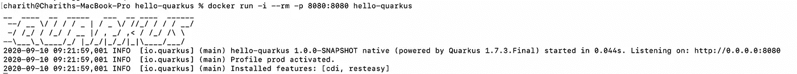
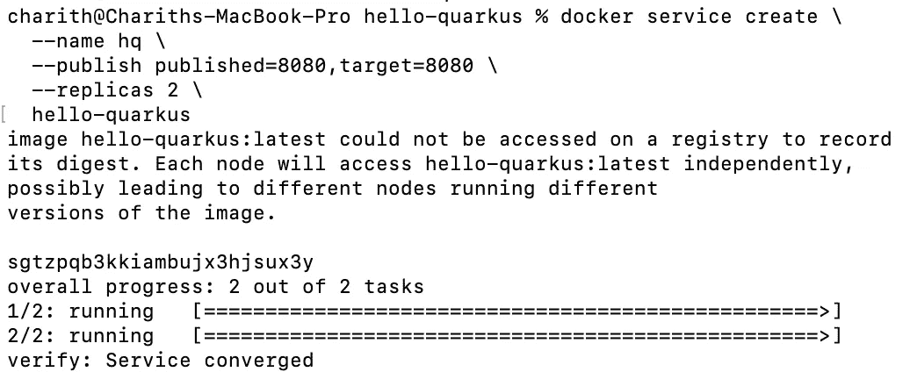

# QUARKUS:在 5 分钟内容器原生 Java 应用

> 原文：<https://blog.devgenius.io/quarkus-container-native-java-apps-in-5mins-1a374705e72f?source=collection_archive---------4----------------------->

照片由[埃里克·扎亚茨](https://unsplash.com/@erickzajac?utm_source=unsplash&utm_medium=referral&utm_content=creditCopyText)在 [Unsplash](https://unsplash.com/photos/PssemCRAQLQ?utm_source=unsplash&utm_medium=referral&utm_content=creditCopyText) 上拍摄

当你想到原生 Java 应用时，你会想到一个可执行的 jar，自从 Google 开始索引我们，我指的是 web 以来，情况一直如此。有大量的平台和框架可以让你快速地编写 java 应用程序，Quarkus 就是其中之一。但是夸库斯也不止如此。您专注于解决问题，而 Quarkus 会做所有其他事情，包括管理依赖关系、捆绑和构建您选择的本机映像。所以一旦你写完了你的应用程序，理论上你应该能够在 Docker 容器中运行它。所以让我们看看它是否有效。

**第 1 步**:转到 [https://code.quarkus.io](https://code.quarkus.io) ，如果你用过 Spring Initializr，这个差不多。填写信息，选择您需要的扩展，我将创建一个名为“ **hello-quarkus** 的工件，并选择 RESTEasy、Docker 并单击“生成您的应用程序”，然后直接将应用程序推送到 github(我更喜欢这个选项)，您也可以以 zip 文件的形式下载它。

**第二步**:昂首阔步，勇往直前。您可以开始构建您的应用程序。我不打算在这里做任何花哨的事情，让默认应用程序保持原样。

转到您的应用程序所在的文件夹并运行

> `./mvnw compile quarkus:dev`

这将在开发模式下启动应用程序，您可以在构建的同时开始测试。在这种模式下，Quarkus 将热部署您的更改。

**步骤 3** :让我们用一个容器运行时来打包我们的 hello API，我这里用的是 docker，我要指定它。

> 。/mvnw package-PNA native-dquarkus . native . container-runtime = docker

这一步成功完成后，运行以下命令来构建 docker 映像。

> docker build-f src/main/docker/docker file . native-t hello-quar kus。

理论上，当这个完成后，您就有了一个容器化的 hello API。

**第四步**:启动 Docker 镜像，测试 API。

> docker run-I-RM-p 8080:8080 hello-quarkus

使用 Postman 或浏览器访问位于[http://localhost:8080/hello](http://localhost:8080/hello)的 hello api，您应该会得到一个问候的响应。

步骤 5 :现在让我们更进一步，创建一个 Docker 服务，并尝试扩展我们的 hello API。“published”是 docker 将对外公开服务的端口，target 是 hello API 在容器中公开的端口。

这将在端口 8080 上启动我们的 hello API 的两个副本。使用下面的链接，你可以看到它是如何愈合和扩展的。

只需 5 个步骤，您就可以立即编写出一个自动修复的可伸缩 API。Quarkus 支持大量的扩展，包括 openshift 到 aws lamba 到 hibernate 等等。它的美妙之处在于，您可以专注于解决您的业务问题，而 Quarkus 会做其他一切事情。

如果您时间紧迫，需要构建一个容器或平台原生服务，那么 Quarkus 是最好的解决方案之一。

[1]自愈，【https://www.youtube.com/watch?v=CokSeoeZM04】T2

[2]缩放，【https://www.youtube.com/watch?v=34EKPJ9ovXg】T4