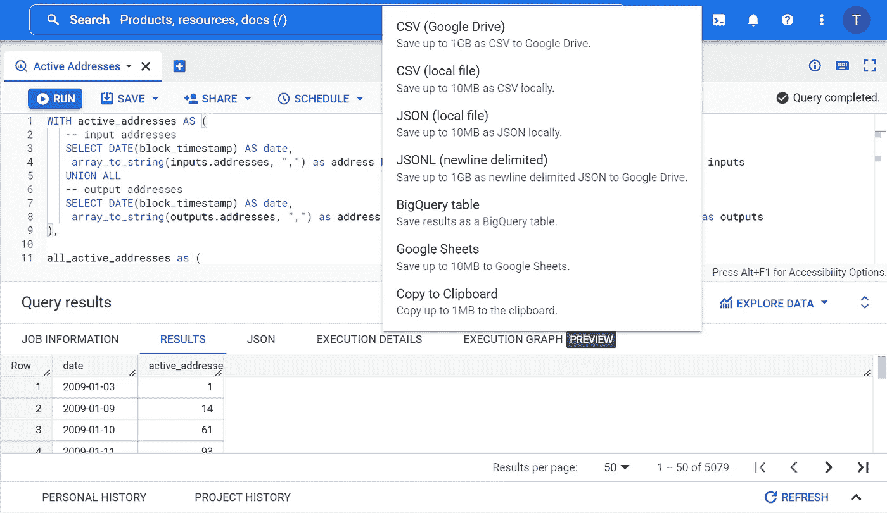

# 在 BigQuery 中查询比特币区块链的活跃地址

> 原文：<https://blog.devgenius.io/query-bitcoin-blockchain-for-active-addresses-in-bigquery-be440f362dd9?source=collection_archive---------19----------------------->

在本文中，我们将展示如何通过在 Google BigQuery 中运行以下查询来查找比特币区块链上的活跃地址数。活动地址是指在指定时间段内至少发送或接收了一个交易的唯一地址的数量。只有在成功事务中处于活动状态的地址才会被计算在内。

活跃地址通常被用来衡量比特币网络的采用和使用水平。当活跃地址的数量增加时，这可能表明比特币生态系统内的兴趣和活动日益增加。值得注意的是，一个用户可以有多个地址，并且不是所有活动的地址都可以代表单个用户。

在我们开始之前，您可能会在[big query](https://medium.com/dev-genius/getting-started-with-google-bigquery-5e076e77d43c)入门中了解如何设置项目，以及如何在[使用 BigQuery](https://medium.com/@vivbellavita/explore-cryptocurrency-public-datasets-with-bigquery-1d9562691580) 探索加密货币公共数据集中对比特币公共数据集运行简单查询。如果您不想运行查询，您可以在 Trigo Labs 的[比特币仪表盘](https://trigolabs.io/bitcoin/)上查看结果。


比特币活跃地址

# 第一步

转到 BigQuery 上的**编辑器**字段。


# 第二步

在**编辑器**字段中，复制下面的查询。

该查询通过从两个表(即`bigquery-public-data.crypto_bitcoin.inputs`和`bigquery-public-data.crypto_bitcoin.outputs`)中提取日期和地址来创建一个公共表表达式(CTE) `active_addresses`。

使用`UNION ALL`子句将两个结果集合并成一个结果集。这将创建事务中使用的所有唯一地址的列表，而不管该地址是用作输入还是输出。

```
WITH active_addresses AS (
   -- input addresses
   SELECT DATE(block_timestamp) AS date,
    array_to_string(inputs.addresses, ",") as address FROM `bigquery-public-data.crypto_bitcoin.inputs` as inputs
   UNION ALL
   -- output addresses
   SELECT DATE(block_timestamp) AS date,
    array_to_string(outputs.addresses, ",") as address FROM `bigquery-public-data.crypto_bitcoin.outputs` as outputs
),
```

接下来，CTE `active_addresses_group_by_date`从表`active_addresses`中选择数据，并计算每天活跃的唯一地址的数量。结果按日期分组。

```
active_addresses_group_by_date as (
  SELECT date, COUNT(DISTINCT address) as active_addresses_count
  FROM active_addresses
  WHERE date > "2009-01-01" AND date <= DATE_SUB(CURRENT_DATE(), INTERVAL 1 DAY) 
  GROUP BY date
)
```

最后，我们使用`SELECT`语句获取日期和活动地址计数，并在运行查询时显示它们。

```
SELECT date, active_addresses_count FROM active_addresses_group_by_date
ORDER BY date
```

完整的查询如下所示。

```
WITH active_addresses AS (
   -- input addresses
   SELECT DATE(block_timestamp) AS date,
    array_to_string(inputs.addresses, ",") as address FROM `bigquery-public-data.crypto_bitcoin.inputs` as inputs
   UNION ALL
   -- output addresses
   SELECT DATE(block_timestamp) AS date,
    array_to_string(outputs.addresses, ",") as address FROM `bigquery-public-data.crypto_bitcoin.outputs` as outputs
),

active_addresses_group_by_date as (
  SELECT date, COUNT(DISTINCT address) as active_addresses_count
  FROM active_addresses
  WHERE date > "2009-01-01" AND date <= DATE_SUB(CURRENT_DATE(), INTERVAL 1 DAY) 
  GROUP BY date
)

SELECT date, active_addresses_count FROM active_addresses_group_by_date
ORDER BY date
```

# 第三步

点击**运行**。

该查询使用 154.54 GB 在 BigQuery 中运行。结果显示在**查询结果**部分。表格标题行包含“日期”和“活动地址计数”。结果显示每天唯一活动地址的数量。


# 第四步

您可以通过点击**保存结果**来导出结果，并在下拉菜单中选择导出到 CSV、JSON 或 Google Sheets 的选项。



有兴趣了解更多关于链上指标的信息吗？查看下面的文章。

**亦读:**

*   [谷歌大查询入门](https://medium.com/dev-genius/getting-started-with-google-bigquery-5e076e77d43c)
*   [使用 BigQuery 探索加密货币公共数据集](https://medium.com/@vivbellavita/explore-cryptocurrency-public-datasets-with-bigquery-1d9562691580)
*   [比特币:如何在 BigQuery 中查询收发地址](https://medium.com/@vivbellavita/bitcoin-how-to-query-for-sending-and-receiving-addresses-in-bigquery-3d930cb64dc3)

***感谢阅读！***

如果您喜欢这篇文章并想了解更多，请考虑关注我。我定期发布与链上分析、机器学习和 BigQuery 相关的主题。我尽量让我的文章简单而精确，尽可能提供代码、例子和模拟。