# 查询要点第 1 部分

> 原文：<https://blog.devgenius.io/query-essentials-part-1-1e7fa7fff67?source=collection_archive---------10----------------------->

我将把谷歌大查询定义指南的第二章分成几个部分，以便于阅读，这是第二章的第一部分，我将在未来的日子里发布接下来的部分，让我们开始吧！！！

BigQuery 是一个 dta 仓库，为结构化和半结构化数据提供存储，存储支持四种基本的 CRUD 操作

什么是 CRUD？？？？

创建(插入新记录，通过 SQL INSERT 语句和流插入 API 实现加载操作，您可以使用 SQL 数据库对象，如表、视图、机器学习模型

读取检索记录

更新会修改现有记录

删除删除现有记录

这是一个大数据分析工具，随后的大多数查询都是在各种数据集上执行的读取操作，读取数据集是在查询中使用单词 SELECT 时执行的

BigQuery 使用传统的 SQL，而不是标准的 SQL

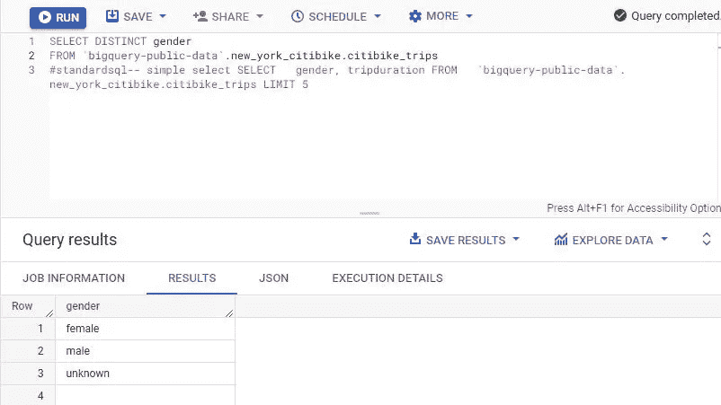

标准 SQL 语法查找不同性别的旅行持续时间

使用 SELECT 检索行

Select 用于从给定的表中检索特定的值，返回到 New York Citibike Trips 表让我们运行一个查询，在一列中显示租赁自行车的人的性别，在另一列中显示旅行的持续时间，我们将使用 BigQuery 公共数据项目，在名为 Citibike Trips 的表上的 New York Citibike 数据集内工作

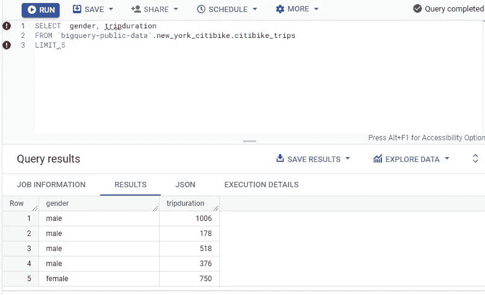

指定性别和旅行持续时间，并应用 5 的限制

我们看到第一行是旅行持续时间为 1006 的男性，第二行是旅行持续时间为 178 的男性，第三行是旅行持续时间为 518 的男性用户，第四行是旅行持续时间为 376 的男性用户，最后一行是旅行持续时间为 750 的女性用户，因为数据集上的限制是 5

用 AS 作为列名的别名

假设您希望您的结果表与 BigQuery 提供的模式(表内容)中的列具有不同的名称，我们可以使用 as 关键字进行更改。

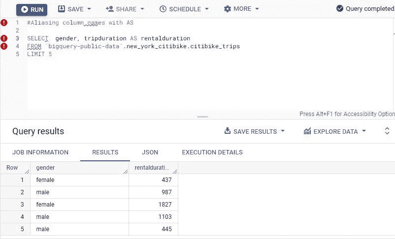

使用关键字“as”为列名取别名

如果您不使用别名，那么它将产生一个自动分配的列名。在这种情况下，默认的列名是 f0_，我们使用别名持续时间分钟数作为描述性的列名运行相同的查询，输出在第一列中显示为性别(在第一行中这是女性),在第二列中显示旅行持续时间分钟数

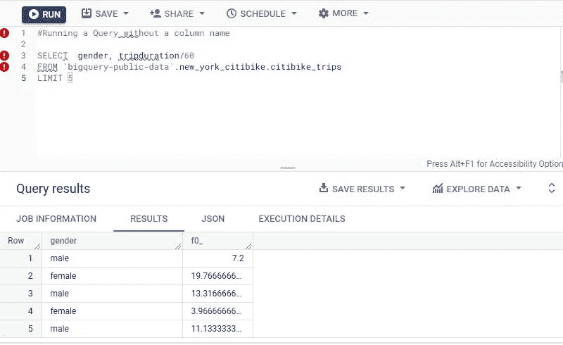

BigQuery 默认列名 f0_

用 where 过滤

现在，我们将使用 where 子句过滤结果，我想找出哪些租赁少于 10 分钟，因此我将使用数字 600，因为 tripduration 是以秒为单位的数字

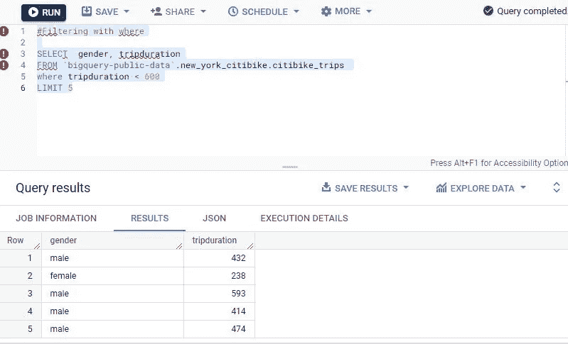

使用关键字“where”过滤

请注意，每次限制不会向我们显示相同的 5 个结果。当运行限制为 5 的查询时，结果表中有 2 列，第一列再次保存性别信息，第二列将显示不到 10 分钟的旅行持续时间

您也可以在 where 子句中使用布尔表达式(该表达式在给定的参数内测试真或假)，查询表中女性 5-10 分钟的租赁时间将如下所示，这 5 个将是结果。

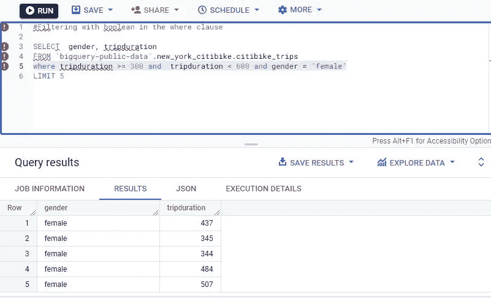

在“where”子句中使用布尔值进行筛选

使用()来控制求值的顺序，就像数学中的运算顺序一样(我被教成 BODMAS，意思是括号优先)我们可以控制查询的执行顺序，通过用括号将 where 子句的一部分括起来，我们告诉 BigQuery 应该首先执行查询的哪一部分， 在这种情况下，我们首先寻找租赁时间少于 10 分钟的女性骑手，只有在找到并返回这些骑手后，BigQuery 才会查询表中租赁时间不受限制的男性骑手。

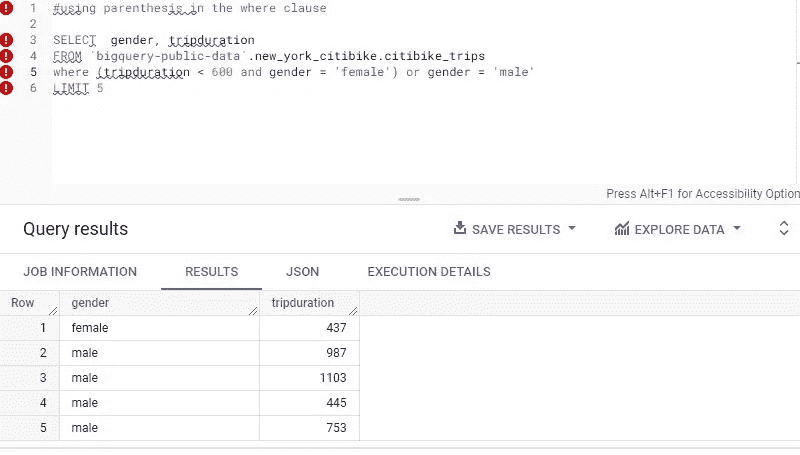

使用括号更改查询执行

选择*，除了和替换

在 BigQuery 上运行的每个查询都要根据处理该查询所使用的数据量来计算成本，这就是为什么作为降低成本的经验法则，要尽量在 select 语句中只包含必要的列名，通过以 SELECT *形式运行查询，它将返回给定表中的所有列，该表也使用了更多的数据， 以下查询返回名称中包含单词“Riverside”的起点桩号名称的所有列，它可能不是桩号名称，但“Riverside”也可能包含在街道地址中，如果您正在查询一个表，而不是查找要打印的精确或特定结果，则关键字“like”最好包含在 where 子句中。

例如，此查询返回名称中包含“Riverside”的所有值，在 select *语句中使用“except in”会从结果表中省略 end_station_id 列和 end_station_longitude 列，从而减少查询将用于处理的数据总量。

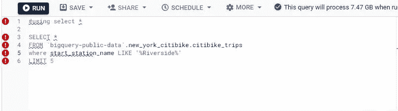

使用带有“like”关键字的 Select*

在 select 语句中使用 Replace 将 select 语句中的所有列替换为您希望替换的列，在本例中，我们将在 citibike stations 表中的所有可租赁自行车数量中添加 5 辆自行车。

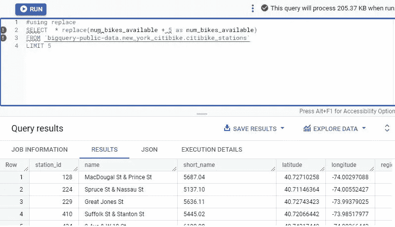

在“select”语句中使用 Replace

带有 with 的子查询

第二个 select 语句用作子查询，因为它用括号()括起来，所以我们可以在 where 子句中使用别名，但是同时使用 select 和括号会使查询重复，为了避免这种情况，我们可以在两个表(citibike trips 和 weather 表)连接的查询中创建一个 with 子句，首先将 WITH 语句用括号括起来， 指示 BigQuery 首先执行查询中包含的部分，然后使用该查询的结果创建一个名为 minutes 的新列来保存结果。

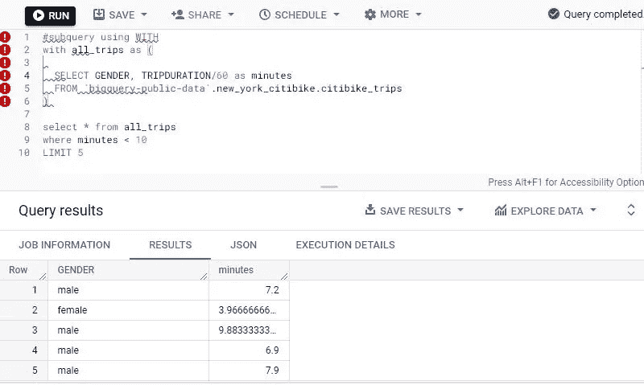

使用“with”创建子查询

使用“order by”排序控制行在结果表中出现的顺序。在此查询中，结果表中的“分钟数”按降序打印，这意味着从最大分钟数到最小分钟数，使用 where 子句进一步过滤查询，打印“女性”参数内的所有结果。

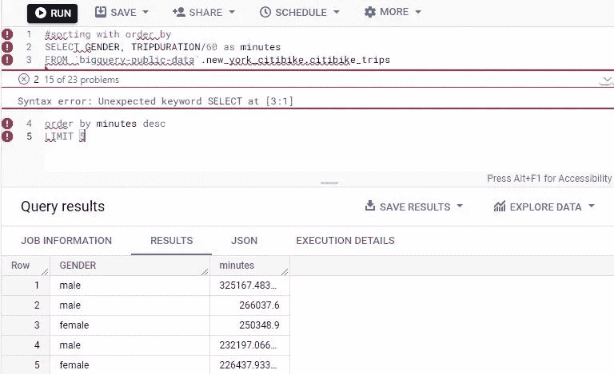

使用“排序依据”进行排序，以更改结果出现的顺序

在接下来的帖子中，我将分享为元组完成的课程，以及每个人最喜欢的主题，表连接和各种连接以实现不同的结果。