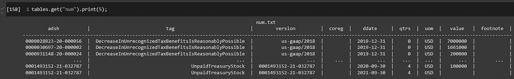

# 使用 Tablesaw for Java 从 SEC 数据中查询财务报表

> 原文：<https://blog.devgenius.io/query-financial-statements-from-sec-data-using-tablesaw-for-java-7d1cf4ba0e8?source=collection_archive---------13----------------------->

使用 Tablesaw for Java 构建数据框架，用于分析资产负债表、损益表和现金流量表等。


帕特里克·韦森伯格的照片

作为一名投资新手，也是一名合格的软件和数据工程师，我已经开始运用我的专业技能…复制在我之前的许多股票新手和数据辩论者的工作，所有这些都是为了更好地理解:

1.  像 [Tablesaw](https://jtablesaw.github.io/tablesaw/) 这样的酷框架
2.  基本和模糊的财务会计原则和实践(如 GAAP)
3.  SEC 文件和公开可用的[财务数据集](https://www.sec.gov/dera/data)
4.  沃伦会怎么做？

在这篇文章中，我可能不会谈到第四点，但是我希望能够涵盖第一至第三点。因此，在我得意忘形地认为我比实际上更有趣之前，让我们继续，从通过 SEC 获得的一些有趣的数据开始。

```
 **Table of Contents**
 **-----------------------------------** 1\. Obtaining Financial Statements 
     from the SEC [[link](#5629)]

  2\. Data Schema [[link](#f534)] 3\. Fetch the Data with Bash 
     Scripting [[link](#05fb)] 4\. Install & Configure the Java 
     Kernel on Google Colab [[link](#00a8)] 5\. Create In-Memory Tables from 
     TSV Files Using Tablesaw [[link](#c3af)] 6\. Obtaining Financial Statements 
     For a Fiscal Year [[link](#52b6)]
```

# 从证券交易委员会获得财务报表

这部分是我们将从 SEC 获得的数据的合理详细的概述。如果您对这些数据的结构有些熟悉，或者如果您只是急于开始编码，那么您可以跳到下一节，“以内存表的形式获取和加载数据”

有许多方法可以从 sec.gov 网站下载数据。在本文中，我们将特别关注由[结构化披露(OSD)](https://www.sec.gov/structureddata) 办公室提供的[财务报表数据](https://www.sec.gov/dera/data)，该办公室位于[经济和风险分析(DERA)](https://www.sec.gov/dera) 部门。


[经济与风险分析部(DERA)](https://www.sec.gov/dera)

*经济和风险分析部门为投资者和市场参与者提供从公共文件中获取的汇总数据，以进行研究和分析。下面的每个数据集链接将提供下载和技术文档的访问。(来自*[*DERA*](http://The Division of Economic and Risk Analysis offers investors and market participants access to aggregated data from public filings for research and analysis.)*网站)*

有许多数据集可用，包括:

```
-Mutual Fund Prospectus Risk/Return Summary
-Crowdfunding Offerings
-Form D
-Regulation A
-Transfer Agent
-EDGAR Logfiles
-Financial Statement
-Financial Statement and Notes
-Number of EDGAR Filings by Form Type
```

在[财务报表数据集](https://www.sec.gov/dera/data/financial-statement-data-sets.html)页面上，你可以下载压缩的档案，其中包括给定季度内提交的数据。*“该数据摘自使用可扩展商业报告语言(XBRL)向委员会提交的公司财务报告的附件。”*

[财务报表和附注数据集](https://www.sec.gov/dera/data/financial-statement-and-notes-data-set.html)，也包含在 [DERA 的数据库](https://www.sec.gov/dera/data)中，提供“*数字和* ***叙述性披露*** *”来自所有财务报表及其附注，财务报表数据集【单独】更为紧凑“*”。


[财务报表数据](https://www.sec.gov/dera/data/financial-statement-data-sets.html)

我建议下载并解包一个归档文件，以遵循下面的数据模式概述。

## 来自 Readme.txt

给定季度数据的每个压缩副本中都提供了 Readme.txt。自述文件提供了每个下载中包含的其他 4 个文件的详细描述， *num.txt、pre.txt、sub.txt & tag.txt.*


2020 年 Q1 数据的未打包副本

自述文件将所包含的数据描述为*、*……*，这些数据摘自以扁平数据格式提交给委员会的 EX-101 附件，以帮助用户更容易地使用这些数据进行分析*

*“数据来源于申报人向委员会提交的 XBRL 标记财务报表中的选定信息。这些数据集目前包括申报人* ***一级财务报表*** *中出现的* ***季度和年度数字数据*** *。”*

# 数据模式

正如每个 Readme.txt 中所详述的，从 XBRL 提交中提取的数据被组织成四个数据集，其中包含关于提交、数字、分类标签和表示的信息。

**子** —提交数据集；这包括每个 XBRL 提交的一条记录。识别数据集中所有的 EDGAR 提交，每行有一个 20 字符的 EDGAR 登录号`unique (primary) key adsh`，在 11 和 14 位有破折号。该集合包括与提交和提交实体相关的信息字段。信息是从 SEC 的 EDGAR 系统和注册人提交给 SEC 的文件中提取的。

**NUM** —主要财务报表上显示的所有数字 XBRL 事实的数据集。包括子数据集中每个提交的每个不同金额的一行。对于每次提交，数字数据集包括 SEC 查看器/预览器提供的每个主要财务报表的所有行项目值。

```
**COMPOUND UNIQUE KEY -** A unique key of each row is a combination of the following fields:**1) adsh-** EDGAR accession number 
**2) tag —** tag used by the filer 
**3) version —** if a standard tag, the taxonomy of origin, otherwise equal to adsh. 
**4) ddate —** period end date 
**5) qtrs —** duration in number of quarters 
**6) uom —** unit of measure 
**7) coreg —** coregistrant of the parent company registrant (if applicable)
```

**标签** —提交中使用的所有标签的数据集，包括标准标签和定制标签。包括定义关于每个标签的信息。信息包括标签描述(文档标签)、分类版本信息和其他标签属性。

```
**COMPOUND UNIQUE KEY -** A unique key of each row is a combination of the following fields:**1) tag —** tag used by the filer 
**2) version —** if a standard tag, the taxonomy of origin, otherwise equal to adsh.
```

**PRE** —演示数据集；这提供了关于标签和数字如何在主要财务报表中呈现的信息。

提供由申报人分配给主要财务报表中每个行项目的文本、行项目出现的顺序以及分配给它的标签。

```
**COMPOUND UNIQUE KEY -** A unique key of each row is a combination of the following fields:**1) adsh —** EDGAR accession number 
**2) report —** sequential number of report within the statements 
**3) line —** sequential number of line within a report.
```

## 数据(表)关系摘要


# 用 Bash 脚本获取数据

在下一节中，我们将开始使用代码直接处理数据。我们将从编写下载脚本开始，然后继续配置我们的 Google Colab 实例以与 Java 内核一起运行，这样我们就可以使用 Tablesaw 将数据作为内存中的“表”来加载，在其他上下文中也称为数据帧(例如 Pandas)。

## 下载并预览 2022 年 Q1 的数据

对数据模式有了粗略的了解后，让我们继续编写下载给定季度数据的脚本并查看其内部。


[财务报表数据](https://www.sec.gov/dera/data)

使用 BASH 下载和预览数据


显示 4 个下载文件中的 2 个(前& NUM)

## 获取更多数据

出于各种原因，我们很快就会想下载并在分析中包含更多的数据。

首先，由于每个公司可以决定何时开始和结束他们的财政年度，从 DERA 数据库下载任何一个档案都只会包括一些财政年度的提交。

您可以在您的环境中使用下面的 bash 脚本。我们将只为 Google Colab 提供我们的例子和具体的配置指南。不过，这里的一切都可以在许多其他环境中使用

# 在 Google Colab 上安装和配置 Java 内核

现在我们已经有了几年的数据，让我们开始使用 Java & Google Colab 设置我们的环境。

## Java、Jupyter 和 Google Colab

虽然在 Google Colab 上使用 Java 可能不是第一个想到的方法，但 Google Colab 可以成为一个优秀的环境来分享各种代码，用于教学或参考目的。在几个社区驱动的努力下，在 Google Colab 中使用 Java 是可能的，包括由[斯潘塞·帕克](https://github.com/SpencerPark)编写的用于 Jupyter 的[ijav 内核。](https://github.com/SpencerPark/IJava)

在完成本教程之前，熟悉在 Google Colab 上配置和安装内核的步骤会有所帮助，如下面链接的几篇文章所示。

*   [Java、Jupyter 和 Google Colab](https://medium.com/@gmsharpe/jupyter-java-and-google-colab-7a2f7fb08808)
*   [table saw 和 Google Colab 入门](https://medium.com/@gmsharpe/getting-started-with-tablesaw-and-google-colab-65ef0cbe280c)
*   [Java、Jupyter 和 Plotly](https://medium.com/@gmsharpe/java-jupyter-plotly-e1bbaa7f2be8)

## TL/DR

如果你想现在就开始，不回顾以上文章中的任何细节，你可以从在 [Google Colab](https://colab.research.google.com/) 上设置你的账户开始，如果你还没有的话。

接下来，在 Colab 中打开并创建该笔记本的副本:

[](https://gist.github.com/gmsharpe/bb8b001b379fa0e960e70776cdcf0630)

## 安装和配置 Java 内核

上面链接的模板首先运行下面的 shell 脚本来安装 Java 内核。

接下来，您可以选择确认选择了 Java 运行时类型:


…然后'*连接到 Colab 中的托管运行时*，


## 用 Java 预览数据

回到我们已经下载的财务数据，现在让我们使用 Java 预览数据。虽然这一步不是绝对必要的，但它强调了一些有用的技巧。

1.  在 Jupyter 笔记本上编写小的实用函数来做一些事情是很容易的，否则可能会有点“冗长”。
2.  我们还将介绍如何使用 ***线条和单元格魔术*** *导入库。*

我们将使用下面的实用程序方法来打印给定文件的前几行。这并不是绝对必要的，但是记住编写在 Jupyter 笔记本中使用的方便实用的 Java 代码是多么容易是很有帮助的。


# 使用 Tablesaw 从 TSV 文件创建内存中的表

## 导入依赖项

使用 Java 内核，我们可以使用 Maven 约定(Ivy)和 IJava 的 Magics(T23)加载依赖项。

具体来说，我们使用`%%loadFromPOM`魔法下载 [tablesaw-core](https://github.com/jtablesaw/tablesaw) 。为此，请在代码块中执行以下内容。

```
%%loadFromPOM
<dependency>
    <groupId>tech.tablesaw</groupId>
    <artifactId>tablesaw-core</artifactId>
    <version>0.43.1</version>
</dependency>
```

## 将 TSV 文件作为表格导入

现在，让我们使用 [Tablesaw](https://www.javadoc.io/doc/tech.tablesaw) 从下载的 TSV 文件中将数据读取为“表格”格式。

在我在 Google Colab 上的运行时环境中，这确实花了有点令人失望的 33 秒。作为比较，下面是使用 Python 读取和打印同一个 TSV 文件的一组等价行。

这只花了不到 5 秒的时间。

## 缩短从 CSV/TSV 加载表格的时间

有一些节省时间的技巧可以提高 Tablesaw 的`read().csv(..)`的执行时间。

**#1)指定列类型:**

Tablesaw 有一些方法可用于在导入之前指定列类型。这可能是有帮助的，因为 Tablesaw 将扫描试图“猜测”最佳类型的列。

[](https://javadoc.io/doc/tech.tablesaw/tablesaw-core/latest/tech/tablesaw/io/csv/CsvReadOptions.Builder.html#columnTypes-tech.tablesaw.api.ColumnType:A-)

从表中看到 [Javadocs](https://javadoc.io/doc/tech.tablesaw/tablesaw-core/latest)

如果我们想查看我们创建的表格的“结构”，我们可以使用`[Table#structure](https://javadoc.io/static/tech.tablesaw/tablesaw-core/0.43.1/tech/tablesaw/table/Relation.html#structure--)`。


根据从上面的结构中收集的信息，我们现在为 nums.txt 中的 9 列中的每一列指定`ColumnType`。

尽管结果各不相同，但即使使用相同的底层数据，这通常也会节省几秒钟，将我们的时间从大约 33 秒减少到大约 30 秒，同时再次读取 3，277，301 条记录。

**#2)指定要“跳过”的列**

同时我们指定列“类型”，我们也可以指示哪些列*不加载*。这可能与`[tech.tablesaw.api.ColumnType.SKIP](https://javadoc.io/doc/tech.tablesaw/tablesaw-core/latest/tech/tablesaw/columns/SkipColumnType.html)`有关。

对于同一个“num.txt”文件，这种技术节省了几秒钟，使我们的时间缩短到大约 28 秒。

> 注意:我想在这里指出，你也可以使用`[CsvReadOptions.Builder#columnTypesPartial(Map<String, ColumnType>)](https://javadoc.io/doc/tech.tablesaw/tablesaw-core/latest/tech/tablesaw/io/csv/CsvReadOptions.Builder.html#columnTypesPartial-java.util.Map-)`来指定列类型。然而，这实际上**增加了**读取表所需的时间，比简单地使用`ColumnType`数组指定类型要频繁得多。
> 
> 用一个`Map`指定`ColumnType` ，看起来像下面这样:

```
Map<String, ColumnType> typeMap =
    Map.of("adsh", STRING,
           "tag", STRING, 
           "version", STRING,
           "coreg", SKIP,
           "ddate", LOCAL_DATE,
           "qtrs", INTEGER,
           "uom", STRING,
           "value", DOUBLE,
           "footnote", SKIP);
```

**#3)指定日期格式:**

这个省时的技巧对我来说有点意外。我预计性能会略有提高，但这种方法实际上节省了大量时间，比其他任何尝试都要多。不幸的是，这个特定方法的 Javadoc 并没有指出这有多有用。

[](https://javadoc.io/doc/tech.tablesaw/tablesaw-core/latest/tech/tablesaw/io/csv/CsvReadOptions.Builder.html#dateFormat-java.time.format.DateTimeFormatter-)

从表中看到 [Javadocs](https://javadoc.io/doc/tech.tablesaw/tablesaw-core/latest)

在浏览了数据之后，我们知道我们的日期格式是 yyyyMMdd 的形式(例如 20201231)。当我们使用适当的`DateTimeFormatter.BASIC_ISO_DATE`指定日期格式时，我们的总加载时间减少到了 10 秒。

现在，这仍然比不上我们用熊猫读取同样数量的数据所用的 5 秒，但这比最初的 33 秒要好得多。

> **注意#1:** 我觉得有必要指出的是，我没有尝试优化使用 Pandas 读取相同数量的数据所花费的时间，因此这两种方法之间的性能差距可能比我们希望的要大一些。

> **注意#2:** 我还觉得应该指出，同一个文件的实际加载时间从一次执行到下一次执行是不同的。我现在真的不能解释为什么，但是你应该知道你的结果会和我的有点不同。然而，最终的结果，也就是说上面每一步节省的大致时间，将是一样的。

## 使用 Tablesaw 加载剩余数据

在检查了其余表(pre.txt & sub.txt)的加载时间后，我得出结论，调优导入所涉及的额外步骤不如我们为适应从 num.txt 文件派生的最大的表所做的更改那样有益。所以，我将把它留给你们中的任何一个人去实现，如果你们好奇的话。如果你发现这个变化很大，值得在这里讨论，请给我发个短信。

现在我们有了几行简单的代码来阅读我们下载的 TSV 文件，这里有一个方便的方法，我们将在剩下的文章中使用。在 Google Colab 的代码单元格中执行下面的代码。

## 加载几年的财务数据

接下来，我们将把几年的数据合并到 3 个单独的表中，分别代表`‘pre’, ‘num’ & ‘sub’`数据。

这花了大约 160 秒钟(大约 2.5 分钟)。这比从 num.txt 文件导入最大的表之前的大约 5 分钟要好得多。



# 获取财政年度的财务报表

下一部分致力于我们最初陈述的目标，即获取给定公司的财务报表。我们将主要关注财年的财务报表，而不是季度业绩。

## 使用股票代码获取 CIK

看着这些数据，我们很快推测，从提交的数据中获得“adsh”是查询其他表以重新构建公司财务报表的关键。要获得公司的“adsh ”,我们可以查询名称本身，但这有点麻烦。如果我们有公司的 CIK，我们可以很容易地获得代表每个提交的“adsh”值的列表。

获得 CIK 的方法有很多，其中很多都涉及到使用“股票代码”(又名“股票代码”)。使用下面的代码，我们下载了每个“ticker”到公司 CIK 的映射。

**注释(re: Tablesaw)**

上面我们还介绍了如何使用`[Tablesaw#where](https://javadoc.io/static/tech.tablesaw/tablesaw-core/0.43.1/tech/tablesaw/api/Table.html#where-tech.tablesaw.selection.Selection-)`查询 table saw[table](https://javadoc.io/doc/tech.tablesaw/tablesaw-core/latest/tech/tablesaw/api/Table.html)(data frames)以及使用`[Relation#stringColumn](https://javadoc.io/static/tech.tablesaw/tablesaw-core/0.43.1/tech/tablesaw/table/Relation.html#stringColumn-java.lang.String-)`和`[StringColumn#isEqualTo](https://javadoc.io/static/tech.tablesaw/tablesaw-core/0.43.1/tech/tablesaw/api/StringColumn.html#isEqualTo-java.lang.String-)`查询`Selection`接口。

我们将使用更多的涉及查询选择的特性。我将继续强调每个实例，并链接到相关文档。我**高度**推荐探索 Tablesaw 的 [Javadoc](https://javadoc.io/doc/tech.tablesaw/tablesaw-core/latest/overview-summary.html) 以更熟悉它的特性，如果你继续感兴趣的话。

## 获取财务报表

上面，我们介绍了`[Selection#and(Selection)](https://javadoc.io/static/tech.tablesaw/tablesaw-core/0.43.1/tech/tablesaw/selection/Selection.html#and-tech.tablesaw.selection.Selection-)`，以及`[Table#select(String)](https://javadoc.io/static/tech.tablesaw/tablesaw-core/0.43.1/tech/tablesaw/api/Table.html#select-java.lang.String...-)`。通过' select '调用，我们精确地限制了哪些列将按名称返回。就我们而言，我们大多只对`‘adsh’, ‘cik’, ‘name’, & ‘fy’`感兴趣。


```
msftSubsForFYs.where(msftSubsForFYs.intColumn("fy")
              .isEqualTo(2020))
              .select("adsh").getString(0,0);
// returns this adsh -> 0001564590-20-034944
```

为了获得与给定提交的任何一份财务报表相关的所有数据，我们将加入上述 2020 年 ADSH 的“数字”数据和“前”数据。

```
Table finStmtsForMSFT = 
         pre.where(pre.stringColumn("adsh")
         .isEqualTo(adshForMSFTForFY))
         .joinOn("adsh", "tag", "version")
         .inner(num)
         .sortOn("stmt", "line")
         .select("line", "stmt", "tag", 
                 "version", "plabel", "ddate", 
                 "qtrs", "uom", "value");
finStmtsForMSFT.print(10);
```


现在，为了获得“特定的”财务报表(如损益表)，我们需要查询上述数据，如下所示:

```
Table incStmt =
    finStmtsForMSFT.where(finStmtsForMSFT.stringColumn("stmt")
                   .isEqualTo("IS"));
incStmt.print();
```

> 注意:我们可以通过 BS 查询资产负债表，或者通过 CF 查询现金流量表。下面进一步列出了可用报表的完整列表。

这为我们提供了微软提交的 2020 年财务报表行项目的有序列表。如您所见，给定行上有多年的数据，代表给定的财政季度或财政年度，如“qtrs”和“ddate”所示。


如果我们想将查询范围缩小到仅代表 4 个财政季度的数据，我们可以应用以下查询。

```
import java.time.LocalDate;
String fiscYear = "2020";
int numQtrs = 4;
Table is20210630 = incStmt.where(incStmt.dateColumn("ddate")
                          .isEqualTo(Year.parse(fiscYear))
                          .and(incStmt.intColumn("qtrs")
                          .isEqualTo(numQtrs)));
is20210630.print();
```


将这些放在一起，让我们创建一个简单的函数来获取任何一个可用的财务报表(资产负债表、损益表、现金流量表等)。).

只获取给定财年的数据需要一点演绎推理。“ddate”表示该数字所代表的时间段的结束时间，但不一定表示该“ddate”用于将返回值限制为仅包含所需会计年度的 4 个季度数据的行。

我们将假设“ddate”将包括我们正在查询的年份，并将占 4 个季度的数据。


## 资产负债表、现金流量表等。

为了获得任何一个剩余的财务报表，我们只需在方法调用中用表示该报表类型的缩写替换' IS ',如下所述。

*   BS =资产负债表
*   IS =损益表
*   CF =现金流量
*   EQ =权益
*   CI =综合收益
*   UN =不可分类报表


请考虑用上面的会员推荐链接注册一个中等会员——谢谢！

# 就是这样！！

现在，我希望你对 Tablesaw 有更好的理解，以及可以从 SEC 的 DERA 图书馆获得什么数据。从这里可以有很多方向。我想我会继续深入研究某家公司几年来的财务报表，并计算出评估一家公司价值的常用比率。

## 附加阅读:

如果您想了解更多有关使用 SEC 数据 API 的信息，我推荐以下文章:

[](https://medium.datadriveninvestor.com/access-companies-sec-filings-using-python-760e6075d3ad) [## 使用 Python 访问公司 SEC 文件

### 如果你曾经试图对一家公司的财务数据进行自动化分析，你可能会遇到一个…

medium.datadriveninvestor.com by](https://medium.datadriveninvestor.com/access-companies-sec-filings-using-python-760e6075d3ad) 

——作者[安托万·德达夫](https://medium.com/u/4d0de819b913?source=post_page-----7d1cf4ba0e8--------------------------------)

[](https://medium.com/@jan_5421/sec-edgar-api-e92049b172b9) [## SEC EDGAR API

### 一个实时 API，用于传输 SEC EDGAR 上发布的新文件。

medium.com](https://medium.com/@jan_5421/sec-edgar-api-e92049b172b9) 

——作者[杰伊](https://medium.com/u/b7bef5032075?source=post_page-----7d1cf4ba0e8--------------------------------)

# 作者的说明

如果您想探索 Java、Jupyter 和许多可用于数据科学、工程和一般分析的工具的交集，下面是一些您可能感兴趣的文章。

*   [爪哇，Jupyter & Plotly](https://medium.com/@gmsharpe/java-jupyter-plotly-e1bbaa7f2be8)
*   [数据框&在 Jupyter 上带有台锯的 JSON】](https://medium.com/@gmsharpe/dataframes-with-tablesaw-json-46dda9c8c217)
*   [用 Java 整理数据& Jupyter](https://medium.com/@gmsharpe/tidy-data-with-java-jupyter-b1e131b37ab0)
*   [Apache Spark 与 Java & Jupyter](https://medium.com/@gmsharpe/apache-spark-with-java-on-jupyter-e2a7144dbab6)

我很期待看到你们所有人的想法。**获得创意**，**别忘了** [**展示你的作品**](https://austinkleon.com/show-your-work/) **！！**

我很乐意听到任何探索如何在笔记本环境中使用 Java 的人的反馈(Jupyter， [Zeppelin](https://zeppelin.apache.org/) 等)。)和命令行( [JShell](https://docs.oracle.com/javase/9/jshell/introduction-jshell.htm) )上使用 Tablesaw 等工具进行数据处理和可视化。

给我发消息，特别是如果你已经在 Medium 上发表了任何材料，我很乐意在将来相关的时候链接到你的内容。