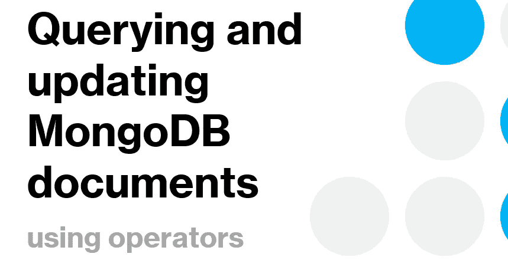

# 使用 MongoDB Compass 查询和更新文档

> 原文：<https://blog.devgenius.io/querying-and-updating-documents-on-mongodb-compass-c9be25ffffb2?source=collection_archive---------0----------------------->

## 使用 MongoDB 指南针

现在你知道了:

[如何在 windows 上安装 MongoDB？](https://medium.com/@ibtissam.makdoun/from-rdbms-to-non-relational-databases-119f4007b214)

[如何创建和处理文档？](https://medium.com/@ibtissam.makdoun/creating-updating-and-deleting-mongodb-documents-94c12219783f)

让我们试着把事情做得更进一步，如何？让我们看看如何查询我们的文档。



因此，在本教程中，我将为您演示如何使用:

*   排序，限制跳过
*   运算符和数组
*   更新文档
*   更新数组
*   删除文档

这个教程看起来很有前途，不是吗？那我们开始吧。

使用命令行查询 MongoDB 集合

# 排序、限制和跳过:

排序、限制和跳过都以同样的方式工作，在将查询发送到数据库之前，在查询的末尾添加选项。通过这样做，您可以保证:

*   **排序**:对查询结果进行排序
*   **限制**:限制查询结果
*   **跳过**:跳过查询之外

所以，让我们用排序、限制和跳过来弄脏我们的手:

首先我们从**排序**开始。排序需要添加一个对象来表示:用来排序的键名和排序的方向 1 升序-1 降序。

例如，要使用姓名升序和年龄降序对查询进行排序，我们可以如下进行:

```
db.students.find().sort({“full_name”:1, “age” : -1});
```

现在，要在 MongoDB Compass 中使用它，我们只需:


使用 MongoDB Compass 排序文档

放松点，柠檬汽水！

要为您的查询设置限制，例如，您只需要数据库中的前几个文档，您可以使用 **limit** ，就像排序一样，您可以在查找查询中使用 Limit 函数，并指定要返回多少个结果:

```
db.students.find().limit(3);
```

> 请记住，如果匹配您的查询的文档较少，将只返回找到的文档数。那是因为**极限**设定的是上限，不是下限。

**跳过**与**限制**的工作方式相同。链接它以查找并指定要跳过的文档数。

```
db.students.find().skip(3);
```

所以，在这种情况下 **Skip** 会传递你集合中的前三个文档，然后返回其余的文档。如果您的收藏少于三个文档。那就什么都不会回。

好了，现在都清楚了。

等等，还有一件事。您可以在同一个查询中将这三种方法链接成 find。就像这样。

```
db.students.find.sort({“full_name”:1,”age”:-1}).limit(3).skip(3);
```


MongoDB Compass 中排序、过滤和限制的链接

# 运算符和数组:

*再来大忽悠！？我们从来没有在 RDBMS 中使用过操作符或数组，所以一开始听起来可能会很奇怪，但是坚持住。我将设法为你清除它。*

因此，MongoDB 有一个可以在你的字段上使用的操作符列表，比如字符串、数字、数组、对象甚至子文档。我们使用操作符有条件地过滤我们的结果。

请记住，即使操作符在开始时听起来有点奇怪，但它们都以相同的方式工作，所以您只需要熟悉它。

所以让我们从**查询条件**开始:

MongoDB 使用类似 JSON 的语法进行查询，因此使用了一些操作符，如>或< won’t work. So we need operators to replace all the mathematical comparison operators. So we introduce : $lt, $lte, $gt, $gte, to replace respectively: 、> =。

所有这些操作符都可以组合起来查找一系列值，例如年龄在 18 到 20 岁之间的学生。

为此，我们将使用:

```
db.students.find({“age”: {“$gte”: 18, “$lte”: 20}});
```

如何在 MongoDB 指南针上使用？不要再说了！


如何使用小于或大于运算符

查询数组怎么样？

嗯，要使用数组中的一个元素找到一个查询，很容易。你只要说:

```
db.students.find({“courses”:”Mathematics”});
```

它将返回所有匹配的文档。


如何使用数组中的元素查找文档

但是，如果您想要匹配多个文档，您需要使用一个运算符来完成，如下所示:

```
db.students.find({“courses”:{$all:[“Mathematics”, “English”]}});
```

这个查询将允许您在 courses 数组中查找包含“Mathematics”和“English”元素的文档，元素之间的顺序无关紧要。

> 还要注意，在数组中使用这样的一个元素*" courses ":{ $ all:[" Mathematics "]}*将匹配与使用*{ " courses ":" Mathematics " }*相同的文档。你自己试试！

如果要对数组中的特定元素运行查询，可以使用:

```
db.students.find({“courses.1”:”English”});
```

这将返回 courses 数组的第二个元素是“English”的所有文档。

再补充一个有趣的信息，如何查询嵌入文档？嗯，就像我们之前做的一样简单，当我们需要数组中的一个特定元素时，我们使用点符号。

因此，如果我们考虑我们集合中的学生存储如下:

```
{“name” : 
{ 
“first”: “Theodore”, 
“last”: “Mosby”
},
…..
}
```

然后，为了查询这个文档，我们将使用:

```
db.students.find({“name.first”:”Theodore”, “name.last”: “Mosby”});
```

您还应该注意，这种类型的查询是顺序敏感的，这意味着如果您以姓氏开始，它不会返回您的结果。

> 本教程中还忽略了其他一些操作符。如果你对这些感兴趣，请在下面留言通知我。

# 更新文档

如果我们的学生名字出现拼写错误怎么办？是呀是呀！我们不能永远把它当作一个错误。幸运的是，我们有几种更新方法来帮助我们解决这个问题。

因此，可以使用 *updateOne、updateMany* 和 *replaceOne* 来更改数据库中的文档。对于 Update 方法，每个方法都将一个过滤器文档作为它们的第一个参数，并将一个修饰符文档作为它们的第一个参数，在这个修饰符文档中，您可以描述您想要进行的更改。 *replaceOne* 还在第一个参数中接受要提交的更改，但在第二个参数中，它期望文档将替换匹配过滤器的文档。

注意，我们同时使用两个查询来更新文档。将应用到达服务器的第一个更新，但是也将应用到达服务器的第二个查询。

通常只有文档的某些部分需要更新。您可以使用更新操作符$set，$unset et $inc .更新文档的特定字段。

让我们练习一下这些运算符，看看它们是如何工作的:

$set 用于设置字段的值。如果该字段尚不存在，将会被创建。使用 set 更新可以方便地更新字段或添加新键。我们可以使用以下命令为学生设置全名:

```
db.students.updateOne({“_id”: ObjectId(“61ea963d4ebc56f0353cda05”)}, {“$set”: {“full_name”:”Frank Brown”}});
```

要使用 Mongo Compass 更新文档中的字段，我们需要首先选择文档，然后我们将手动更新它，如下图所示。

现在，如果我们意识到我们不需要全名，名和姓就足够了。我们可以使用$unset 文档删除键“full_name”。

```
db.students.updateOne({“_id”: }, {“$unset”: {“full_name”:1}});
```

然后文档会和开始时一样。

$inc 运算符可用于更改现有键的增量和减量，或者创建一个现有的新键(如果它尚不存在)。我们可以用它来增加我们数据库中学生的年龄，增加我们想要增加的值。

```
db.students.updateOne({“_id”: ObjectId(“61ea963d4ebc56f0353cda05”}, {$inc: {“age”: 1}});
```

如果我们发现这个学生还没有变老，那么我们可以很容易地改变这个值，使用:

```
db.students.updateOne({“_id”: ObjectId(“61ea963d4ebc56f0353cda05”}, {$inc: {“age”: -1}});
```

您的文档将恢复到之前的状态。

# 更新数组:

我想你已经猜对了，如果你想在你的文档中更新一个数组，你必须使用一个操作符。但是在这一点上，这是很容易做到的。因此，让我们继续探索这些操作符。

让我们从向数组中添加一个元素开始。$push，将允许您在数组末尾添加一个元素。例如，假设我们想在课程列表中添加一门新课程。因此，我们将再次使用 update，但是我们将对我们想要更新的字段和我们想要添加的值使用$push。

```
db. student.pdateOne({“_id”: ObjectId(“61ea963d4ebc56f0353cda05”}, {$push: {“courses”: “History”}})
```

这将把历史添加到学生课程列表中。使用 MongoDB compass 来实现这一点甚至更容易。

如果我们犯了一个错误，在错误的文档上做了更新。不要担心。您可以使用相同的语法，只需稍加修改，就可以从数组中删除一个元素。首先，您需要更改操作符，使用$pull 而不是$push。然后你会保持其余的原样。很简单，不是吗？

```
db. student.pdateOne({“_id”: ObjectId(“61ea963d4ebc56f0353cda05”}, {$pull: {“courses”: “History”}})
```

让我们在 MongoDB 罗盘上练习一下。


使用 MongoDB Compass 从文档中更新数组

# 删除文档:

当我们仍然对现有数据感兴趣时，更新非常有用和方便，但有时我们需要为新数据腾出更多空间。我们做到这一点的唯一解决方案是删除不再需要的数据。MongoDB 允许您使用两种不同的方法从集合中删除数据: **deleteOne** 和 **deleteMany** 。这两种方法都将过滤器文档作为第一个参数。 **DeleteOne** 将删除集合中的第一个匹配，而 **deleteMany** 将删除集合中所有匹配的文档。

要使用 _id 删除文档，我们可以使用:

```
db.students.deleteOne({“_id”: ObjectId(“61ea963d4ebc56f0353cda05”})
```

使用 MongoDB compass 更容易，如下图所示:


从 MongoDB Compass 中删除文档

# 结论:

就是这样。现在您已经知道了如何使用操作符以及如何运行更新和删除，我们可以开始质疑查询的性能了。

接下来，我们将了解更多关于索引和在 MongoDB 上存储文档的信息。

# 参考资料:

> MongoDB:权威指南，第三版，[奥赖利媒体公司](https://learning.oreilly.com/library/publisher/uuid/cde70c0c-24bc-41d1-aab0-8a405063a16e)，2019 年 12 月，511 页