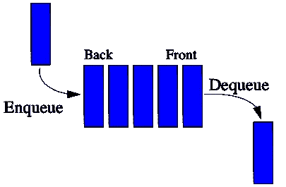

# 长队

> 原文：<https://blog.devgenius.io/queue-abf07c6d42f?source=collection_archive---------1----------------------->

队列:队列是按顺序维护的实体的集合

长队

我们将使用面向[协议的编程来实现这个](https://developer.apple.com/videos/play/wwdc2015/408) [*抽象*](https://en.wikipedia.org/wiki/Abstraction_(computer_science)) 。

队列的抽象

这里我们已经定义了抽象。

1.  使用关键字“associated type”捕获了关联类型“Element”
2.  定义“元素”类型的序列
3.  定义声明“enqueue”以在集合中排队。
4.  定义声明“出列”以从集合中出列。

实现入队和出队

这里我们定义了两种方法，称为“入队”和“出列”

**队列的应用**

*调度:*调度是将工作分配给完成工作的资源的方法。

创建计划

调度程序

假设我们定义了一个[流程](https://en.wikipedia.org/wiki/Process_(computing)):

过程

现在我们将定义 CPU 调度程序

让我们在 CPU 调度程序中加入三个进程

让我们从 CPU 调度程序中取消三个进程的队列

希望你喜欢:)

如果你喜欢，请给我鼓掌。
快乐阅读。